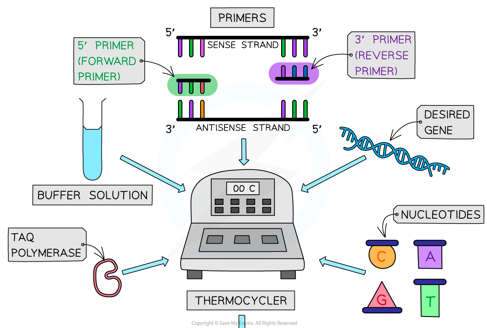
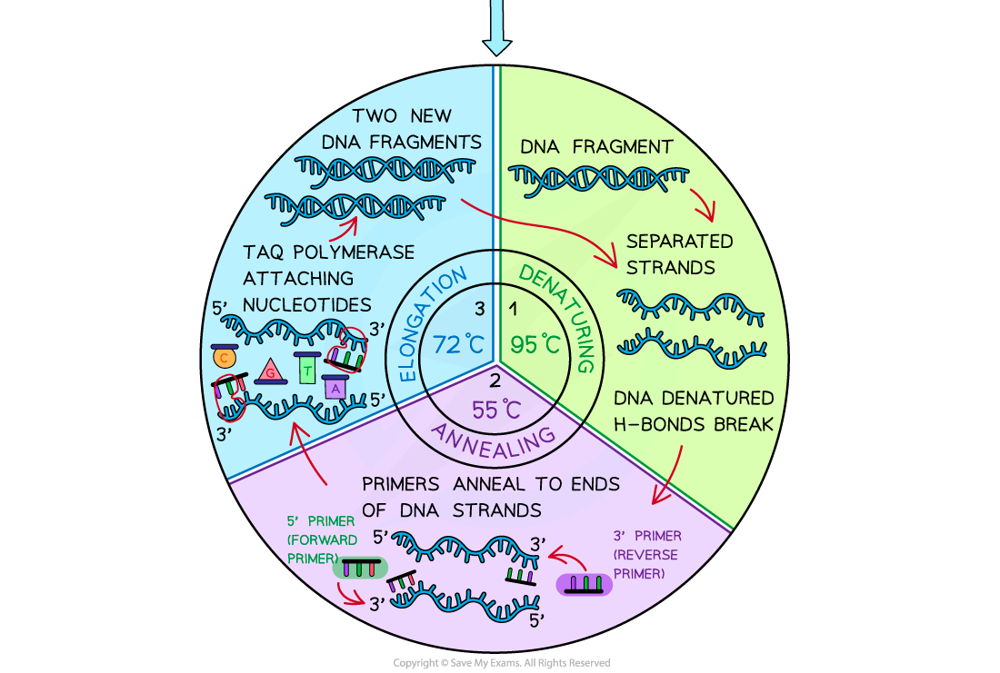
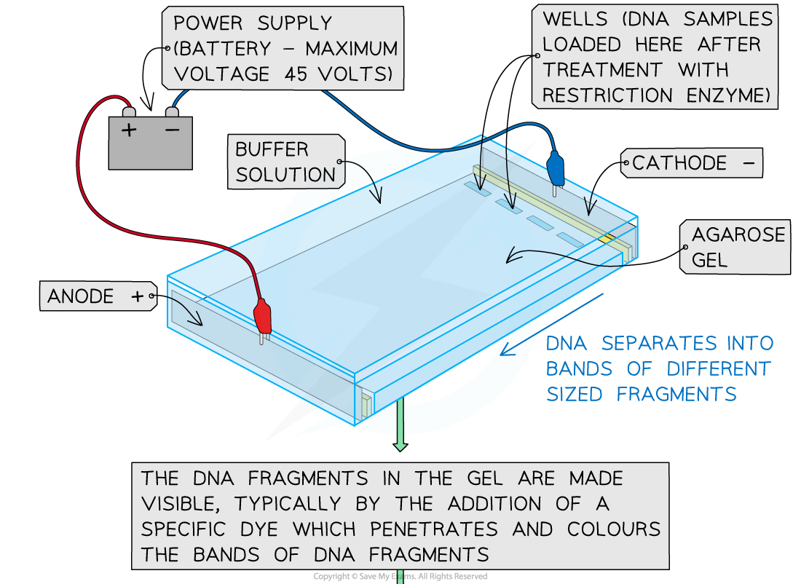
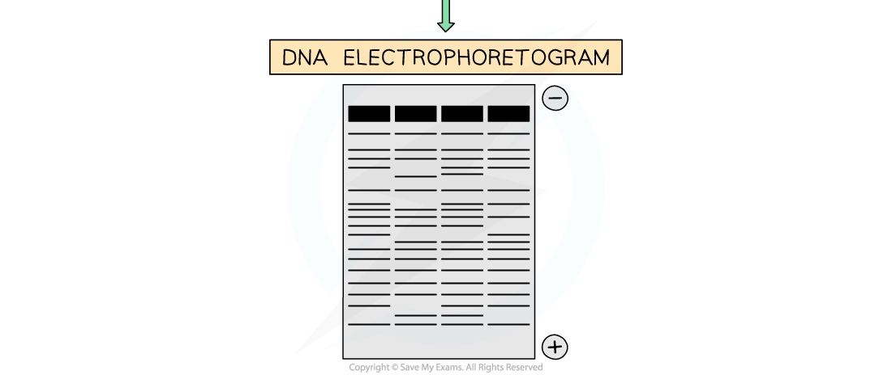
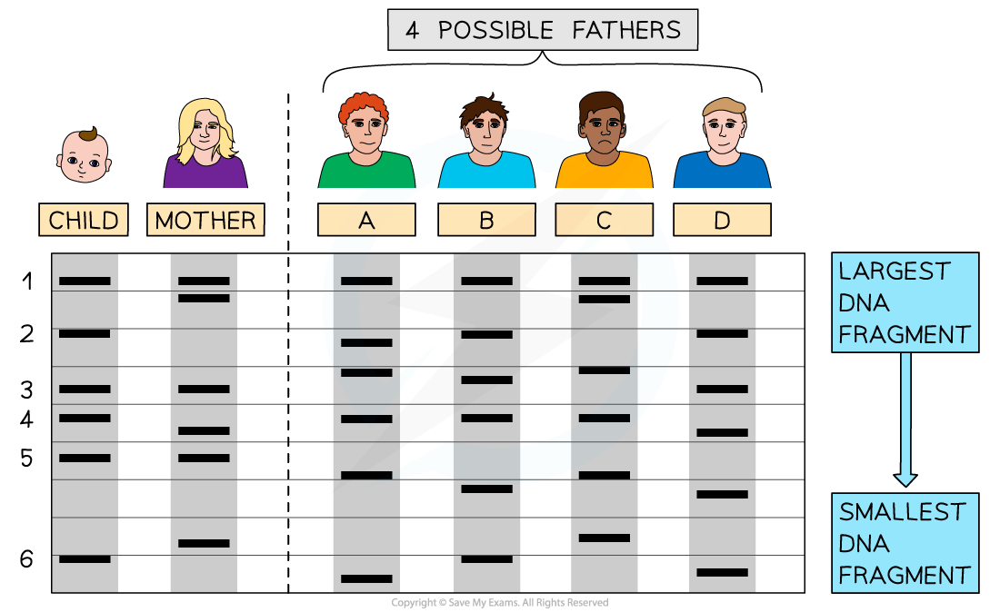

## Polymerase Chain Reaction

* Every person, with the exception of identical twins, has a **unique DNA sequence** which can be used to create a **DNA profile**

  + This is very useful in forensic science as it provides a way to **identify individuals**
  + DNA profiling can also be used to determine the **genetic relationships** between different organisms e.g.

    - Paternity and maternity testing
    - Ancestry kits
    - Determining evolutionary relationships between different species
* DNA profiles can be created using the following steps

  + Isolating a **sample of DNA** e.g. from saliva, skin, hair, or blood
  + Producing more copies of the DNA fragments in the sample using the **polymerase chain reaction** (PCR)
  + Carrying out **gel electrophoresis** on the DNA produced by PCR
  + **Analysing the resulting pattern** of DNA fragments

#### The polymerase chain reaction

* PCR is a common molecular biology technique used in most applications of gene technology e.g.

  + DNA profiling
  + Genetic engineering
* It can be described as an *in vitro* **method of DNA replication**
* PCR produces many copies of a piece of DNA; this can be referred to as DNA **amplification**

  + It is used to produce **large quantities** of specific fragments of DNA or RNA from very small quantities; even just one molecule of DNA or RNA is enough to run PCR
  + By using PCR scientists can produce billions of **identical copies** of the DNA or RNA sample within a few hours
  + In each PCR cycle the DNA is doubled, so in a standard run of 20 cycles a million DNA molecules are produced.
* The process is carried out in a PCR machine, or **thermal cycler,** which automatically provides the **optimal temperature** for each stage and controls the **length of time** spent at each stage

* Each PCR reaction requires

  + **DNA** or **RNA** to be amplified
  + **Primers**

    - These are short sequences of single-stranded DNA that have base sequences complementary to the 3’ end of the DNA or RNA being copied; they define the region that is to be amplified, identifying where the DNA polymerase enzyme needs to bind
  + **DNA polymerase**

    - The enzyme used to build the new DNA or RNA strand.
    - The most commonly used polymerase is ***Taq*****polymerase,** which comes from thermophilic bacterium *Thermus aquaticus*

      * *Taq* polymerase **does not denature** at the**high temperature** required during the first stage of the PCR reaction
      * The optimum temperature of *Taq*polymerase is high enough to prevent annealing of the DNA strands that have not been copied yet
  + **Free nucleotides**

    - Enable the construction of new DNA or RNA strands
  + **Buffer solution**

    - Ensures the optimum pH for the reactions to occur in

* There are three main stages of the PCR reaction

  + **Denaturation**

    - The double-stranded DNA is heated to 95 °C which breaks the hydrogen bonds that hold the two DNA strands together
  + **Annealing**

    - The temperature is decreased to 50-60 °C so that primers can anneal to the ends of the single strands of DNA
  + **Elongation / Extension**

    - The temperature is increased to 72 °C, as this is the optimum temperature for *Taq*polymerase to build the complementary strands of DNA to produce the new identical double-stranded DNA molecules
* These three stages make up a single PCR cycle, and **many cycles can be completed**

  + Each PCR cycle **doubles the amount of DNA**

***PCR can be used to amplify a fragment of DNA. Note that you don't need to know about forward and reverse primers***

* After PCR is completed the DNA is treated with **restriction enzymes** and a **fluorescent tag** can be added; both in preparation for **gel electrophoresis**

  + Restriction enzymes break the DNA up into fragments of different length
  + Fluorescent tags enable the DNA fragments to be seen under UV light

## Practical: Separation of DNA by Gel Electrophoresis

* Gel electrophoresis is a technique used widely in the analysis of DNA, RNA and proteins

  + DNA fragments are inserted into a well at the end of a piece of agar gel, before a current is passed through the gel
* Molecules move through the agar due to the difference in charge across the gel

  + **Positively charged molecules** will move towards the **cathode** (negative pole) while **negatively charged molecules** will move towards the **anode** (positive pole)
  + DNA is negatively charged due to the phosphate groups and so when placed in an electric field the molecules **move towards the anode**
* The **molecules are separated** according to their **size / mass**

  + **Different sized molecules** move through the gel at different rates
  + The tiny pores in the gel allow smaller molecules to move quickly, whereas larger molecules move more slowly

#### Apparatus

* Agarose gel
* Electrophoresis tank
* Electrolyte solution
* Micropipette
* Electrodes
* DNA samples to be tested
* DNA standard, or control
* Probes, e.g. fluorescent or radioactive, or stain

#### Method

1. Create an **agarose gel plate** in a tank and **cut wells** into the gel at one end
2. Submerge the gel in a tank containing **electrolyte solution;** this isa salt solution that conducts electricity
3. **Pipette the DNA samples into the wells** using a micropipette, ensuring the DNA standard is loaded into the first well

   * The purpose of the standard is to produce a set of known results with which to **compare** any new results
4. Connect the negative electrode to the end of the plate with the wells and connect the positive anode at the far end

   * The **DNA fragments** will then move towards the **anode** due to the attraction between the negatively charged phosphates of DNA and the anode
   * The **smaller mass / shorter pieces** of DNA fragments will move **faster and therefore further** from the wells than the larger fragments
5. **Probes are then added**, after which an **X-ray image** is taken or **UV-light is shone** onto the paper producing a **pattern of bands** which can be compared to the control. or standard, fragments of DNA

   * Probes are single-stranded DNA sequences that are complementary to the regions of interest; they can be

     + A radioactive label which causes the probes to emit radiation that makes the X-ray film go dark, creating a pattern of dark bands
     + A **fluorescent dye** which fluoresces when exposed to UV light, creating a pattern of coloured bands

***Gel electrophoresis can be used in DNA profiling***

#### Analysing the results of gel electrophoresis

* Gel electrophoresis produces a **pattern of bands** on the gel that represent DNA fragments of different length

  + The fragments were produced after PCR by cutting the DNA samples into pieces using restriction enzymes
  + Restriction enzymes cut DNA at specific locations in the DNA, so will always cut in between sections of repeated bases known as variable number tandem repeats (VNTRs)
  + Different people have different numbers of repeats in their VNTR regions, so the **fragments will differ in length** depending on whether there are few or many repeats
* Different individuals will have **different lengths of DNA fragments**, so a **different pattern of banding** will form on each profile
* Every banding pattern will be **unique to an individual**, so comparisons of DNA from crime scenes with that of suspects is a reliable way of finding out who was present at a crime scene

#### Examiner Tips and Tricks

Note that you don't need to understand the details regarding restriction enzymes and why fragments differ in length, but you should be able to explain how to carry out gel electrophoresis and understand the basis on which DNA profiles are analysed

## DNA Profiling

* DNA profiles can be used to determine the **genetic relationships** between people, e.g. in **paternity tests**

  + During a paternity test the **DNA profile of a child** is compared with a **variety of candidates** that could be the potential father
  + If **many bands** of the child's DNA profile **match with the bands in a paternity candidate's profile**, this could indicate that they are the **most likely** biological father

    - During fertilisation **half** of the DNA comes from each parent, so a child will share **half of their DNA with a parent**
    - When comparing DNA profiles, the **more bands that match** between the profiles, the **greater the genetic similarity**between those individuals and the closer the relationship
* DNA profiling can also be useful in **selective or captive breeding programmes** of animals or **cultivation of plants**

  + DNA profiles of the particular organisms can be **compared** to determine which are **genetically the most different** from each other
  + These organisms will then be crossbred, ensuring that the individuals that breed together are **not** closely related

    - Breeding between closely related individuals is known as **inbreeding**, and can cause genetic problems at an individual and population level

      * In individuals there can be an accumulation of harmful recessive alleles that might otherwise have been masked by healthy dominant alleles
      * Inbreeding leads to a **smaller gene pool** within a population, which can reduce a population's ability to adapt to change

***DNA profiles can be compared to determine relationships in paternity testing. Here the child shares bands 1, 3, and 5 with the mother and bands 2, 4, and 6 with candidate B, so candidate B is the most likely father***