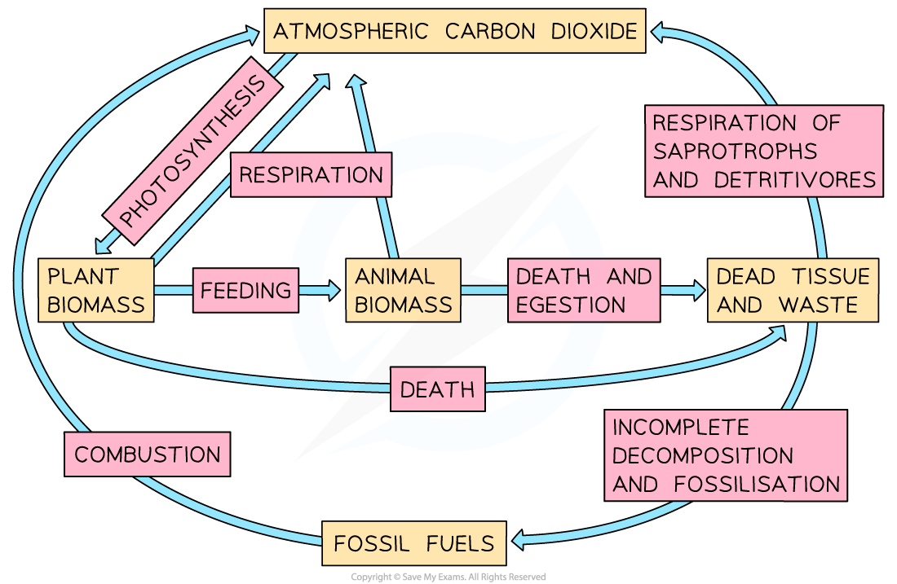

## Micro-organisms: Decomposition & Nutrient Recycling

* Dead plants and animals are **broken down** by microorganisms such as **bacteria** and **fungi**

  + These organisms are known as decomposers
* These decomposers **secrete enzymes** that break **large organic molecules** down into **smaller ones**

  + These small molecules, such as glucose, can be broken down further during **respiration**
* The microorganisms involved in decomposition produce **CO****2**and **methane** which are **released** into the atmosphere
* Carbon dioxide can then be **absorbed** by green plants which will **fix the carbon** back into carbohydrates during **photosynthesis**

***Microorganisms use biological molecules within dead tissue to fuel their respiration, releasing carbon back into the atmosphere as they do so***