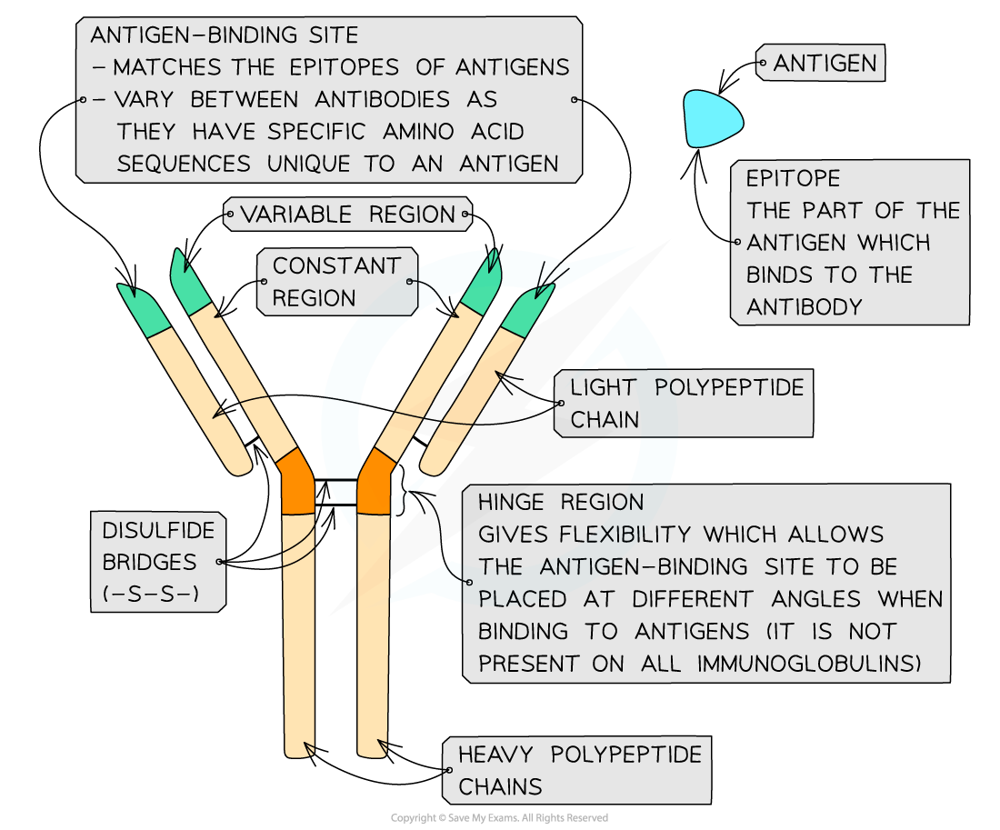
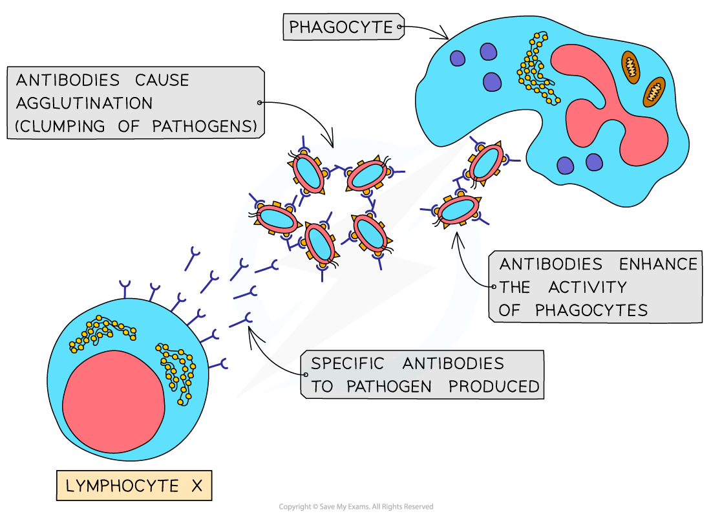

## The Role of Antigens & Antibodies

#### Antigens

* Every cell in the human body has **markers** on its cell surface membrane that **identify** it
* Microorganisms such as bacteria and viruses also have their own unique markers
* These markers are called **antigens** and they allow **cell-to-cell recognition**

  + Antigens are found on cell surface membranes, bacterial cell walls, or the surfaces of viruses
  + Some glycolipids and glycoproteins on the outside of cell surface membranes act as antigens
* Antigens can be either **self antigens** or **non-self antigens**

  + Antigens **produced by the organism's own body cells** are known as **self antigens**

    - Self antigens **do not** stimulate an immune response
  + Antigens **not produced by the organism’s own body cells** are known as **non-self antigens**

    - Non-self antigens**stimulate an immune response**
    - E.g. the antigens found on pathogenic bacteria and viruses, or on the surface of a transplanted organ
* After pathogens are engulfed by phagocytosis, phagocytes transfer the antigens of the digested pathogen to their cell surface membrane, becoming **antigen presenting cells**

  + Antigen presenting cells such as macrophages **activate the specific immune response**

    - This occurs when the white blood cells of the specific immune response, known as lymphocytes, **bind to the presented antigens** with specific receptors on their cell surface membranes
    - Note that **macrophages are a type of phagocytic white blood cell**

#### Antibody structure

* Antibodies are Y-shaped molecules sometimes known as **immunoglobulins**
* Antibodies consist of **four polypeptide chains;** **two ‘heavy’** chains attached by **disulfide bonds** to **two ‘light’** chains

  + 'Heavy' chains are long while 'light' chains are short
* Each polypeptide chain has a **constant region** and **variable region**

  + The **constant regions** **do not vary** within a class of antibody

    - There are 5 classes of mammalian antibodies, each with different roles
  + The amino acid sequences in the **variable region** are different for each antibody

    - The variable region is where the antibody binds to an antigen to form an **antigen-antibody complex**
    - At the end of the variable region is a site called the **antigen binding site**

      * The antigen binding sites **vary** greatly, giving the antibody its **specificity** for binding to **antigens**
* The **‘hinge’ region,** where the disulfide bonds join the heavy chains, gives flexibility to the antibody molecule, allowing the antigen binding site to be placed at different angles when binding to antigens

  + This region is not present in all classes of antibodies
* Antibodies can be either **membrane-bound** or **secreted directly** into the blood

  + Membrane-bound antibodies are **attached to the surface of lymphocytes**
  + The membrane-bound antibodies have an **extra section of polypeptide chain within their heavy chains** which forms the attachment to lymphocytes

    - This extra section of polypeptide is **not required** in antibodies that are not bound to lymphocytes
    - The gene which codes for the antibody heavy chains can undergo a process called **alternative splicing** to remove this extra section in non-bound antibodies

      * Splicing removes non-coding sections of mRNA called introns, while **alternative splicing removes coding sections called exons**; in this case the exons that **code for the the extra section** of the heavy chains are removed

***Antibodies are Y-shaped molecules consisting of four polypeptide chains. Note that the term epitope here refers to the part of the antigen that is recognised by the immune system; the variable regions of the antibody are*** **complementary** ***to the epitope of the antigen, allowing them to bind.***

#### Antibody function

* Antibodies bind to **specific antigens** that trigger the specific immune response
* Antibodies function to disable pathogens in several ways

  + Pathogens enter host cells by binding to them using receptors on their surface; antibodies can **bind to these receptors**, **preventing pathogens from infecting host cells**
  + Antibodies can act as **anti-toxins** by binding to toxins produced by pathogens, e.g. the bacteria that cause diphtheria and tetanus; this neutralises the toxins
  + Antibodies cause pathogens to clump together, a process known as **agglutination**; this reduces the chance that the pathogens will spread through the body and makes it possible for phagocytes to engulf a number of pathogens at one time

***Antibodies cause agglutination, which makes it difficult for the pathogens to infect host cells. This also makes it easier for the phagocytes to engulf the trapped pathogens***