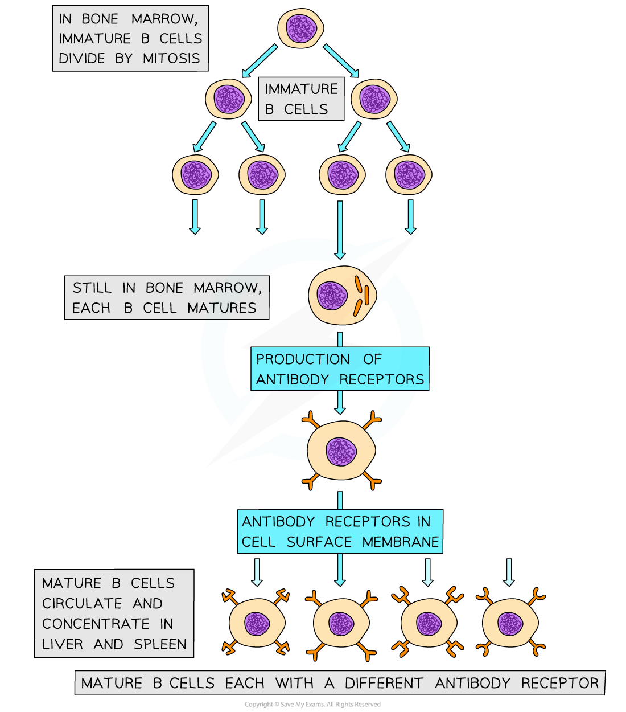

## B Cell Response

* **B cells,** also known as B lymphocytes, are a second type of white blood cell in the specific immune response

  + B cells remain in the **b**one marrow as they mature, hence the **B** in their name
* B cells have many **specific receptors** on their cell surface membrane

  + The receptors are in fact **antibodies**, and are known as **antibody receptors**
  + Each B cell has a **different type of antibody receptor**, meaning that each B cell can **bind to a different type of antigen**

***Mature B cells each have different types of antibody receptors on their cell surface membrane***

* If the corresponding antigen enters the body, B cells with the correct cell surface antibodies will be able to **recognise** it and bind to it

  + When the B cell binds to an antigen it forms an **antigen-antibody complex**
* The **binding of the B cell to its specific antigen**, along with the **cell signalling molecules produced by T helper cells**, **activates** the B cell
* Once activated the B cells divide repeatedly by mitosis, producing many clones of the original activated B cell
* The daughter cells differentiate into **two main types of cells**

  + **Effector cells,** which go on to form **plasma** **cells**

    - Plasma cells produce specific antibodies to combat non-self antigens
  + **Memory cells**

    - Remain in the blood to allow a faster immune response to the same pathogen in the future

***During a primary immune response B cells divide by mitosis to form plasma cells and memory cells. Note that a primary response occurs the first time an individual comes into contact with a particular pathogen***