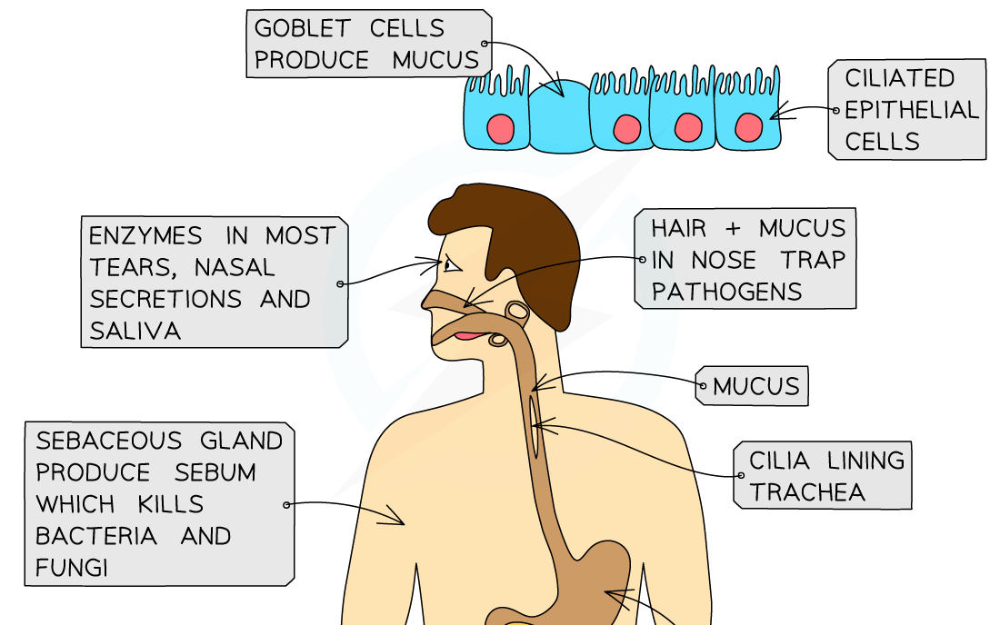
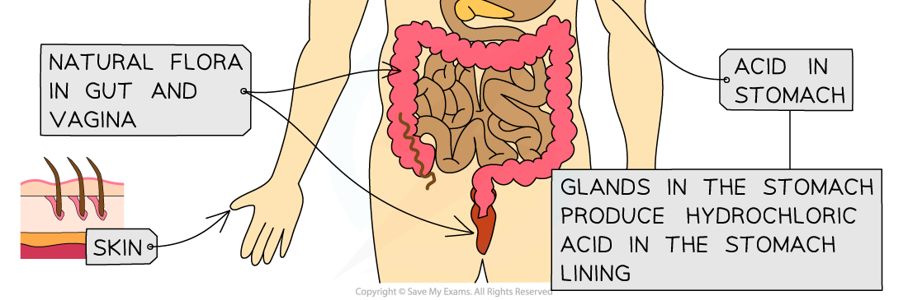

## Entry Routes of Pathogens

* In order for pathogens to cause disease they need to enter the body
* There are four main ways in which pathogens can enter

  + **Broken skin**

    - This provides direct access to the tissues and bloodstream
  + The **digestive system**

    - When we consume contaminated food and drink
  + The **respiratory system**

    - Every time we inhale
  + **Mucosal surfaces**

    - The lining of body cavities e.g. inside of nose, mouth, genitals

#### Barriers to infection

* Skin

  + This provides a **physical barrier** against infection
  + If the skin is damaged it leaves the exposed tissue beneath vulnerable to pathogens
  + The **blood clotting mechanism** of the body plays an important role in preventing pathogen entry in the case of damage to the skin
  + Blood clotting takes time, however, so a few pathogens may still enter before a clot forms
* Microorganisms of the gut and skin

  + Collectively these **harmless** microorganisms are known as the **gut** or **skin** **flora**
  + They **compete** with pathogens for resources, thereby **limiting** their numbers and therefore their ability to infect the body
* Stomach acid

  + The **hydrochloric acid** that makes up a large part of the gastric juices in the stomach creates an **acidic environment** that is **unfavourable** to many pathogens present on food and drink
  + Sometimes a few of these pathogens may survive and make their way to the intestines where they infect the gut wall cells and cause disease
* Lysozyme

  + Secretions of the **mucosal surfaces,** e.g. tears, saliva, and mucus, contains an enzyme called **lysozyme**
  + This enzyme will **damage bacterial cell walls**, causing them to burst, or lyse

***The body has physical defences that prevent the entry of pathogens***