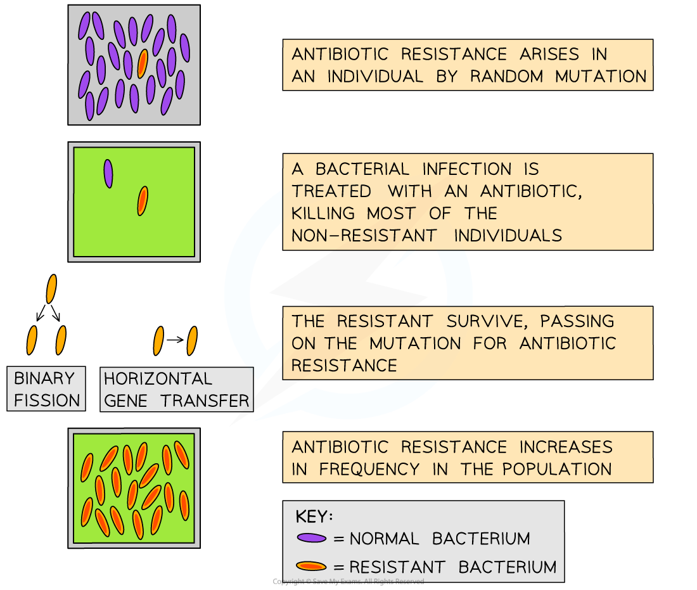

## Limiting Antibiotic Resistance

#### Hospital acquired infections

* Infections that are contracted by a patient while in hospital are known as **hospital acquired infections** (HAIs)
* The transmission of HAIs is increased by **poor hygiene practices** which might include

  + Staff and visitors **not washing hands** regularly
  + **Uncontained** coughing and sneezing
  + **Failing to disinfect** equipment and surfaces after use
* Patients in hospital are likely to already be ill and to have weakened immune systems, putting them at **high risk** of contracting infectious disease
* Hospitals have measures in place that aim to reduce the spread of HAIs

  + Staff and visitors must **wash hands regularly** while visiting patients
  + If a person contracts a HAI they should be moved to an **isolation ward**to prevent spread of the infection
  + Surfaces and equipment must be **disinfected** after every use

#### HAIs and antibiotic resistance

* Some HAIs are caused by **antibiotic resistant bacteria**

  + A well known example of an antibiotic resistant HAI is methicillin-resistant *Staphylococcus aureus*, also known as **MRSA**; in this case the bacterial strain of *S. aureus* has developed resistance to the antibiotic methicillin
* Antibiotic resistant infections are **difficult to treat** as they do not respond to regular antibiotics

  + These HAIs can cause **serious health complications** or **death**
* The risk of antibiotic resistant bacterial strains arising is high in hospital environments

  + Antibiotics are **widely used in hospitals** to treat disease which provides a **selection pressure** for resistant strains of bacteria to develop

    - Selection pressures are factors in the environment that **drive natural selection**

      * In ecology the presence of a predator would be an example of a selection pressure
* Certain hospital practices have been developed to **reduce the risk of antibiotic resistant HAIs**

  + **No** antibiotic prescriptions for **minor infections** or **viral diseases**
  + **No** use of antibiotics **as a preventative measure** against infections
  + Prescription of a **narrow-spectrum antibiotic** to treat the infection

    - Narrow-spectrum antibiotics are active against a **narrow range of bacterial infections**, as opposed to broad-spectrum antibiotics which are effective against many types of bacteria
    - The advantage of using narrow-spectrum antibiotics is that any resistance genes that arise will not cause problems if they are transferred to other types of bacteria, as those other types of bacteria will be treated with a different antibiotic

      * Bacteria are able to exchange genes with each other by a process of horizontal gene transfer
  + **Rotate the use of different antibiotics** to decrease the chance of bacteria developing resistance against one antibiotic

***Antibiotic resistance in bacteria arises by natural selection; it is therefore more likely to occur in environments where antibiotics are frequently used, such as hospitals***