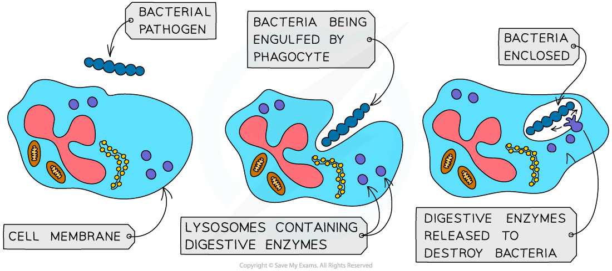

## Non-specific Immune Responses

* There are two types of immune response in the body once a pathogen enters

  + **Non-specific**

    - This response is the same, regardless of the pathogen that invades the body
  + **Specific**

    - This is a response specific to a particular pathogen
    - The immune system is able to recognise specific pathogens due to the presence of **antigens** on their cell surface

      * Antigens are molecules such as **proteins** or glycoproteins located on the surface of cells; their role is to act as an ID tag, **identifying a cell as being 'self' or 'non-self'**

        + Pathogens have **non-self antigens**, so the immune system recognises them as **not belonging to the body**
* When a pathogen invades tissue the non-specific immune response begins immediately; this includes

  + Inflammation
  + Interferons
  + Phagocytosis

#### Inflammation

* The surrounding area of a wound can sometimes become **swollen, warm and painful** to touch; this is **inflammation**
* Body cells called **mast cells** respond to tissue damage by secreting the molecule **histamine**

  + Histamine is a **chemical signalling molecule** that enables **cell signalling**, or communication between cells
* Histamine stimulates the following responses

  + Vasodilation increases blood flow through capillaries
  + **Capillary walls become 'leaky'**, or **more permeable**, allowing fluid to enter the tissues and creating swelling

    - Some plasma proteins leave the blood when the capillaries become more permeable
  + **Phagocytes** leave the blood and enter the tissue to **engulf foreign particles**
  + Cells release **cytokines**, another cell signalling molecule that triggers an immune response in the infected area

#### Interferons

* Cells infected by viruses produce **anti-viral proteins** called **interferons**
* Interferons **prevent viruses from spreading** to uninfected cells

  + They **inhibit** the production of viral proteins, preventing the virus from replicating
  + They **activate** white blood cells involved with the **specific immune response** to destroy infected cells
  + They **increase the non-specific immune response** e.g. by promoting inflammation

#### Phagocytosis

* **Phagocytes** are a type of white blood cell responsible for **removing dead cells and invasive microorganisms**; they do this by engulfing and digesting them

  + The process of engulfing and digesting is known as **phagocytosis**
* Phagocytes travel throughout the body and can leave the blood by **squeezing through capillary walls**
* During an infection they are released in **large numbers**
* Mode of action

  + **Chemicals** released by pathogens, as well as chemicals released by the body cells under attack, e.g. histamine,**attract phagocytes** to the site where the pathogens are located
  + They move towards pathogens and **recognise** **the antigens** on the surface of the pathogen as being **non-self**
  + The **cell surface membrane** of a phagocyte extends out and around the pathogen, **engulfing it** and trapping the pathogen within a **phagocytic vacuole**

    - This part of the process is known as **endocytosis**
  + Enzymes are released into the phagocytic vacuole when **lysosomes** **fuse** with it
  + These digestive enzymes, which includes lysozyme, **digest** **the pathogen**
  + After digesting the pathogen, the phagocyte will **present the antigens** of the pathogen on its cell surface membrane

    - The phagocyte becomes what is known as an **antigen presenting cell**
  + The presentation of antigens **initiates the specific immune response**

***Phagocytes engulf pathogens in the process of phagocytosis, enclosing them in a phagocytic vacuole. Lysosomes fuse with the vacuole, releasing enzymes which digest the pathogen.***