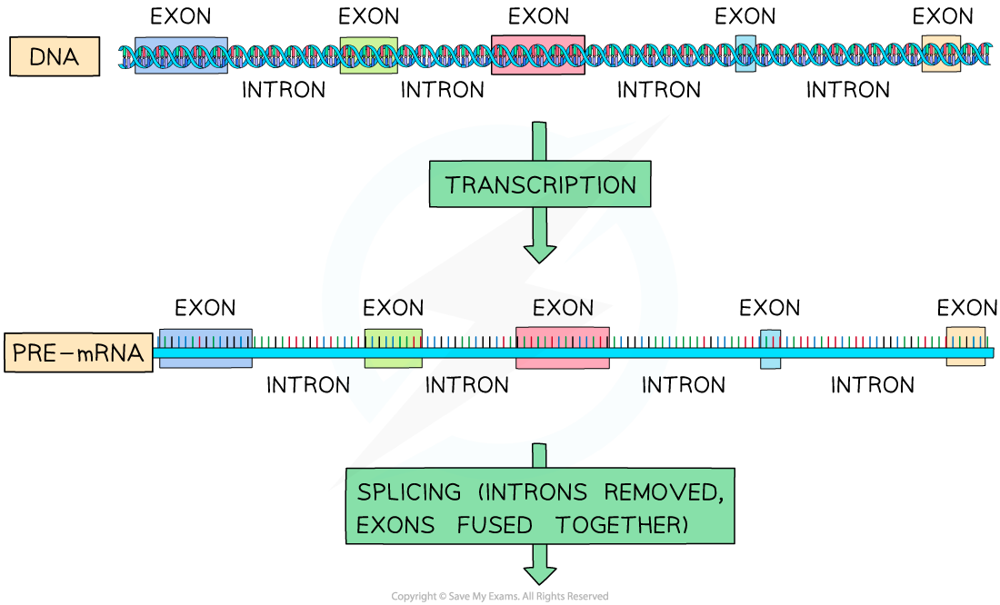
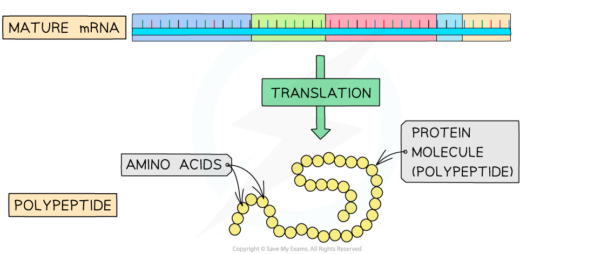
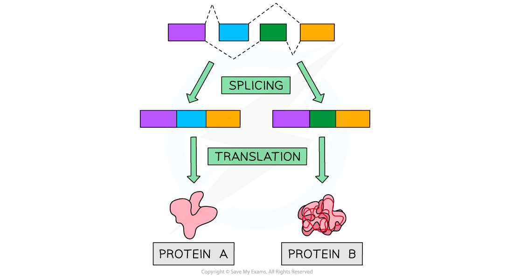

## Post-transcriptional Modification

* Antibody molecules consist primarily of **protein**
* They contain four separate polypeptide chains, two of which are longer, **heavy chains**, and two of which are shorter, **light chains**
* The structure of the heavy chain determines whether an antibody will be **bound to the membrane of a white blood cell**, or **secreted directly** into the blood
* Some heavy chains contain an **extra section which allows the antibody to bind to the surface** of a white blood cell
* White all heavy chains are **coded for by the same gene**, post-transcriptional modification determines whether or not this **extra section of protein** is present in the heavy chain of an antibody
* **Post transcriptional modification** mechanisms include

  + Splicing
  + Alternative splicing

#### Splicing

* Polypeptides are made during the process of protein synthesis, during which the DNA base code is transcribed and translated
* The DNA code within eukaryotic cells contains many **non-coding sections**
* Non-coding DNA can be found within genes; these sections are called **introns,** whilesections of coding DNA are called **exons**
* During transcription eukaryotic cells transcribe both introns and exons to produce**pre-mRNA** molecules
* Before the pre-mRNA exits the nucleus, a process called **splicing** occurs

  + The non-coding intron sections are removed
  + The coding exon sections are joined together
  + The resulting mRNA molecule contains **only the coding sequences** of the gene
* Since these modifications are made after transcription occurred, they are called **post-transcriptional modifications**

***Pre-mRNA is spliced before it exits the nucleus***

#### Alternative splicing

* The exons of genes can be spliced in many different ways to produce **different mature mRNA** molecules through **alternative splicing**
* This means that a single eukaryotic gene can code for **more than one** polypeptide chain

  + E.g. depending on the exons that are removed from the gene coding for the antibody heavy chain, it can produce either a membrane-bound or a directly secreted antibody

***Alternative splicing of a gene can produce more than one type of protein***