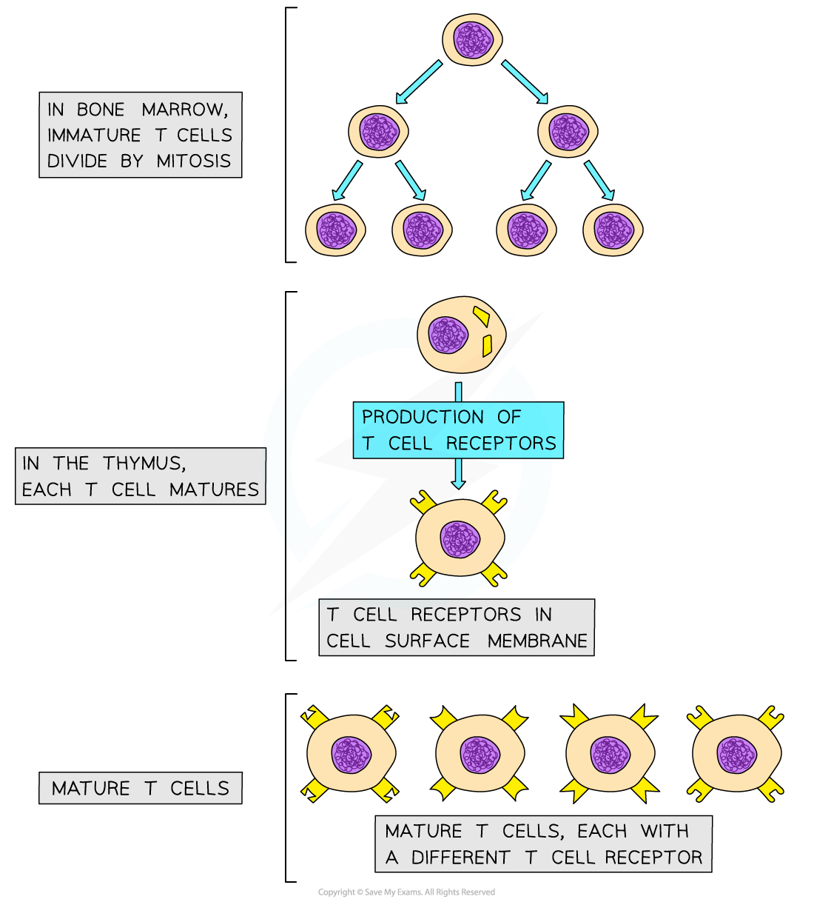

## T Cell Response

* **T cells**, sometimes known as T lymphocytes, are a **type of white blood cell** involved with the specific immune response

  + They are produced in the bone marrow and finish maturing in the **t**hymus, which is where the **T** in their name comes from
* Mature **T cells** have specific cell surface receptors called **T cell receptors**
* These receptors have a **similar structure to antibodies** and are each **specific to a particular type of antigen**

***Mature T cells have many different types of receptor on the cell surface membrane; these receptors will bind to different antigens on antigen presenting cells***

* T cells are **activated** when they encounter and **bind to their specific antigen** on the surface of an antigen presenting cell

  + This **antigen-presenting** cell might be a **macrophage,** an **infected body cell**, or the **pathogen** itself
* These activated T cells **divide** **by** **mitosis** to increase in number

  + Dividing by mitosis produces **genetically identical cells**, or **clones**, so all of the daughter cells will have the **same type of T cell recepto**r on their surface
* As they divide by mitosis the T cells differentiate into **three main types** of T cell

  + **T helper cells**

    - Release chemical signalling molecules that help to **activate B cells**
  + **T killer cells**

    - Bind to and **destroy infected cells** displaying the relevant specific antigen
  + **T memory cells**

    - **Remain in the blood** and enable a faster specific immune response if the same pathogen is encountered again in the future