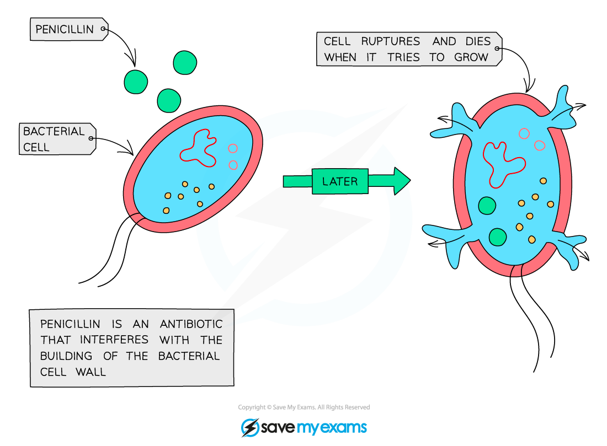
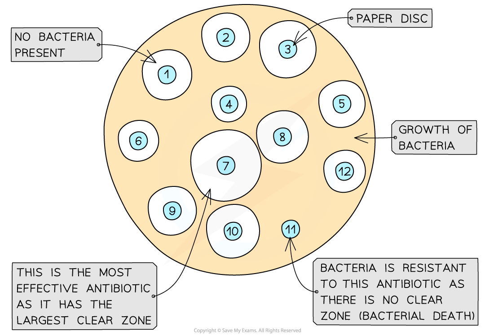

## Types of Antibiotics

* When humans experience a bacterial infection, they are often prescribed **antibiotics**
* Antibiotics are chemical substances that **damage bacterial cells** with little or no harm to human tissue

  + **Penicillin** is a well-known example; it was discovered in 1928 by Sir Alexander Fleming
* Antibiotics are either

  + **Bactericidal;** they kill bacterial cells
  + **Bacteriostatic;** they inhibit bacterial growth processes

    - Note that bacteriostatic antibiotics given at a high enough dose will result in the death of bacterial cells
* Antibiotics work by **interfering with the growth or metabolism of the target bacterium**e.g.

  + **Inhibiting bacterial enzymes** needed to form bonds in the cell walls; this prevents bacterial growth and can cause death

    - Cell walls are weakened and burst under the pressure of water entering the cell by osmosis
  + Binding to ribosomes and **preventing protein synthesis;** this inhibits enzyme production, stopping metabolic processes in the bacterial cell
  + Damaging cell membranes, leading to **loss of useful metabolites** or **uncontrolled entry of water**
  + Preventing bacterial DNA from coiling into rings, meaning that it **no longer fits into the bacterial cell**
* Since mammalian cells are **eukaryotic,** they **will not be damaged** by antibiotics

  + They do not have cell walls
  + They have different enzymes
  + They have different ribosomes
* **Viruses** do not have cellular structures such as enzymes, ribosomes, and cell walls so they **are not affected** by antibiotics

***Penicillin prevents the formation of a strong cell wall in prokaryotes, ultimately leading to the death of the cell by lysis***

## Practical: Investigating Effects of Different Antibiotics

* The effectiveness of different antibiotics in preventing the growth of specific types of bacteria can be studied using **aseptic techniques**
* Aseptic techniques involve the use of **sterile** **equipment** and require a researcher to work in a **sterile environment**

  + Sterile refers to the **absence of microorganisms**

    - Equipment can be sterilised by washing at high temperatures or with antibacterial chemicals
    - Work benches can be wiped with antibacterial chemicals
    - An updraft can be created to ensure sterile air around a work space e.g. by placing a Bunsen burner next to the work bench

#### Apparatus

* Bacterial culture
* Disinfectant
* Bunsen burner
* Agar plates
* Pipettes
* Plastic spreader or metal inoculating loop
* Antibiotics and paper discs, or antibiotic infused paper discs
* Distilled water
* Forceps

#### Method

1. Set up your sterile work area by wiping surfaces with disinfectant and setting up a Bunsen burner

   * The Bunsen burner will create an **updraft** and prevent microorganisms in the air from landing in the work area
2. Transfer some of the bacterial culture on to an agar plate using a sterile pipette and spread it out using a sterile spreader or inoculating loop

   * Plastic equipment can be set aside for **washing** after each use
   * Metal equipment, e.g. inoculating loops, can be **sterilised in a Bunsen flame** after each use
3. Soak similar sized paper discsin different types of antibiotics, e.g. Methicillin, Tetracycline and Streptomycin

   * An alternative to using different types of antibiotics could be to use different concentrations of the same antibiotic
   * Note that you can use paper discs that have been pre-treated with antibiotics as an alternative to soaking
4. Add a negative control to the investigation by soaking a disc in distilled water

   * This provides a point of comparison, demonstrating that any results gained are due to the changes in antibiotic type and not any other factor
5. Space the discs apart on the agar plate using sterile forceps

   * Place the forceps in a container filled with disinfectant after use, or **sterilise in a Bunsen flame**
6. Lightly tape a lid onto the petri dish, invert and incubate at 25 °C for 24 to 48 hours

   * Lightly taping rather than sealing ensures that **oxygen is available** to the bacteria
   * Inverting the dish, i.e. storing it upside down, prevents condensation from dripping onto the agar, potentially **contaminating** the dish
   * Incubating at around room temperature prevents the growth of **harmful pathogens**; research laboratories may use warmer temperatures to achieve faster results

* Bacteria will grow to form a 'lawn' on top of the agar
* Any clear patches in the lawn will indicate where bacteria could not grow

  + This is called the **clear zone**

#### Interpretation of results

* The **larger the clear zone**, the **more effective the antibiotic** was at inhibiting bacterial growth
* If **no clear zone** is present, it means that the bacteria is **resistant** to that type of antibiotic
* The sizes of the clear zones can be compared between the **different types of antibiotics**, as well as the **different concentrations of each**

***The presence and size of clear zones around the paper discs indicates the effectiveness of an antibiotic against the type of bacteria used***