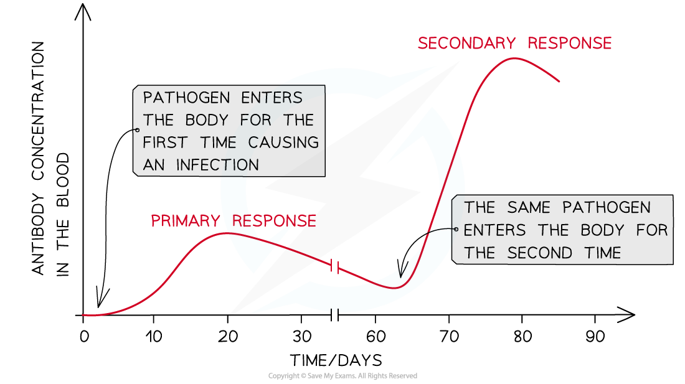
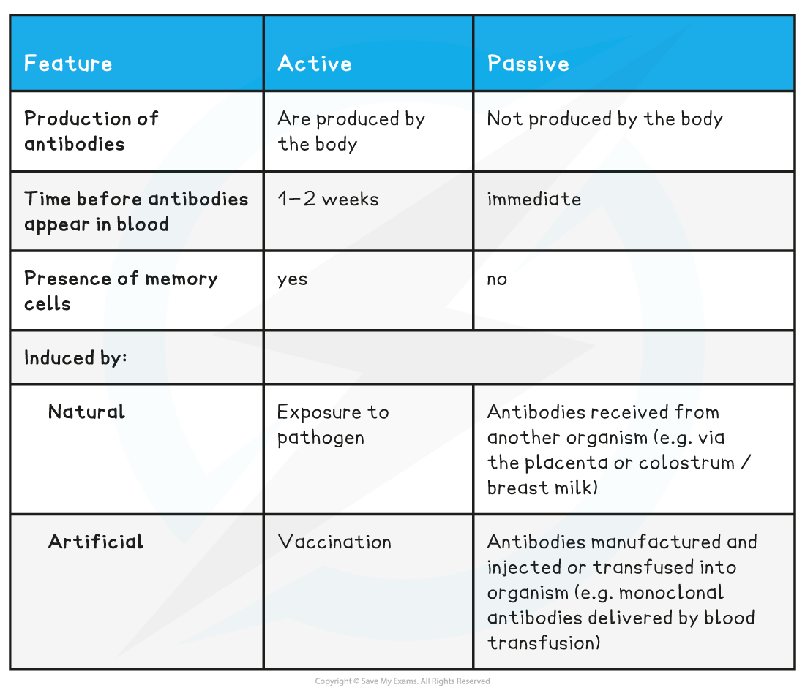

## Types of Immunity

#### Developing immunity

* The immune system is **activated** when a **new antigen is encountered**
* This launches a **primary immune response** consisting of a **non-specific immune response** followed by a **specific immune response**

  + The primary response occurs the **first time** an antigen is encountered by the immune system
* Since it is the first time the immune system has encountered the antigen, the numbers of **T and B cells with the correct membrane receptors** present in the blood will be **low**
* It will **take time** for the correct T and B cells to be activated and to divide and differentiate into different cell types

  + It can take several days before **plasma cells** develop and are able to start producing **antibodies** against an antigen
  + This is the reason why an infected person will **experience symptoms** of the disease the first time they contract it
* Both T and B cells produce **memory cells** during the primary response, which will remain in the blood after an infection is over

  + The presence of memory cells means that a person is said to be **immune** to the pathogen
* Should the immune system encounter the same antigen again in the future it will launch a **secondary immune response** which will be much **faster** and **stronger** than the primary response

  + Memory cells are present in larger quantities than the mature lymphocytes at the start of the primary response, so the correct memory cells are able to detect an antigen, activate, multiply by mitosis, and differentiate much more quickly
  + Antibodies are produced **more quickly** and in **larger quantities** in a secondary response
* This will often eliminate the pathogen **before the infected person can show symptoms**

***The secondary response is much larger and faster than the primary response due to the presence of memory cells in the blood***

#### Active immunity

* **Active immunity** is acquired when an antigen enters the body triggering a specific immune response
* Active immunity can be

  + **Natural**; acquired through exposure to pathogens
  + **Artificial;** acquiredthrough vaccination
* In both cases the body **produces memory cells,** giving the person **long-term immunity**

#### Passive immunity

* **Passive immunity** is acquired without an immune response; antibodies are gained from another source, not produced by the infected person
* Passive immunity can be

  + **Natural**

    - Foetuses receive antibodies across the **placenta** from their mothers
    - Babies receive antibodies in breast milk
  + **Artificial**

    - People can be given an **injection / transfusion** of antibodies e.g. the tetanus antitoxin
    - The antibodies will have been collected from people or animals whose immune system had been triggered by a vaccination to produce antibodies
* As the person’s immune system has not been activated, there are **no memory cells**that can enable antibody production in a secondary response; if a person is reinfected they would need another infusion of antibodies

**Comparing Active & Passive Immunity Table**

#### Vaccines

* A **vaccine** contains **antigens** that are intentionally put into the body to induce **artificial active immunity**

  + Vaccines can contain dead or weakened pathogens, less harmful strains of a pathogen, antigens alone, or a piece of genetic material that codes for the antigens
* Vaccines are administered either by injection or by mouth
* **Vaccinations** produce long-term immunity as they cause **memory cells**to be created.
* The immune system recognises the antigen when re-encountered and produces antibodies in a faster, stronger **secondary response**

  + This is the main reason why vaccinated individuals typically do not show symptoms of the diseases they were vaccinated against
* **Antigenic variation** can mean that vaccinations need to be constantly modified to keep up with the changes to a pathogen's antigens

  + Antigenic changes are the result of mutation