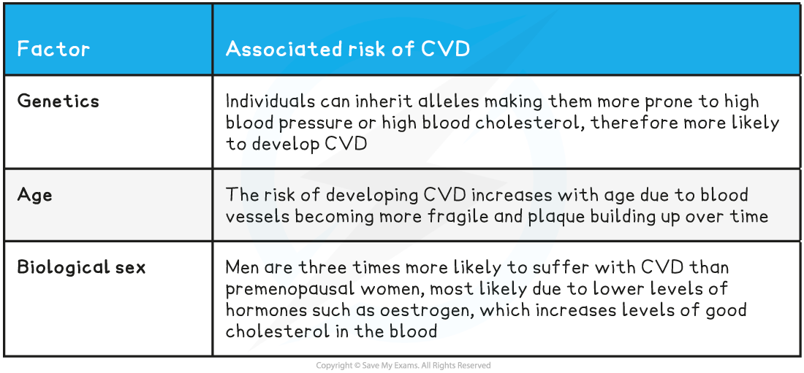

## Cardiovascular Disease

* There are many **lifestyle factors** that can **increase the risk of cardiovascular disease (CVD)**

  + CVD is a general term for conditions affecting the heart and blood vessels
  + It is usually associated with

    - **Atherosclerosis**; the formation of hard plaques in the artery lining
    - **Thrombosis**; the formation of blood clots in the arteries
* **Risk factors** are factors that can be linked to an **increased risk of a disease**

  + Exposure to a risk factor doesn’t guarantee that an individual will suffer a disease, e.g. a person who smokes regularly isn’t guaranteed to develop lung cancer but their risk compared to someone who doesn’t smoke is much higher
  + Certain risk factors are correlated with certain diseases, but **correlations are not always causations**

* Risk factors can be

  + Aspects of a person’s **lifestyle** such as the food they eat or whether or not they drink alcohol
  + **Substances in a person’s body or environment** such as air pollution in a crowded city or asbestos in old buildings
  + **Genetic predispositions** to developing certain diseases
  + Other **biological factors** such as age or biological sex
* Many diseases are caused by the **interaction** of a number of factors

  + E.g. the chance of developing CVD is higher in individuals who have a diet high in cholesterol, don’t exercise regularly, and smoke; all of these behaviours increase the likelihood of damage occurring to the arteries
* Some factors, such as those related to lifestyle, are to some extent **under the control of the individual**

  + It is usually possible to **make decisions** about diet, smoking, alcohol intake, and exercise levels
  + Note that scientists are becoming increasingly aware that the best choices are easier to make for some than others; unhealthy food choices are often cheaper and easier, and not everyone has time to exercise
* Other factors are **outside of an individual's control**, such as genetics, biological sex, and age

**Lifestyle Factors Linked to CVD Table**

**Other Factors Linked to CVD Table**

