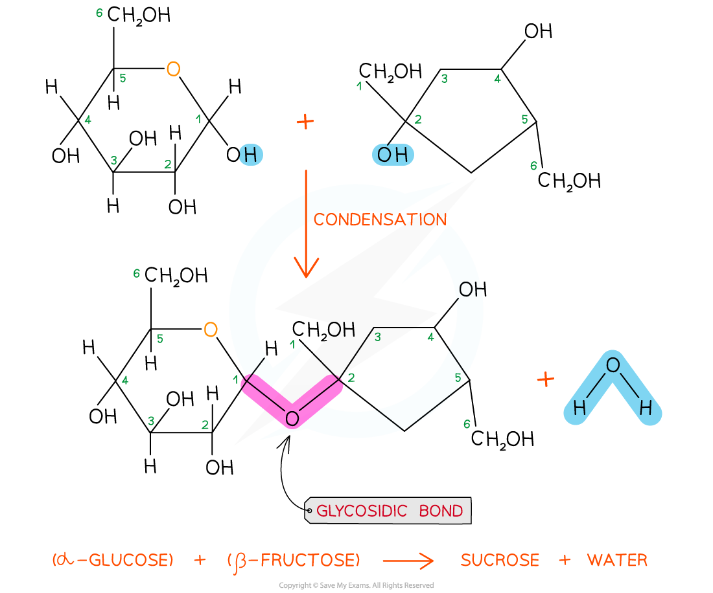

## Disaccharides: Structure

* **Two monosaccharides** can join together via **condensation reactions** to form **disaccharides**

  + A condensation reaction is one in which two molecules join together via the formation of a new chemical bond, with a **molecule of water** being **released** in the process
  + The new chemical bond that forms between two monosaccharides is known as a **glycosidic bond**

* Common examples of disaccharides include

  + **Maltose**

    - Contains two molecules of glucose linked by a 1,4 glycosidic bond

      * This means that the glycosidic bond is located between carbon 1 of one monosaccharide and carbon 4 of the other
  + **Sucrose**

    - Contains a molecule of glucose and a molecule of fructose linked by a 1,2 glycosidic bond

      * This means that the glycosidic bond is located between carbon 1 of one monosaccharide and carbon 2 of the other
  + **Lactose**

    - Contains a molecule of glucose and a molecule of galactose linked by a 1,4 glycosidic bond

***Sucrose is a disaccharide formed from a molecule of glucose (left) and a molecule of fructose (right) joined together by a 1,2 glycosidic bond***

## Disaccharides: Function

* The function of disaccharides is to **provide the body with a quick-release source of energy**

  + Disaccharides are made up of two sugar molecules so they're easily broken down by enzymes in the digestive system into their respective monosaccharides and then absorbed into the bloodstream
* Due to the presence of a large number of hydroxyl groups, **disaccharides are easily soluble in water**

  + These hydroxyl groups form hydrogen bonds with the water molecules when dissolved in aqueous solutions
* Just like monosaccharides they are **sweet in taste**

  + Sucrose, also known as table sugar, is an example