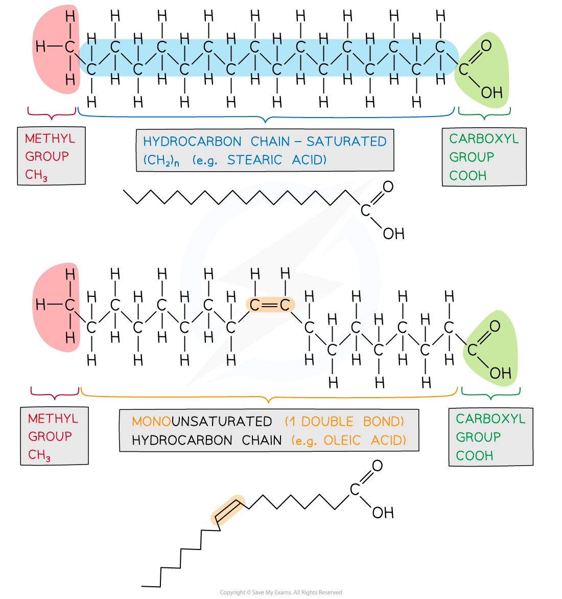
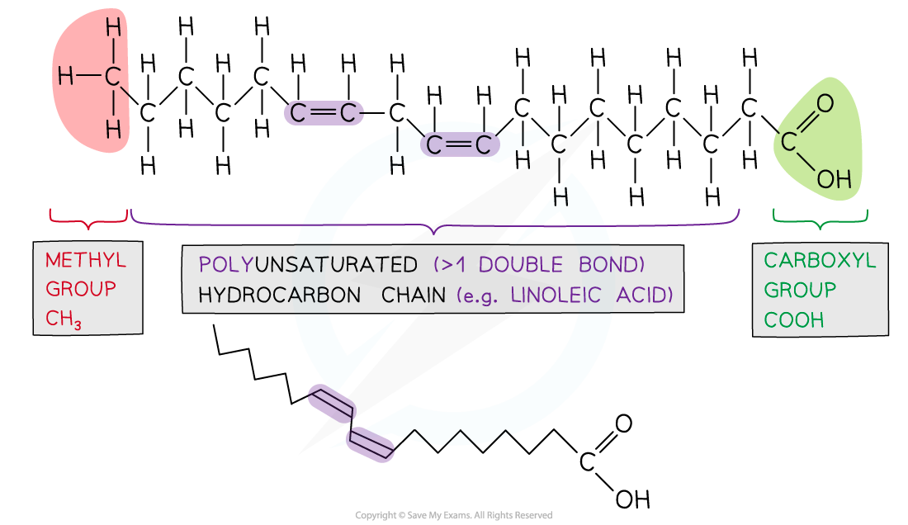
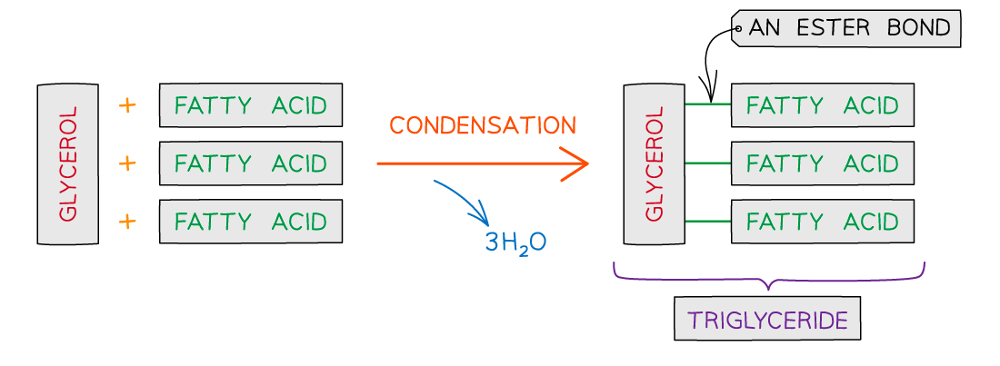

## Lipids

#### Lipids

* Lipids are macromolecules that contain carbon, hydrogen and oxygen atoms. Unlike carbohydrates, lipids contain a lower proportion of oxygen
* Lipids are non-polar and **hydrophobic** (**insoluble** in water)
* Triglycerides are a kind of lipid that forms the main component of fats and oils
* Lipids play an important role in **energy yield, energy storage, insulation and hormonal communication**

#### Triglycerides

* Are non-polar, hydrophobic molecules
* The monomers are **glycerol** and **fatty acids**
* Glycerol is an alcohol (an organic molecule that contains a hydroxyl group bonded to a carbon atom)
* Fatty acids contain a **methyl** group at one end of a **hydrocarbon** chain known as the R group (chains of hydrogens bonded to carbon atoms, typically 4 to 24 carbons long) and at the other is a **carboxyl** group

  + The shorthand chemical formula for a fatty acid is **RCOOH**
* **Fatty acids** can vary in two ways:

  + **Length** of the hydrocarbon chain (R group)
  + The fatty acid chain (R group) may be **saturated** (mainly in animal fat) or **unsaturated** (mainly vegetable oils, although there are exceptions e.g. coconut and palm oil)
* **Saturated** fatty acids contain **no carbon-carbon double bonds**

  + The hydrocarbon chain is **saturated with hydrogen atoms** due to the absence of double bonds
  + They form unbranched, linear chains
* **Unsaturated** fatty acids can be **mono** or  **poly****-unsaturated**

  + If H atoms are on the same side of the double bond they are *cis*-fatty acids and are metabolised by enzymes
  + If H atoms are on opposite sides of the double bond they are *trans*-fatty acids and cannot form enzyme-substrate complexes, therefore, are not metabolised. They are linked with coronary heart disease

***Examples of different types of fatty acids with the functional groups and presence of double bonds highlighted***

#### Function of lipids

* Triglycerides are **fats and oils**
* **Fatty acid and glycerol molecules** are the components that make up triglycerides
* Fats and oils have a number of important functions in organisms: **energy storage,** **insulation**, **buoyancy**, and **protection**

## The Ester Bond

* Triglycerides are formed by **esterification**
* An **ester bond** forms when a hydroxyl (-OH) group from glycerol bonds with the carboxyl (-COOH) group of the fatty acid

  + The formation of an ester bond is a **condensation reaction**
  + For each ester bond formed a water molecule is released
  + **Three fatty acids** join to **one glycerol** molecule to form a **tri**glyceride
  + Therefore for one triglyceride to form, **three water molecules** are released

***Formation of a triglyceride from a glycerol molecule and three fatty acid molecules by the process of esterification***

#### Examiner Tips and Tricks

Ensure you are confident with the structure of a triglyceride so you can recognise whether they are saturated or unsaturated.