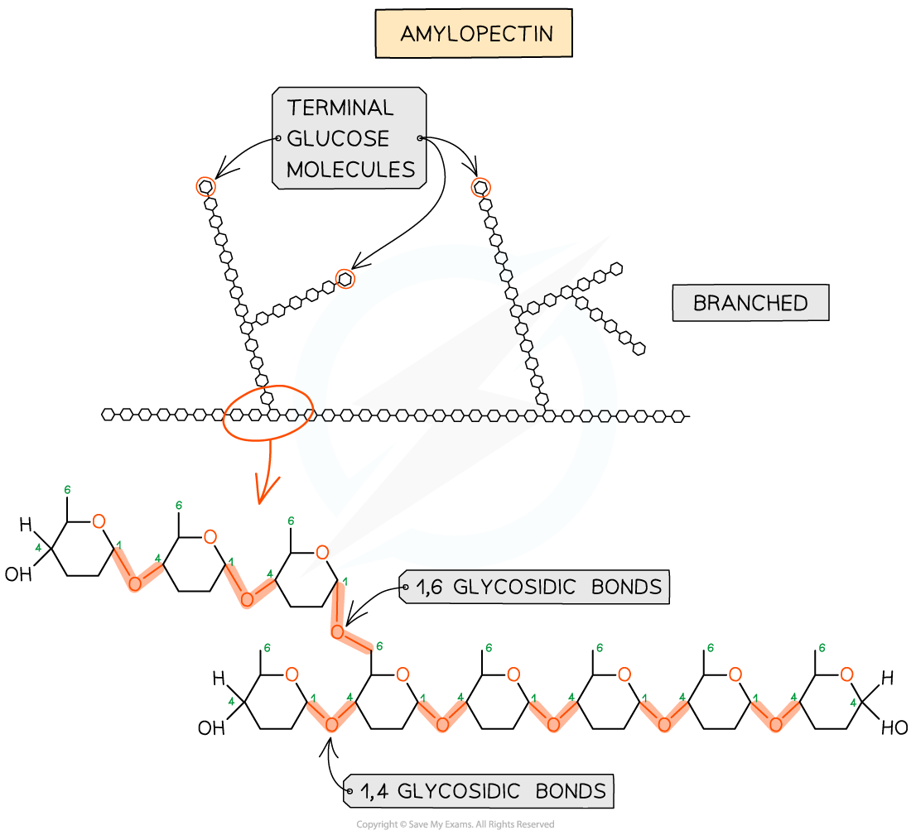
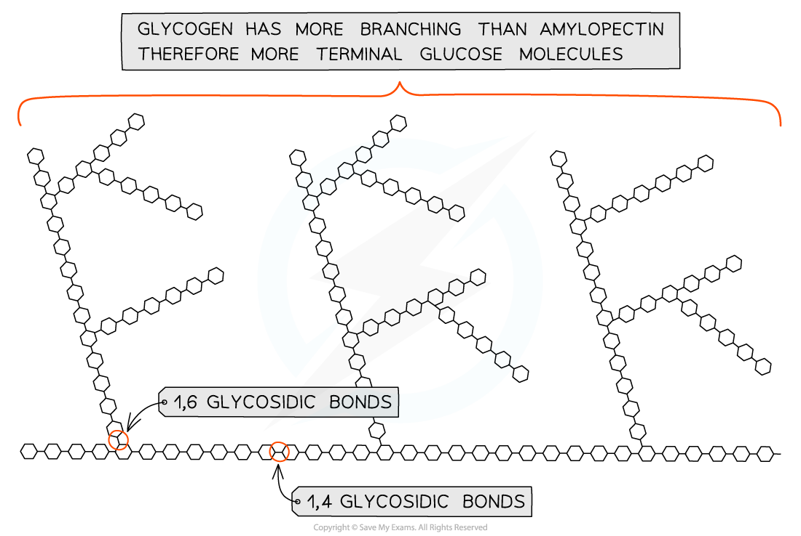
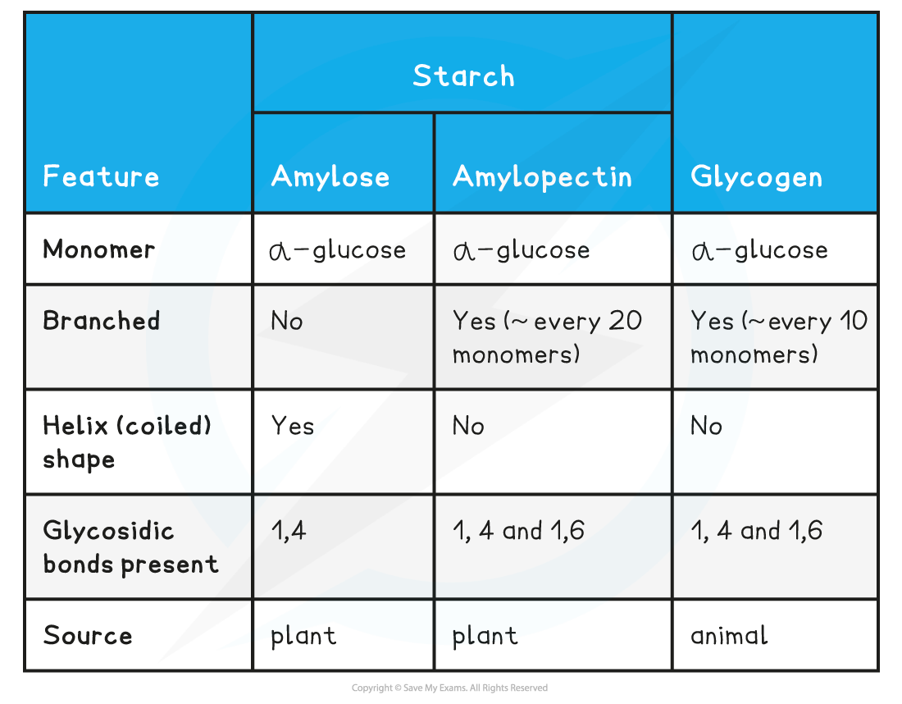
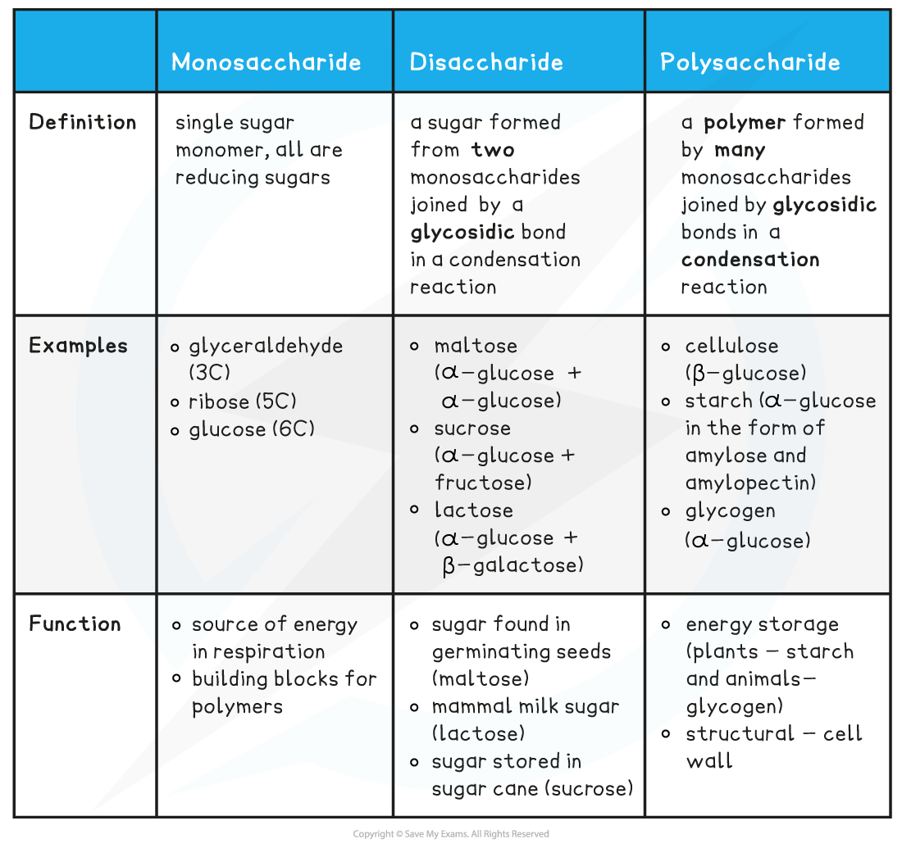

## Polysaccharides: Structure

* Starch, glycogen, and cellulose are examples of **polysaccharides**

  + Polysaccharides are carbohydrate polymers; repeated chains of many monosaccharides **joined by glycosidic bonds** in a **condensation reaction**
* Polysaccharides may be

  + **Branched** or **unbranched**

    - Being branched increases the rate at which a polysaccharide can be broken down
  + **Straight** or **coiled**

    - Being straight makes the molecules suitable for constructing cellular structures e.g. cellulose
    - Being coiled makes a molecule more compact and suitable for storage e.g. amylose in starch

* **Starch** and **glycogen** are useful as storage polysaccharides because they are

  + **Compact;** large quantities can be stored
  + **Insoluble;** theywill have **no osmotic effect,** unlike glucose which would increase the solute concentration of a cell and causing water to move in by osmosis

#### Starch

* Starch is the **storage** polysaccharide of **plants**

  + It is stored as granules inside plant cells
  + Plants make glucose during **photosynthesis** and the molecules of glucose are joined to make the polysaccharide starch
* Starch is constructed from **two** **different** **polysaccharides**

  + **Amylose**

    - Unbranched **helix-shaped** chain with 1,4 glycosidic bonds between α-glucose molecules

      * A helix is a spiral shape
    - The helix shape enables it to be more compact and thus more can be stored
  + **Amylopectin**

    - A **branched molecule** containing 1,4 glycosidic bonds between α-glucose molecules **and** 1,6 glycosidic bonds
    - The branches result in many terminal glucose molecules that can be **easily hydrolysed** for use during cellular respiration or added to for storage

***Amylose is a helix-shaped polysaccharide found in starch, the storage polysaccharide in plants***

***Amylopectin is a branched polysaccharide found in starch***

#### Glycogen

* Glycogen is the **storage polysaccharide** of **animals and fungi**

  + It is highly **branched** and not coiled
  + It contains both **1,4 and 1,6 glycosidic bonds**
* Glycogen is **more branched than amylopectin**

  + The branching provides more terminal glucose molecules which can either be **added to or removed by hydrolysis**; this allows the **quick** storage or release of glucose to suit the demands of the cell

    - This is essential in animal cells as animals are very metabolically active
* Glycogen is compact which means that much can be stored in a small space

  + Liver and muscles cells have a high concentration of glycogen, present as**visible granules;**this enables a high cellular respiration rate

***Glycogen is a highly branched molecule used as a storage polysaccharide in animals and fungi***

**Summary of Storage Polysaccharides Table**

**Types of Carbohydrate Summary Table**

#### Examiner Tips and Tricks

Although cellulose is an important polysaccharide you do not need to know about it in this topic

Make sure you are clear on the differences between starch and glycogen.

## Polysaccharides: Function

* **Starch** and **glycogen** are **storage** polysaccharides; they are adapted for this function by being

  + **Compact**

    - Large quantities can be stored
  + **Insoluble**

    - They will have **no osmotic effect** on cells, unlike glucose which can dissolve and raise the solute concentration of cell cytoplasm, causing water to move into cells by osmosis

#### Starch

* Starch is the **storage** polysaccharide of **plants;** it is stored as granules in **plastids**

  + Plastids are **membrane-bound organelles** that can be found in plant cells

    - They have a specialised function, e.g. amyloplasts store starch grains and chloroplasts carry out photosynthesis
* The **amylose** in starch has a helical structure which makes it very compact, meaning that much can be stored in a small space
* The **amylopectin** in starch has branches that provide many terminal glucose molecules that can be **easily hydrolysed** for use during cellular respiration or added for storage

#### Glycogen

* Glycogen is the **storage** polysaccharide of **animals** and **fungi**
* Glycogen is **more branched than amylopectin**

  + The branching provides more terminal glucose molecules which can either be **added to or removed by hydrolysis**; this allows the **quick** storage or release of glucose to suit the demands of the cell

    - This is essential in animal cells as animals are very metabolically active
* Glycogen is compact which means that much can be stored in a small space

  + Liver and muscles cells have a high concentration of glycogen, present as**visible granules;**this enables a high cellular respiration rate