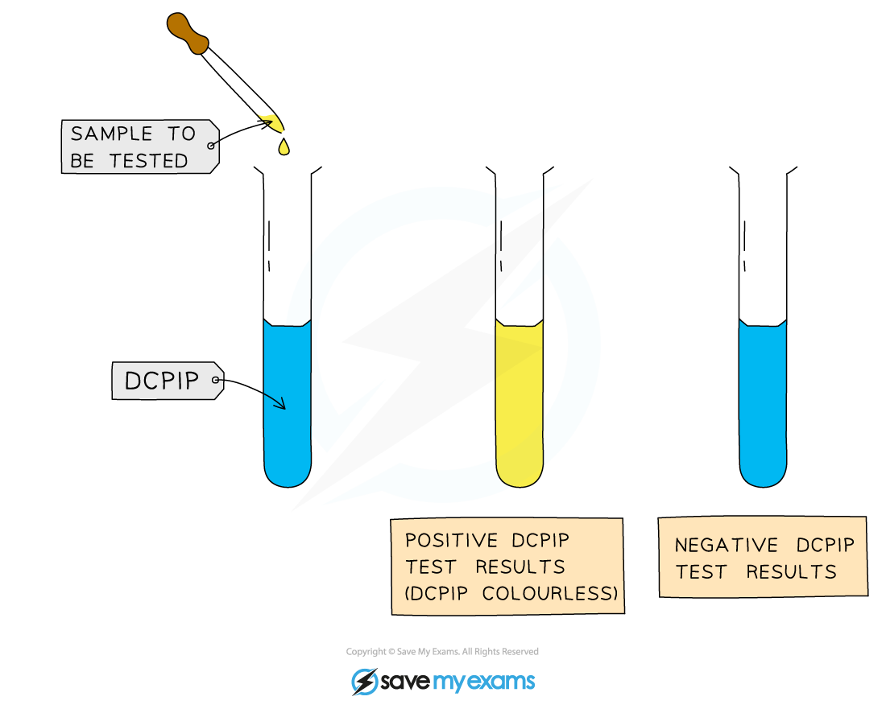

## 1.2.11 Practical: Vitamin C Content

* Vitamin C is found in green vegetables, fruits, and potatoes
* It is essential for a healthy diet
* The chemical name for vitamin C is **ascorbic acid**

  + Ascorbic acid is a good **reducing****agent** and therefore it is easily **oxidised**
* Methods for the detection of vitamin C involve **titrating** it against a solution of an oxidising agent called DCPIP

  + DCPIP is a blue dye that **turns colourless** in the presence of vitamin C
  + Note that titration is a **method of chemical analysis** that involves determining the quantity of a substance present by gradually adding another substance

#### Apparatus

* Vitamin C solutions
* 1% DCPIP solution
* Distilled water
* Range of fruit juices
* Measuring cylinder
* Pipette
* Stop watch
* Test tubes

#### Method

1. Make up a series. e.g. six, of known vitamin C concentrations

   * This can be done by serial dilution
2. Use a measuring cylinder to measure out 1 cm3 of DCPIP solution into a test tube
3. Add one of the vitamin C solutions, drop by drop, to the DCPIP solution using a graduated pipette or burette

   * Shake the tube for a set period of time after adding each drop
   * It is important to keep the shaking time the same for each concentration; this is a **control variable**
4. When the solution turns colourless record the volume of vitamin C solution added
5. Repeat steps 2-4 for the same concentration twice more and calculate a mean
6. Repeat steps 2-5 for each of the known concentrations
7. Results can be plotted as a line of best fit showing the volume of vitamin C needed to decolourise DCPIP against the concentration of vitamin C

   * This is a **calibration curve** and can be used to find the concentration of vitamin C in unknown samples such as fruit juices
8. Repeat steps 2-6 using fruit juices of unknown concentration; these can be compared to the calibration curve to estimate concentration of vitamin C in each juice sample

#### Risk assessment

* DCPIP is an irritant

  + Avoid contact with the skin
  + Wear eye protection

***Drops of vitamin C solution of known concentration can be added to DCPIP to determine the volume required for the DCPIP to be decolourised***

#### Results

* The volume of vitamin C solution required to decolourise DCPIP should **decrease** as the concentration of the vitamin C solution **increases**
* The results of the experiment can be plotted on a graph of **volume of vitamin C needed to decolourise DCPIP** against the **concentration of vitamin C**

  + The line of best fit for such a graph is known as a **calibration curve**; unknown substances can be compared to it to gain an **estimate** of their vitamin C concentration
* This calibration curve produced from this experiment can be used to **estimate the concentration of vitamin C** in fruit juices

***A graph of volume of vitamin C needed to decolourise DCPIP against vitamin C concentration can be used as a calibration curve to estimate the vitamin C concentration of unknown substances***

#### Calculating the mass of vitamin C

* It is possible to use the results of the practical described above to calculate the mass of vitamin C present at various points in the investigation

  + This is because we know that 1 cm³ of 1 % vitamin C solution contains 10 mg of vitamin C

* The mass of vitamin C needed to decolourise DCPIP can be calculated as follows:

**mass of vitamin C to decolourise 1cm³ of DCPIP = 10 mg × volume of vitamin C used**

* Calculating the mass of vitamin C needed to decolourise DCPIP then allows us to calculate the mass of vitamin C present in a fruit juice sample:

**mass of vitamin C in fruit juice sample = mass of vitamin C to decolourise 1cm³ of DCPIP × volume of fruit juice used**

#### Worked Example

In an investigation into vitamin C concentration a mean of 0.6 cm3 of a 1 % vitamin C solution was needed to decolourise a 1 cm3 DCPIP sample. A mean of 1.4 cm3 of a fruit juice was needed to decolourise the same volume of DCPIP.

Calculate the mass of vitamin C needed to decolourise 1 cm3 DCPIP, and the mass of DCPIP present in the fruit juice sample.

**Answer:**  
  
**Step 1: calculate the mass of vitamin C needed to decolorise 1 cm****3** **DCPIP**

mass to decolourise DCPIP = 10 mg × volume of vitamin C used

= 10 x 0.6

= 6 mg

**Step 2: calculate the mass of vitamin C in the fruit juice sample**

mass in fruit juice sample = mass of vitamin C to decolourise 1cm³ of DCPIP × volume of fruit juice used

= 6 x 1.4

= 8.4 mg