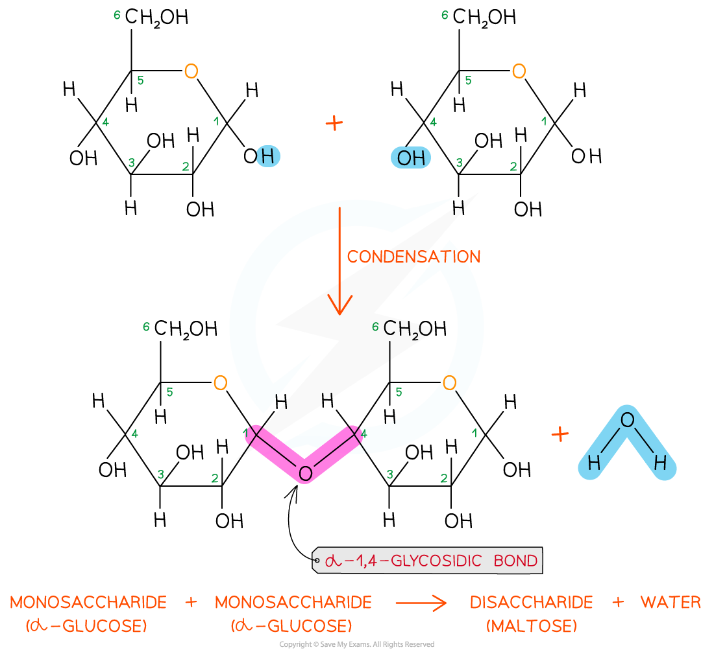
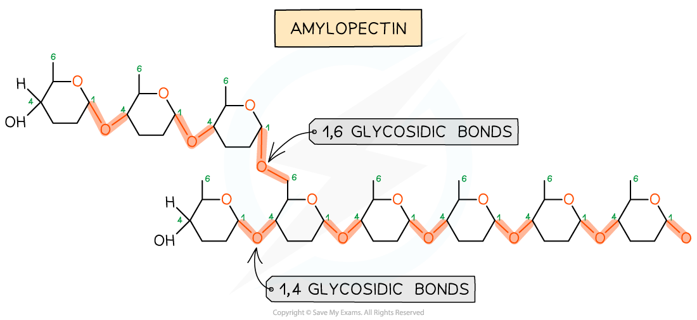
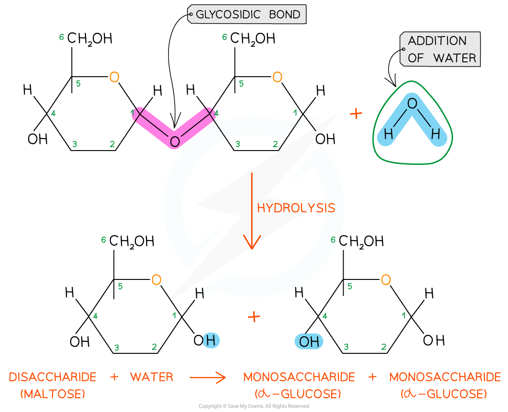

## The Glycosidic Bond

* To make monosaccharides more suitable for storage they are bonded together to form **disaccharides** and **polysaccharides**

  + Polysaccharides are insoluble so have less influence on the process of osmosis
* Disaccharides and polysaccharides are formed when **two hydroxyl (OH) groups** on different monosaccharides interact to form a **strong covalent bond** called a **glycosidic bond**
* The name of the glycosidic bond that forms depends on the **location of the OH groups** on the monosaccharides concerned, e.g.

  + If the OH groups are located on carbon 1 of one monosaccharide and carbon 4 of the other, a **1,4 glycosidic bond forms**
  + If the OH groups are located on carbon 1 of one monosaccharide and carbon 6 of the other, a **1,6 glycosidic bond forms**
* Every glycosidic bond results in **one water molecule being released**, thus glycosidic bonds are formed by a **condensation reaction**

***Glycosidic bonds form through condensation reactions, during which a water molecule is released. When two glucose molecules are joined by a glycosidic bond, the resulting disaccharide is maltose.***

***Glycosidic bonds can link monosaccharides together to form polysaccharides such as amylopectin, a form of starch. Amylopectin contains 1,4 and 1,6 glycosidic bonds.***

* There are many different types of monosaccharide, which join together to form **different disaccharides,** e.g.

  + Two molecules of glucose join to form **maltose**
  + Glucose joins with the monosaccharide fructose to form **sucrose**
  + Glucose joins with the monosaccharide galactose to form **lactose**

#### Breaking the glycosidic bond

* The glycosidic bond is broken when **water is added** in a **hydrolysis reaction**

  + Hydro = water
  + Lysis = to break
* Examples of hydrolytic reactions include the **digestion of food** in the alimentary tract and the **breakdown of stored carbohydrates** in muscle and liver cells for use in cellular respiration

***Glycosidic bonds are broken when water is added in a hydrolysis reaction***