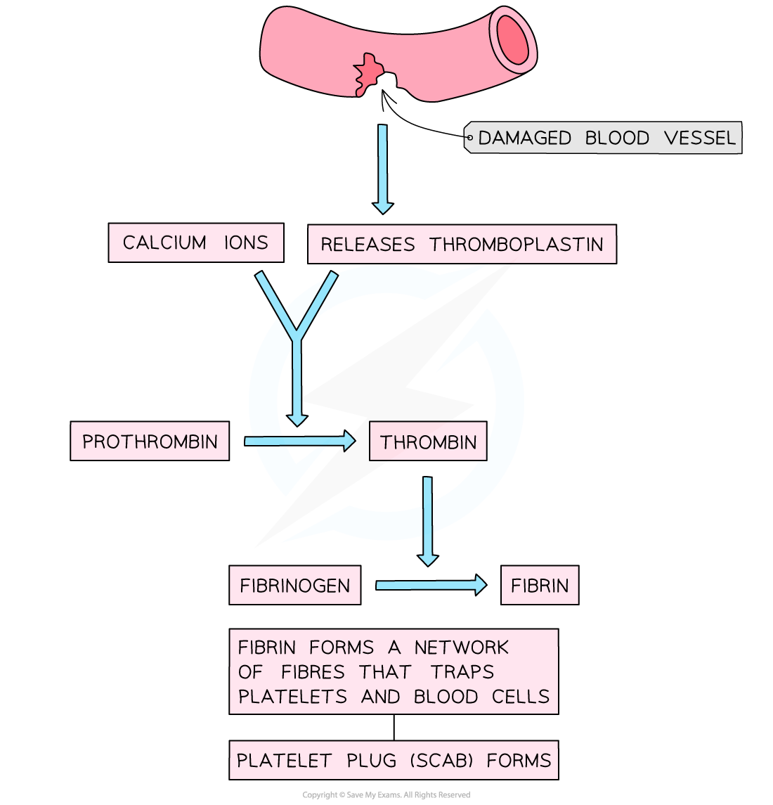

## Blood Clotting

* Blood clotting is an important process; it prevents excess blood loss, the entry of pathogens, and provides a barrier, or scab, under which wound healing can occur
* A break in the mucous membranes or skin membranes causes the release of molecules that trigger a **chemical cascade** which results in blood clotting

  + The process of blood clotting is known as **thrombosis**
* The chemical cascade involves a large number of steps and several plasma proteins

* The process of thrombosis involves

  + The damaged blood vessel releases a protein called **thromboplastin**
  + **Calcium ions** from the plasma, along with thromboplastin, trigger the conversion of soluble **prothrombin** protein into the enzyme **thrombin**
  + Thrombincatalyses the conversion of the **soluble protein** **fibrinogen** to the **insoluble protein fibrin**
  + Fibrin fibres mesh and tangle together, **trapping platelets and red blood cells**
  + A blood clot is formed

***Blood clotting, or thrombosis, is brought about by a cascade of chemical reactions***

#### Blood clots and atheromas

* **Atheromas** can **increase the risk** ofblood clotting

  + The **plaque deposit** of an atheroma can **rupture through the endothelium** of the artery, damaging the endothelium and forming a rough surface
  + The damage to the endothelium triggers the process of thrombosis
* The combination of atheromas and blood clotting can be dangerous to the health of an individual

  + The blood clot that forms can **completely block the artery**

    - Blood clots reduce blood flow which **restricts the movement of oxygen** in the blood, therefore **reducing respiration**of the surrounding cells, tissues and organs
  + The blood clots can dislodge and travel to different blood vessels in the body; if they reach the brain this can cause a **stroke** to occur
* Blood clotting can also lead to

  + **Heart attack**
  + **Deep vein thrombosis**

#### Stroke

* A stroke is a **sudden loss of brain function** in a localised area due to **disruption of blood flow** to the brain

  + A blood clot leads to a **blockage of the arteries** supplying the brain
  + This leads to **reduced blood flow and delivery of oxygen** to the cells of the brain, reducing respiration
  + Cells in the affected part of the brain cannot produce ATP and their function is reduced
* A stroke caused by a blood clot is called an **ischemic stroke**

#### Heart attack

* **Coronary heart disease (CHD)** is caused by the formation of atheromas and blood clots in the **coronary arteries**

  + The coronary arteries flow over the surface of the heart, supplying the heart muscle itself with blood
* **Blood flow to certain areas of the heart is restricted** and delivery of oxygen to the affected cells decreases, thereby **reducing respiration** in these cells

  + The cells can no longer produce ATP
  + The cells can no longer contract, **reducing the force generated by the heart** when it beats
  + The cells can die, causing permanent damage to heart tissue
* This leads to a **myocardial infarction,** also known as a heart attack
* **Complete heart failure** may occur if large areas of the heart are affected by blood clots; this can be fatal
* **Symptoms** of a heart attack include

  + Chest pain
  + Shortness of breath
  + Sweating

***Atheroma and blood clots in the coronary arteries can restrict blood flow to the heart muscle, leading to a heart attack***

#### Deep vein thrombosis

* If a blood clot forms in a vein deep inside the body, it is known as **deep vein thrombosis (DVT)**
* This is most common in the **veins of the legs**
* Causes include

  + Prolonged inactivity
  + Old age
  + Some medications