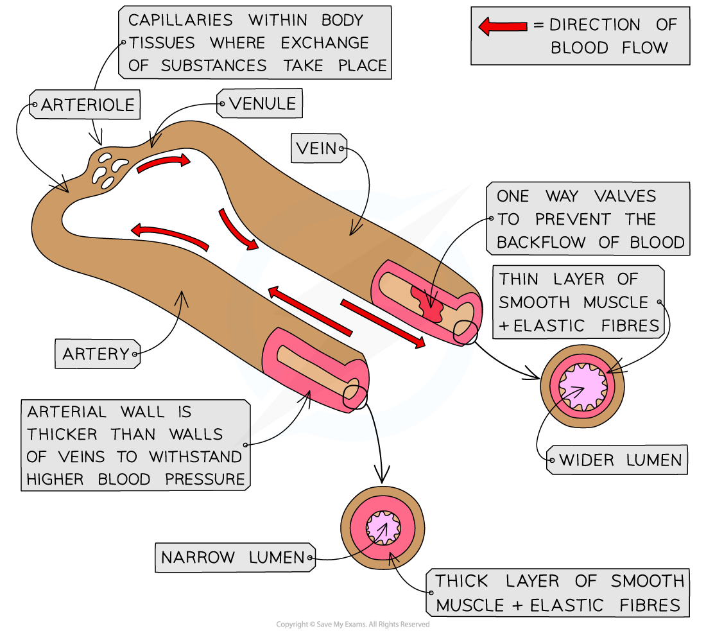
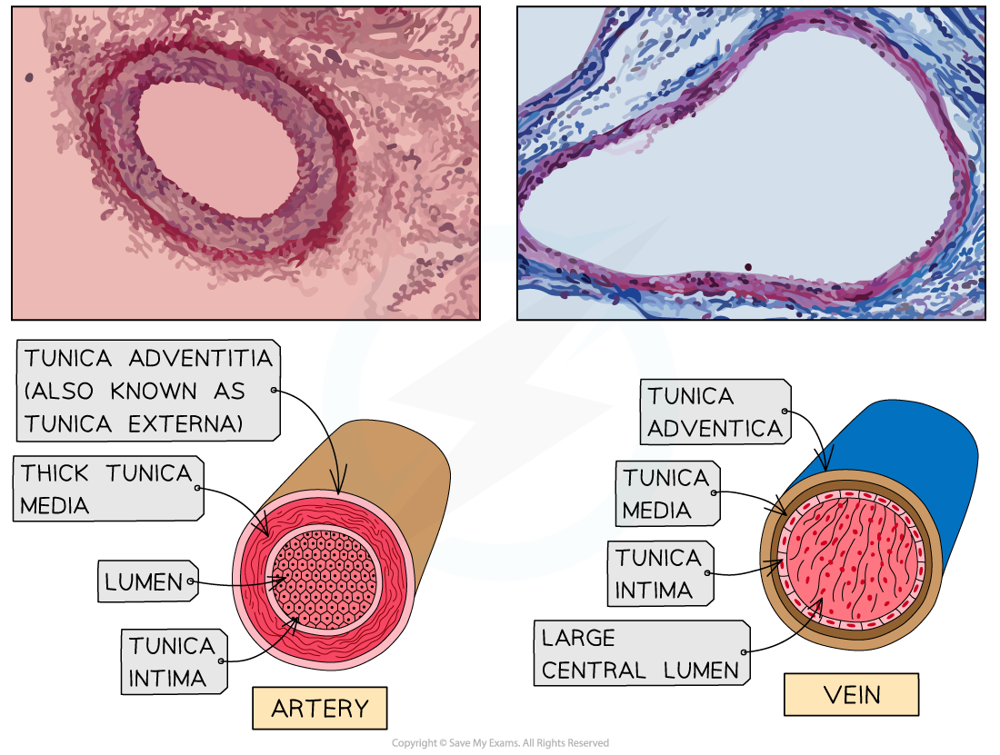
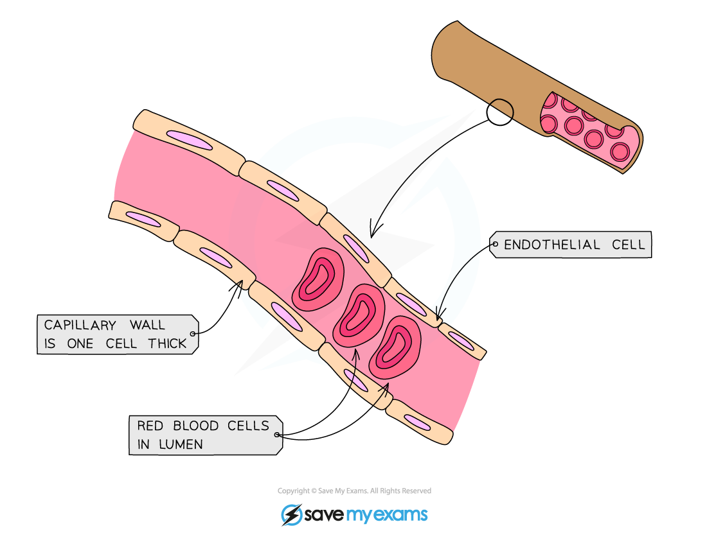

## Blood Vessels: Structure & Function

* The body contains several different types of blood vessel

  + **Arteries**: transport blood away from the heart, usually at high pressure, to the tissues

    - Remember; **a**rteries carry blood **a**way from the heart
  + **Arterioles**: arteries branch into narrower blood vessels called arterioles which transport blood into capillaries
  + **Veins**: transport blood to the heart, usually at low pressure

    - Remember; ve**in**s carry blood **in**to the heart
  + **Venules**: these narrower blood vessels transport blood from the capillaries to the veins
  + **Capillaries:** microscopic blood vessels that carry blood to the cells
* Blood flows through the lumen of a blood vessel; the size of the lumen varies depending on the type of blood vessel

  + Arteries have a narrow lumen and the veins a wider lumen
* The walls of each type of blood vessel have a **structure that relates to the function** of the vessel

***The blood vessels form a continuous network; the structure of each allows it to carry out its function***

#### Arteries

* Artery walls consist of three layers

  + The **endothelium**, sometimes referred to as the tunica intima

    - The endothelium is one cell thick and lines the lumen of all blood vessels.
    - It is very smooth and **reduces friction** for free blood flow
    - In arteries the endothelium is **highly folded**, enabling it to expand under high pressure
  + **Smooth muscle** and **elastic tissue**, sometimes referred to as the tunica media

    - This layer is thick in arteries
    - The layer of muscle cells strengthen the arteries so they can **withstand high pressure**
    - It also enables them to constrict and narrow the lumen for reduced blood flow

      * **Contraction** of the muscle causes constriction of the lumen
      * This is useful for diverting blood flow away from certain locations e.g. away from the digestive system during exercise
    - The elastic tissue helps to **maintain blood pressure** in the arteries

      * It stretches and **recoils** to even out any fluctuations in pressure
  + The outer wall, sometimes referred to as the tunica adventitia, or tunica externa

    - Contains the structural protein **collagen**
    - Collagen is a strong protein that **protects blood vessels** from damage by over-stretching
* Arteries have a **narrow lumen** which helps to maintain a high blood pressure
* A pulse is present in arteries as they stretch to accommodate an increased volume of blood with each heartbeat

#### Veins

* Veins return blood to the heart
* They receive blood that has passed through capillary networks, so the blood pressure is very low
* Veins contain the same layers as arteries but in different proportions

  + The **smooth muscle and elastic layer** is much thinner in veins

    - There is no need for a thick muscular layer as veins don't have to withstand high pressure
* The **lumen** of the vein is much wider than that of an artery

  + A larger lumen helps to ensure that blood returns to the heart at an adequate speed
  + A large lumen reduces friction between the blood and the endothelium of the vein

    - The rate of blood flow is slower in veins but a larger lumen means the volume of blood delivered per unit of time is equal to that of arteries
* Veins contain **valves**

  + These prevent the backflow of blood, helping return blood to the heart
* A **pulse is absent** in veins due to the increased distance from the heart

***Arteries have a thick layer of elastic and muscle tissue and a narrow lumen, while veins have a thin layer of elastic and muscle tissue and a wide lumen***

#### Capillaries

* Capillaries have thin walls which are permeable, allowing substances to leave the blood to reach the body’s tissues
* They can form networks called **capillary beds** which are very important **exchange surfaces** within the circulatory system

  + A **large number** of capillaries **branch between cells**

    - Substances can diffuse between the blood and cells quickly as there is a short diffusion distance
* Capillaries have a lumen that is very **narrow in diameter**

  + Red blood cells need to pass through the capillaries in single file
  + This forces the blood to travel slowly which provides more time for **diffusion** to occur
* The **wall of the capillary is a single layer of endothelial cells**

  + This layer also lines the lumen in arteries and veins
  + The wall is only one cell thick; this **reduces the diffusion distance** for oxygen and carbon dioxide between the blood and the tissues of the body
  + The cells of the wall have gaps called **pores** which allow blood plasma to leak out and form tissue fluid
  + **White blood cells** can combat infection in affected tissues by squeezing through the pores in the capillary walls

***Capillaries have a narrow lumen and walls that are one cell thick***

#### Examiner Tips and Tricks

You need to know about the **structure** and **function** of arteries, veins and capillaries; for “explain” questions remember to pair a description of a structural feature to an explanation of how it helps the blood vessel to function. For example, “Capillary walls are one-cell thick, which enables quick diffusion of substances due to the short diffusion distance.”

Remember that muscle tissue **contracts** and elastic tissue **recoils.**

Remember that **capillary walls** are one cell thick; they do **not** have cell walls