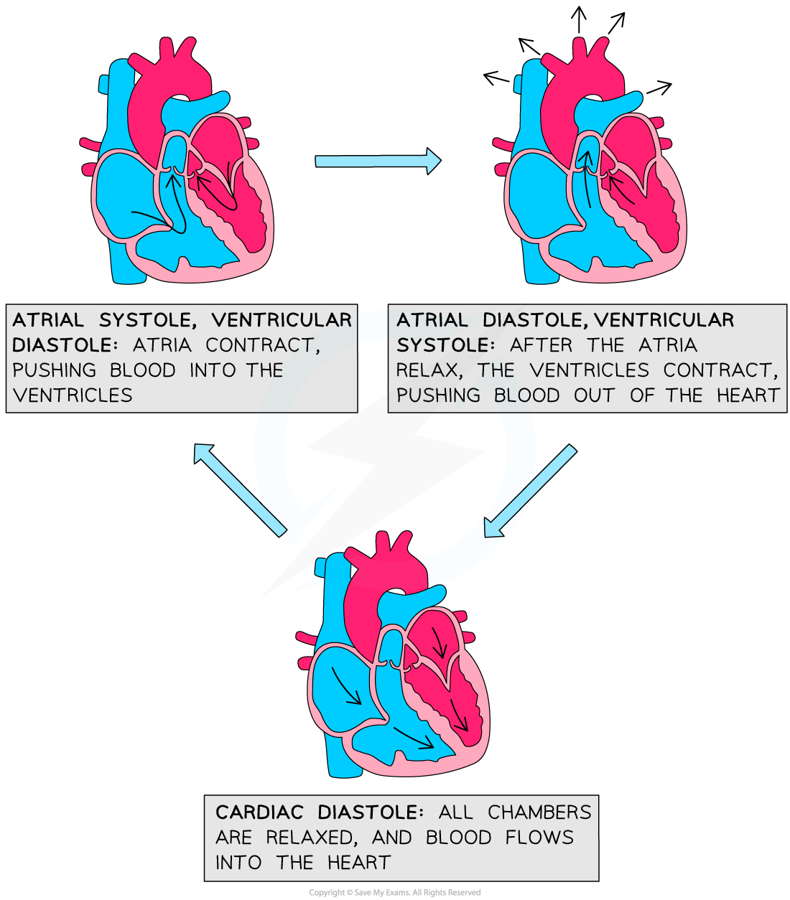
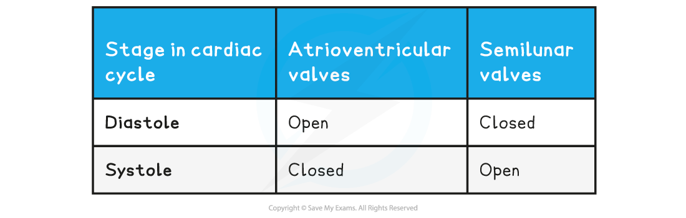
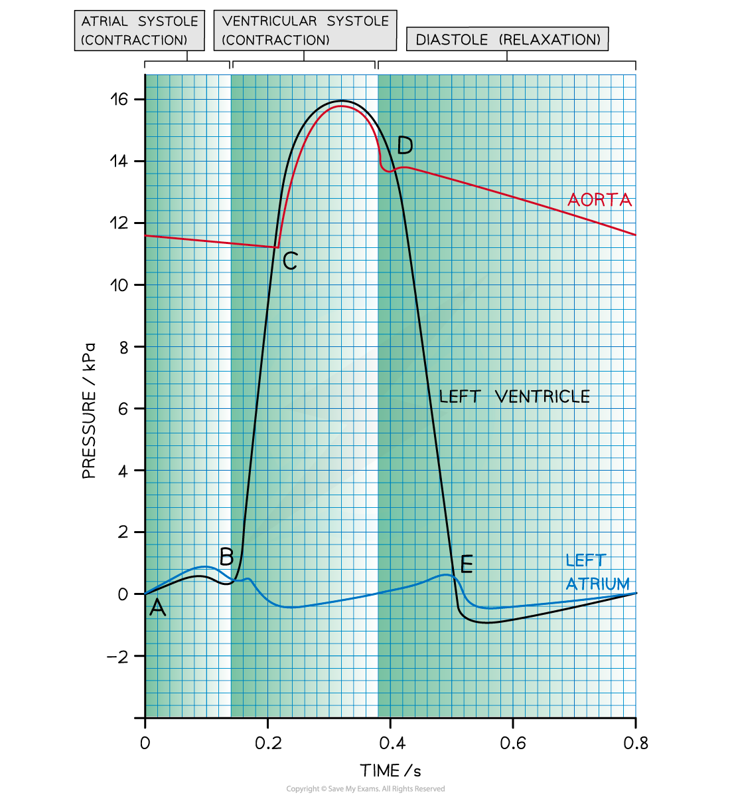
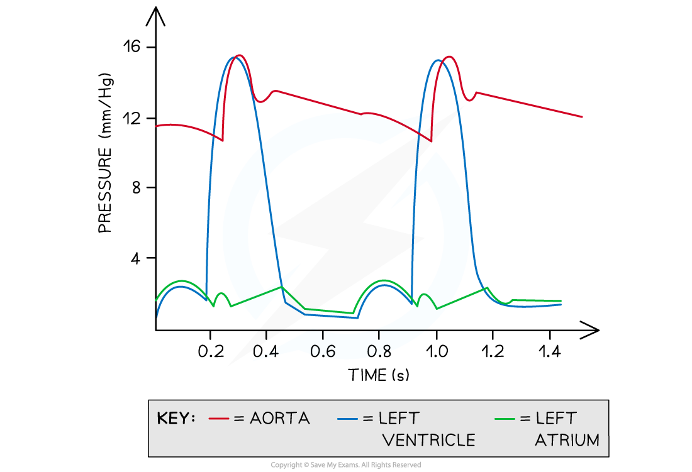

## Cardiac Cycle

* The **cardiac cycle** is the series of events that take place in **one heart beat**, including **muscle contraction** and **relaxation**

  + The contraction of the heart is called **systole**, while the relaxation of the heart is called **diastole**
* One cardiac cycle is followed by another in a **continuous process**

  + There is no gap between cycles where blood stops flowing

#### Volume and pressure changes

* **Contraction** of the heart muscle causes a **decrease in volume** in the corresponding chamber of the heart, which then **increases** again when the muscle **relaxes**
* Volume changes lead to **corresponding pressure changes**

  + When volume decreases, **pressure increases**
  + When volume increases, **pressure decreases**
* Throughout the cardiac cycle, **heart valves open and close** as a result of **pressure changes** in different regions of the heart

  + Valves **open** when the pressure of blood **behind them is greater than the pressure in front of them**
  + They **close** when the pressure of blood **in front of them is greater than the pressure behind them**
* Valves are an important mechanism **to stop blood flowing backwards**

#### Atrial systole

* The walls of the **atria** **contract**

  + Atrial volume decreases
  + Atrial pressure increases
* The pressure in the atria rises above that in the ventricles, **forcing the atrioventricular (AV) valves open**
* Blood is forced into the ventricles

  + There is a slight increase in ventricular pressure and chamber volume as the **ventricles receive the blood from the atria**
* The ventricles are relaxed at this point; **ventricular diastole** coincides with atrial systole

#### Ventricular systole

* The walls of the ventricles contract

  + Ventricular volume decreases
  + Ventricular pressure increases
* The pressure in the ventricles rises above that in the atria

  + This **forces the AV valves to close**, preventing back flow of blood
* The pressure in the ventricles rises above that in the aorta and pulmonary artery

  + This **forces the semilunar (SL) valves open** so blood is forced into the arteries and out of the heart
* During this period, the atria are relaxing; **atrial diastole** coincides with ventricular systole

  + The blood flow to the heart continues, so the relaxed **atria begin to fill with blood** again

#### Diastole

* The **ventricles and atria are both relaxed**
* The pressure in the ventricles drops belowthat in the aorta and pulmonary artery, forcing the **SL valves** to **close**
* The atria continue to fill with blood

  + **Blood returns to the heart** via the vena cava and pulmonary vein
* Pressure in the atria rises above that in the ventricles, forcing the **AV valves open**
* **Blood flows passively into the ventricles** without need of atrial systole
* The cycle then begins again with atrial systole

***The events of the cardiac cycle allow the heart to pump blood to the lungs and body***

**Pressure Changes in the Heart Table**

***The pressure changes in the cardiac cycle can be analysed***

#### Analysing the cardiac cycle

* The lines on the graph represent the **pressure** of the left atrium, aorta, and the left ventricle
* The points at which the **lines cross each other** are important because they indicate when **valves open and close**

**Point A - the end of diastole**

* The atrium has filled with blood during the preceding diastole
* Pressure is higher in the atrium than in the ventricle, so the **AV valve is open**

**Between points A and B - atrial systole**

* **Left atrium contracts,**causing an increase in atrial pressure and forcing blood into the left ventricle
* Ventricular pressure increases slightly as it fills with blood
* Pressure is higher in the atrium than in the ventricle, so the **AV valve is open**

**Point B - beginning of ventricular systole**

* **Left ventricle contracts** causing the ventricular pressure to increase
* Pressure in the left atrium drops as the muscle relaxes
* Pressure in the ventricle exceeds pressure in the atrium, so the**AV valve shuts**

**Point C - ventricular systole**

* The ventricle continues to contract
* Pressure in the left ventricle exceeds that in the aorta
* **Aortic valve opens** and blood is forced into the aorta

**Point D - beginning of diastole**

* Left ventricle has been emptied of blood
* Muscles in the walls of the left ventricle relax and pressure falls below that in the newly filled aorta
* **Aortic valve closes**

**Between points D and E - early diastole**

* The ventricle **remains relaxed** and ventricular pressure continues to decrease
* In the meantime, blood is **flowing into the relaxed atrium** from the pulmonary vein, causing an increase in pressure

**Point E - diastole**

* The relaxed left atrium fills with blood, causing the pressure in the atrium to exceed that in the newly emptied ventricle
* **AV valve opens**

**After point E - late diastole**

* There is a short period of time during which the **left ventricle expands** due to relaxing muscles
* This increases the internal volume of the left ventricle and **decreases the ventricular pressure**
* At the same time, blood is flowing slowly through the newly opened AV valve into the left ventricle, causing a **brief decrease in pressure** in the left atrium
* The pressure in both the atrium and ventricle then **increases slowly** as they continue to fill with blood

#### Worked Example

The graph below shows the cardiac cycle.

Calculate the heart rate of this person. Give your answer in beats per minute.

**Answer:**

**Step 1: Work out the length of one heart beat**

It takes 0.7 seconds for completion of one cardiac cycle, which is **one heart beat**

So there is 1 cycle in 0.7 seconds

**Step 2: Calculate how many heart beats occur per second**

Divide by 0.7 to find out how many cycles in 1 second

1 ![divided by](data:image/svg+xml;charset=utf8,%3Csvg%20xmlns%3D%22http%3A%2F%2Fwww.w3.org%2F2000%2Fsvg%22%20xmlns%3Awrs%3D%22http%3A%2F%2Fwww.wiris.com%2Fxml%2Fmathml-extension%22%20height%3D%2219%22%20width%3D%2219%22%20wrs%3Abaseline%3D%2216%22%3E%3C!--MathML%3A%20%3Cmath%20xmlns%3D%22http%3A%2F%2Fwww.w3.org%2F1998%2FMath%2FMathML%22%3E%3Cmo%3E%26%23xF7%3B%3C%2Fmo%3E%3C%2Fmath%3E--%3E%3Cdefs%3E%3Cstyle%20type%3D%22text%2Fcss%22%3E%40font-face%7Bfont-family%3A'math13cec07e9ba5f5bb252d13f5f43'%3Bsrc%3Aurl(data%3Afont%2Ftruetype%3Bcharset%3Dutf-8%3Bbase64%2CAAEAAAAMAIAAAwBAT1MvMi7iBBMAAADMAAAATmNtYXDEvmKUAAABHAAAADRjdnQgDVUNBwAAAVAAAAA6Z2x5ZoPi2VsAAAGMAAAAm2hlYWQQC2qxAAACKAAAADZoaGVhCGsXSAAAAmAAAAAkaG10eE2rRkcAAAKEAAAACGxvY2EAHTwYAAACjAAAAAxtYXhwBT0FPgAAApgAAAAgbmFtZaBxlY4AAAK4AAABn3Bvc3QB9wD6AAAEWAAAACBwcmVwa1uragAABHgAAAAUAAADSwGQAAUAAAQABAAAAAAABAAEAAAAAAAAAQEAAAAAAAAAAAAAAAAAAAAAAAAAAAAAAAAAAAAAACAgICAAAAAg1UADev96AAAD6ACWAAAAAAACAAEAAQAAABQAAwABAAAAFAAEACAAAAAEAAQAAQAAAPf%2F%2FwAAAPf%2F%2F%2F8KAAEAAAAAAAABVAMsAIABAABWACoCWAIeAQ4BLAIsAFoBgAKAAKAA1ACAAAAAAAAAACsAVQCAAKsA1QEAASsABwAAAAIAVQAAAwADqwADAAcAADMRIRElIREhVQKr%2FasCAP4AA6v8VVUDAAADAIAAgAMAAoAAAwAHAAsAQRgBsAQQsQAD9LEEB%2FSwCDyxBRH0sAo8sQEH9LEMA%2BYAsQMMENWxAAX1sAMQsQgF9bELEfWwABCxBwX1sQQR9TAxEyEVIQEzFSMRMxUjgAKA%2FYABAICAgIABq1YBK4D%2FAIAAAAEAAAABAADVeM5BXw889QADBAD%2F%2F%2F%2F%2F1joTc%2F%2F%2F%2F%2F%2FWOhNzAAD%2FIASAA6sAAAAKAAIAAQAAAAAAAQAAA%2Bj%2FagAAF3AAAP%2B2BIAAAQAAAAAAAAAAAAAAAAAAAAIDUgBVA4AAgAAAAAAAAAAoAAAAmwABAAAAAgBeAAUAAAAAAAIAgAQAAAAAAAQAAN4AAAAAAAAAFQECAAAAAAAAAAEAEgAAAAAAAAAAAAIADgASAAAAAAAAAAMAMAAgAAAAAAAAAAQAEgBQAAAAAAAAAAUAFgBiAAAAAAAAAAYACQB4AAAAAAAAAAgAHACBAAEAAAAAAAEAEgAAAAEAAAAAAAIADgASAAEAAAAAAAMAMAAgAAEAAAAAAAQAEgBQAAEAAAAAAAUAFgBiAAEAAAAAAAYACQB4AAEAAAAAAAgAHACBAAMAAQQJAAEAEgAAAAMAAQQJAAIADgASAAMAAQQJAAMAMAAgAAMAAQQJAAQAEgBQAAMAAQQJAAUAFgBiAAMAAQQJAAYACQB4AAMAAQQJAAgAHACBAE0AYQB0AGgAIABGAG8AbgB0AFIAZQBnAHUAbABhAHIATQBhAHQAaABzACAARgBvAHIAIABNAG8AcgBlACAATQBhAHQAaAAgAEYAbwBuAHQATQBhAHQAaAAgAEYAbwBuAHQAVgBlAHIAcwBpAG8AbgAgADEALgAwTWF0aF9Gb250AE0AYQB0AGgAcwAgAEYAbwByACAATQBvAHIAZQAAAwAAAAAAAAH0APoAAAAAAAAAAAAAAAAAAAAAAAAAALkHEQAAjYUYALIAAAAVFBOxAAE%2F)format('truetype')%3Bfont-weight%3Anormal%3Bfont-style%3Anormal%3B%7D%3C%2Fstyle%3E%3C%2Fdefs%3E%3Ctext%20font-family%3D%22math13cec07e9ba5f5bb252d13f5f43%22%20font-size%3D%2216%22%20text-anchor%3D%22middle%22%20x%3D%229.5%22%20y%3D%2216%22%3E%26%23xF7%3B%3C%2Ftext%3E%3C%2Fsvg%3E) 0.7 = 1.43 beats in 1 second

**Step 3: Calculate how many heart beats occur per minute**

Multiply by 60 to find out how many cycles in 60 seconds

1.43 ![cross times](data:image/svg+xml;charset=utf8,%3Csvg%20xmlns%3D%22http%3A%2F%2Fwww.w3.org%2F2000%2Fsvg%22%20xmlns%3Awrs%3D%22http%3A%2F%2Fwww.wiris.com%2Fxml%2Fmathml-extension%22%20height%3D%2219%22%20width%3D%2218%22%20wrs%3Abaseline%3D%2216%22%3E%3C!--MathML%3A%20%3Cmath%20xmlns%3D%22http%3A%2F%2Fwww.w3.org%2F1998%2FMath%2FMathML%22%3E%3Cmo%3E%26%23xD7%3B%3C%2Fmo%3E%3C%2Fmath%3E--%3E%3Cdefs%3E%3Cstyle%20type%3D%22text%2Fcss%22%3E%40font-face%7Bfont-family%3A'math13b8a614226a953a8cd9526fca6'%3Bsrc%3Aurl(data%3Afont%2Ftruetype%3Bcharset%3Dutf-8%3Bbase64%2CAAEAAAAMAIAAAwBAT1MvMi7iBBMAAADMAAAATmNtYXDEvmKUAAABHAAAADRjdnQgDVUNBwAAAVAAAAA6Z2x5ZoPi2VsAAAGMAAAAl2hlYWQQC2qxAAACJAAAADZoaGVhCGsXSAAAAlwAAAAkaG10eE2rRkcAAAKAAAAACGxvY2EAHTwYAAACiAAAAAxtYXhwBT0FPgAAApQAAAAgbmFtZaBxlY4AAAK0AAABn3Bvc3QB9wD6AAAEVAAAACBwcmVwa1uragAABHQAAAAUAAADSwGQAAUAAAQABAAAAAAABAAEAAAAAAAAAQEAAAAAAAAAAAAAAAAAAAAAAAAAAAAAAAAAAAAAACAgICAAAAAg1UADev96AAAD6ACWAAAAAAACAAEAAQAAABQAAwABAAAAFAAEACAAAAAEAAQAAQAAANf%2F%2FwAAANf%2F%2F%2F8qAAEAAAAAAAABVAMsAIABAABWACoCWAIeAQ4BLAIsAFoBgAKAAKAA1ACAAAAAAAAAACsAVQCAAKsA1QEAASsABwAAAAIAVQAAAwADqwADAAcAADMRIRElIREhVQKr%2FasCAP4AA6v8VVUDAAACAIAAVQLVAoAAAwAHAEYYsAEUALEAABMQsQAJ5LEAARMQsAQ8sQYI9LACPDABsQgBExCxAAP2sAc8sQEF9bAGPLIFBwAQ9LACPLEJA%2BaxBAX1sAM8EzMBIxEzASOAVQIAVVX%2BAFUCgP3VAiv91QAAAQAAAAEAANV4zkFfDzz1AAMEAP%2F%2F%2F%2F%2FWOhNz%2F%2F%2F%2F%2F9Y6E3MAAP8gBIADqwAAAAoAAgABAAAAAAABAAAD6P9qAAAXcAAA%2F7YEgAABAAAAAAAAAAAAAAAAAAAAAgNSAFUDVgCAAAAAAAAAACgAAACXAAEAAAACAF4ABQAAAAAAAgCABAAAAAAABAAA3gAAAAAAAAAVAQIAAAAAAAAAAQASAAAAAAAAAAAAAgAOABIAAAAAAAAAAwAwACAAAAAAAAAABAASAFAAAAAAAAAABQAWAGIAAAAAAAAABgAJAHgAAAAAAAAACAAcAIEAAQAAAAAAAQASAAAAAQAAAAAAAgAOABIAAQAAAAAAAwAwACAAAQAAAAAABAASAFAAAQAAAAAABQAWAGIAAQAAAAAABgAJAHgAAQAAAAAACAAcAIEAAwABBAkAAQASAAAAAwABBAkAAgAOABIAAwABBAkAAwAwACAAAwABBAkABAASAFAAAwABBAkABQAWAGIAAwABBAkABgAJAHgAAwABBAkACAAcAIEATQBhAHQAaAAgAEYAbwBuAHQAUgBlAGcAdQBsAGEAcgBNAGEAdABoAHMAIABGAG8AcgAgAE0AbwByAGUAIABNAGEAdABoACAARgBvAG4AdABNAGEAdABoACAARgBvAG4AdABWAGUAcgBzAGkAbwBuACAAMQAuADBNYXRoX0ZvbnQATQBhAHQAaABzACAARgBvAHIAIABNAG8AcgBlAAADAAAAAAAAAfQA%2BgAAAAAAAAAAAAAAAAAAAAAAAAAAuQcRAACNhRgAsgAAABUUE7EAAT8%3D)format('truetype')%3Bfont-weight%3Anormal%3Bfont-style%3Anormal%3B%7D%3C%2Fstyle%3E%3C%2Fdefs%3E%3Ctext%20font-family%3D%22math13b8a614226a953a8cd9526fca6%22%20font-size%3D%2216%22%20text-anchor%3D%22middle%22%20x%3D%228.5%22%20y%3D%2216%22%3E%26%23xD7%3B%3C%2Ftext%3E%3C%2Fsvg%3E) 60 = 85.71 beats in 60 seconds

So the heart rate is **85.71 beats / min**

#### Examiner Tips and Tricks

You might be asked to interpret the graph of the cardiac cycle so it is important you understand it and can analyse where each stage of the cycle is happening. Common areas of assessment are about the pressure and volume changes, where valves open and close, and when blood starts flowing in or out of specific chambers.