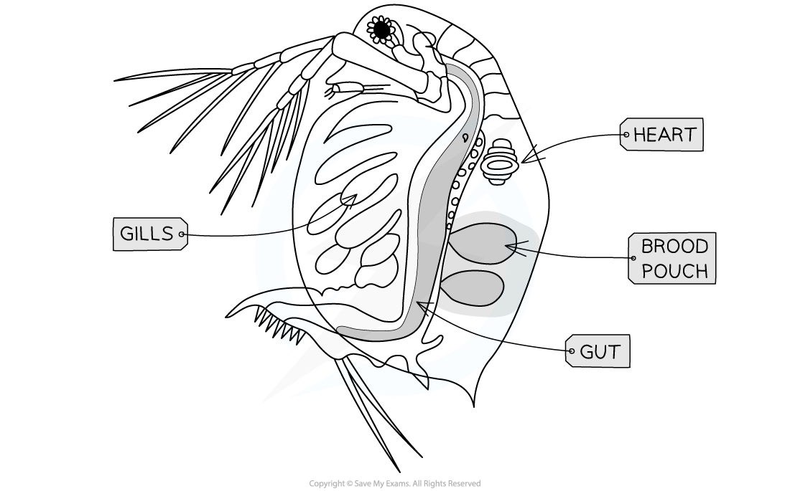

## Investigating Heart Rate

* There are a wide range of factors that influence the **heart rate** of an organism
* Experiments can be designed to **investigate the effect of a named variable on an organism's heart rate**
* These experiments are commonly done using **invertebrates,** e.g. *Daphnia,* as well as **vertebrates,**e.g. humans

  + Care needs to be taken during these experiments to ensure that no test subjects are harmed
* Some of the **factors that can influence heart rate** include

  + Drugs
  + Caffeine
  + Alcohol
  + Sex i.e. male or female
  + Weight
  + Height
  + Temperature
  + Diet
  + Dehydration
* When designing experiments investigating a single factor, it is essential to control other variables
* Heart rate investigations can be used to study the relationship between heart structure and function

## Practical: The Effect of Caffeine on Heart Rate in Daphnia

* *Daphnia,*also known as water fleas, are small aquatic invertebrates
* They are suitable for investigating heart date due to having **transparent** bodies; their **internal organs**, such as the heart, can be observed using a **light microscope**
* It is possible to investigate the impact of caffeine on the heart rate of *Daphnia* by placing them in a caffeine solution on a microscope slide and counting their heart beats

***Daphnia internal organs can be viewed through a light microscope***

#### Apparatus

* Light microscope
* Cavity slide
* Culture of *Daphnia*
* Pipette
* Caffeine solutions at a range of concentrations
* Distilled water
* Stop watch

#### Method

1. Prepare five different concentrations of caffeine solution and a control solution of distilled water

   * The serial dilution technique could be used here
2. Add some pond water into the well of a cavity slide and add three drops of distilled water
3. Select a large *Daphnia* and use a pipette to carefully transfer it to the cavity slide

   * You can also use a Petri dish if you do not have access to a cavity slide
4. Place the cavity slide onto the stage of a microscope and observe the animal under low power

   * The beating heart is located on the dorsal side just above the gut and in front of the brood pouch
5. Use a stopwatch to time 20 seconds, and count the number of heart beats

   * The heart beat of *Daphnia* is very rapid, so you can count the beats by making dots on a piece of paper
6. Count the dots and express heart rate as number of beats per minute

   * Multiply by three to convert beats per 20 seconds into beats per 60 seconds
7. Return the *Daphnia* to the stock culture
8. Repeat steps 3-7 with at least 5 other *Daphnia* individuals
9. Repeat steps 3-8 with different caffeine concentration solutions

#### Variations

* You can also investigate the effect of

  + Temperature
  + Other chemicals such as alcohol (1% ethanol solution)

#### Results

* To analyse your results it is best to draw a graph

  + Take an average of the heart rate repeats for each caffeine concentration
  + Plot average heart rate (y axis) against caffeine concentration (x axis)
  + The graph should show a positive correlation; as caffeine concentration increases, heart rate increases

#### Ethical considerations

* Although they are simple organisms that may not 'suffer' in the same way as animals with more developed nervous systems, *Daphnia* still deserve respect

  + They **cannot give consent** to be studied
  + They **cannot express pain**
* Some people believe it is more ethical to experiment with invertebrates than vertebrates as they have **less sophisticated nervous systems** and may not feel pain in the same way
* Care can be taken to minimise potential harm by

  + Animals should be **handled gently**
  + Examination periods should be kept as **short as possible**
  + Animals should be **returned promptly to the holding tank** after being examined

    - This is in line with ethical approaches that are appropriate to field work where pond animals are returned to their habitat after observations have been made
  + **Extreme ranges of the variables being tested should be avoided**, e.g. extremes of temperature or strong caffeine solutions