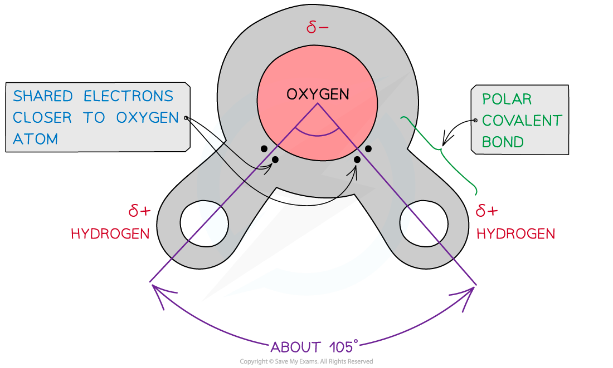
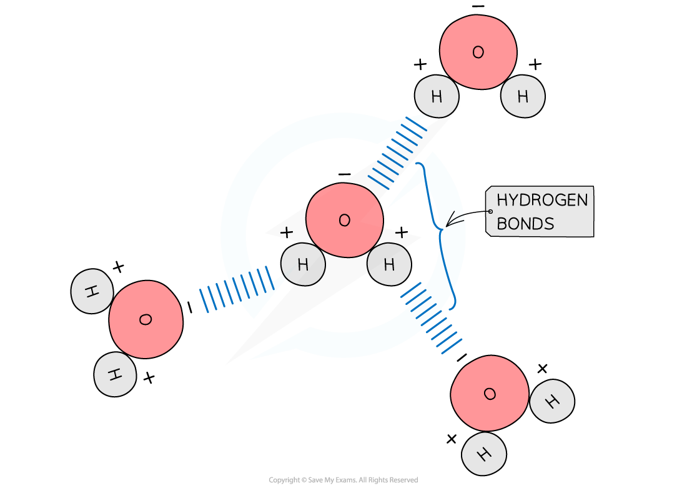
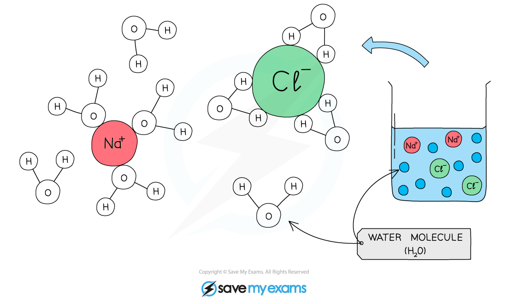

## The Importance of Water in Transport

* Water is the medium in which all metabolic reactions take place in cells and in which all substances are transported around the body
* Water is composed of atoms of **hydrogen and oxygen**

  + One atom of oxygen combines with two atoms of hydrogen by sharing electrons; this is **covalent bonding**
* The **sharing** of the **electrons** is **uneven**between the oxygen and hydrogen atoms

  + The oxygen atom attracts the electrons more strongly than the hydrogen atoms, resulting in a **weak negatively charged region** on the oxygen atom (δ-) and a **weak positively charged region** on the hydrogen atoms (δ+)
* This separation of charge due to the electrons in the covalent bonds being unevenly shared is called a **dipole**
* When a molecule has **one**end that is negatively charged and **one**end that is positively charged it is said to be a **polar molecule**

  + Water is a **polar** molecule

***The covalent bonds of water make it a polar molecule***

* **Hydrogen bonds** form between the positive and negatively charged regions of water molecules as a result of the polar nature of water

  + Hydrogen bonds are weak when they are few in number, so they are constantly breaking and reforming; this means that water molecules flow past each other in a liquid state
* Hydrogen bonds contribute to the many properties water molecules have that make them so important to living organisms

***The polarity of water molecules allows hydrogen bonds to form between adjacent water molecules***

#### Water's dipole nature makes it good at transporting substances

* The polar nature of water gives water properties that make it good at transporting substances

  + Water is **cohesive**
  + Water is a **solvent**

#### Cohesion and adhesion

* Hydrogen bonds between water molecules allow for strong **cohesion between water molecules**

  + **Cohesion** is the attraction of water molecules to each other
* Water is also able to hydrogen bond to **other molecules;** this is known as **adhesion**
* The forces of cohesion and adhesion within a body of water and between water and its surroundings means that water **flows easily**

  + Water molecules pull other water molecules along due to cohesion
  + Water adheres to the sides of a vessel due to adhesion

#### Solvent

* As water is a **polar molecule** many ions, e.g. sodium and chloride ions, and covalently bonded polar substances, e.g. glucose, will dissolve in it

  + Water molecules **surround charged particles**; the positive parts of water are attracted to negatively charged particles and the negative parts of water are attracted to positively charged particles
  + The surrounded molecules break apart e.g. sodium chloride molecules break into sodium ions and chloride ions
  + The ions surrounded by water molecules have **dissolved**
* This allows chemical reactions to occur within cells as the dissolved solutes are more chemically reactive when they are free to move about
* Metabolites can be transported efficiently in a dissolved state

***Water molecules surround charged particles due to forces of attraction between polar water and the charged particles. The surrounded particles are said to have dissolved.***

#### Examiner Tips and Tricks

Examiners will often assess how structure relates to function, so it is important you know the structure of water and how its properties help it carry out its role, specifically with regards to transport.