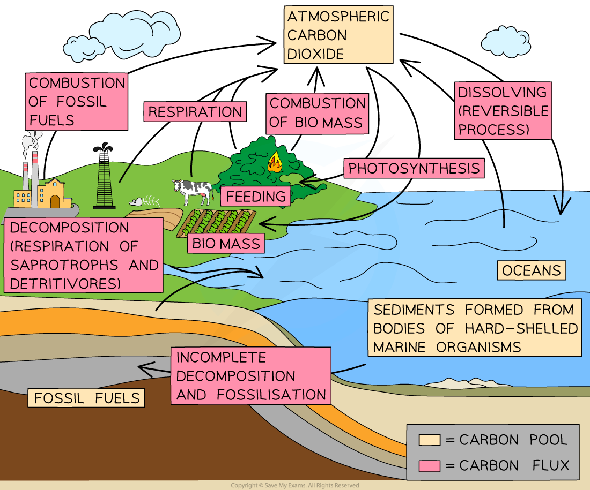

## Carbon Cycle & Reduction of Atmospheric Carbon Dioxide

* The atmospheric carbon dioxide that contributes to the greenhouse effect is part of the global carbon cycle
* The term **carbon cycle** refers to the many processes by which carbon is transferred and stored, e.g.

  + Carbon is found in the biomass of living organisms e.g. in **carbohydrates** and **proteins**
  + Carbon is transferred when one organism **consumes and digests** another
  + Carbon is found in the **atmosphere** as **carbon dioxide** and in the **oceans** as e.g. **hydrogen carbonate ions**
  + Carbon in **fossil fuels** is present in the form of hydrocarbons

#### The carbon cycle

* The following events occur during the carbon cycle

  + Carbon is present in the **atmosphere** in the form of **carbon dioxide**
  + Carbon dioxide is removed from the atmosphere by **producers** during **photosynthesis**

    - Producers incorporate carbon into their biomass in the form of **carbohydrates** and other biological molecules
  + Carbon is transferred to and between consumers as a result of **feeding**
  + Carbon is transferred back into the atmosphere by both plants and animals as a result of **respiration**

    - Respiration releases carbon dioxide as a product
  + Carbon dioxide can also be removed from the atmosphere by **dissolving in the oceans**
  + **Dissolved carbon** can be taken in by marine plants when they **photosynthesise** or by other marine organisms as they **build calcium carbonate exoskeletons**
  + When living organisms die their tissues are broken down by **decomposers** such as bacteria and fungi

    - When these organisms **respire**, they too **release carbon dioxide** back into the atmosphere
  + Any living tissue that is not fully decomposed can go towards the **formation of peat or fossil fuels** over millions of years; carbon can be stored in these **sinks** for long periods
  + The **combustion** of peat and fossil fuels releases carbon dioxide back into the atmosphere

    - The combustion of biomass such as wood also returns carbon to the atmosphere

***The carbon cycle includes the locations in which carbon is stored, shown here as 'carbon pools', and the processes by which it is transferred, shown here as 'carbon fluxes'***

* A good understanding of the carbon cycle is essential in the fight against global warming

  + It is possible to see the points at which carbon enters the atmosphere; **reducing the carbon transfer** at these points will prevent further increases in atmospheric carbon dioxide e.g.

    - Reducing the **combustion of fossil fuels**
    - Reducing the **combustion of biomass**
    - Reducing **disturbance of carbon pools** such as soils and peat bogs
  + We can also see the points at which carbon is removed from the atmosphere; **increasing the transfers** here could help to reduce the greenhouse effect e.g.

    - Increasing **rates of photosynthesis** by planting trees