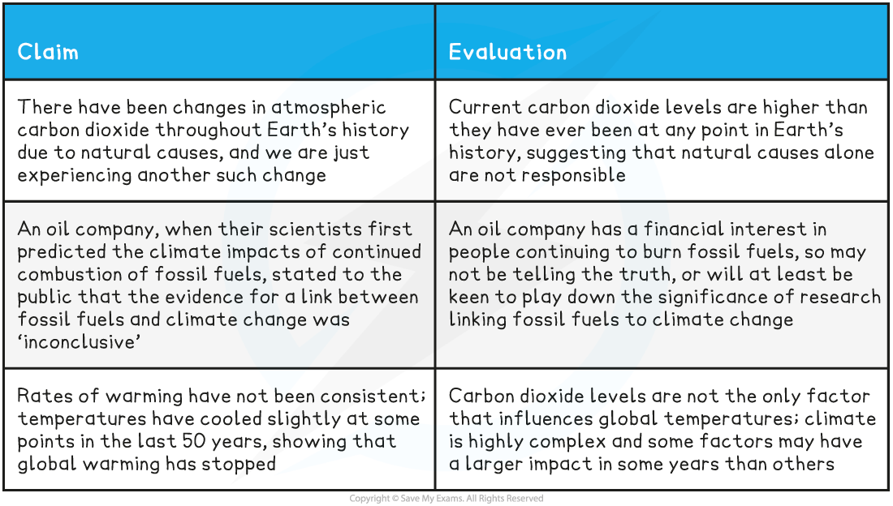

## Climate Change & the Scientific Community

* It can be said that there is a **consensus**, i.e. everyone agrees, **among the scientific community** that

  + Increasing concentrations of greenhouse gases **cause** global warming
  + **Human activities are the direct cause** of increasing greenhouse gas concentrations
* Despite this there are some individuals, even among the scientific community, who **do not believe that the correlation** seen between humans burning fossil fuels and global warming is a **causal relationship**

  + These individuals claim that global warming is caused by **factors other than human activities**

#### Evaluating the data

* It is important to **evaluate any statement** that is made about the causes of climate change in the light of scientific evidence

  + **Consider how good the evidence is**

    - Does a statement address **all of the evidence**, or only part of it?

      * E.g. there may be some years when global temperatures go down, but there is strong evidence for an overall upward trend
    - Is the data reliable?
    - Does the data come from **several independent studies** i.e. is there plenty of evidence?
    - Does statistical analysis show that findings are **statistically significant**?
  + Find out whether the statement comes from a **trustworthy, unbiased source**e.g.

    - An individual working for an oil company or a particular government is likely to be **biased** because they have a **financial** or **political interest** in the outcome of a study

      * Several countries wrote to the United Nations in 2021 to ask that urgent recommendations against burning fossil fuels were toned down; all of these countries had economies that depended on the use of fossil fuels
    - An individual who campaigns passionately for conservation may be **biased** because they strongly believe that humans are causing climate change and they have an **emotional stake** in the outcome of a study
    - An individual who works for a renewable energy company may be **biased** because they are of the **opinion** that their technologies are better than fossil fuel technologies as well as having a **financial interest** in the outcome of a study

**Evaluating Claims that Human Activities are not the Cause of Cimate Change Table**

* When claims are made about the causes of climate change, it is important to evaluate these claims while bearing the following factors in mind

  + There is a **great deal of scientific evidence** that has been tested and checked by other scientists that **supports the hypothesis that humans burning fossil fuels causes climate change**; this increases the likelihood that further claims of this nature are correct
  + **Climate is highly complex**, so scientists need to be careful not to state that one factor alone has led to a specific event

    - Climate can be affected by any number of factors in any given year; it is important to look at **all of the data**

      * Climate and weather experts in the media are often asked about whether one particular extreme weather event is due to climate change; they always say that it is **wrong to draw conclusions from one event**, while also pointing to **that event's place in a trend** of increasingly extreme weather
    - Climate change is **not expected to be linear** in effect; scientists expect that there may be a **tipping point** beyond which changes happen faster

      * This makes it very **difficult to make predictions** about exact future climate conditions
  + People may have a **personal interest**; some are especially passionate about the environment, while others depend financially on fossil fuels

    - It is important that we are aware of the personal **biases** of those making claims about the causes of climate change
* If predictions about global warming are correct, then the potential impacts on the future of Earth are huge
* As scientists, it is our responsibility to be aware of the important factors surrounding this debate so that we can help other to assess evidence thoroughly