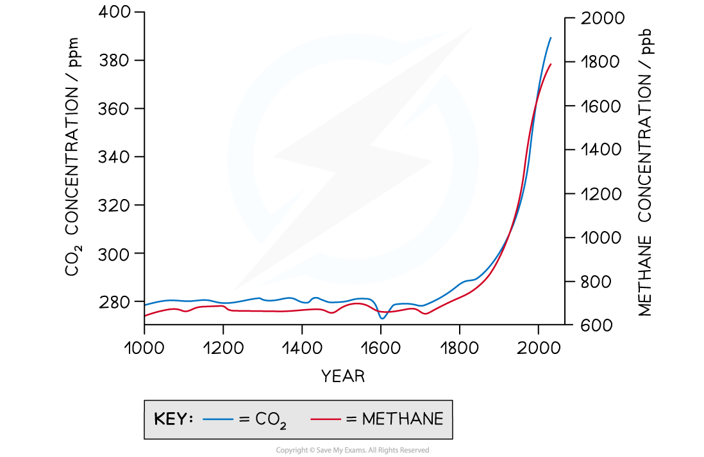

## The Greenhouse Effect

* When **radiation from the sun** hits the earth, it is **radiated back**from the earth's surface
* A **greenhouse gas** is a gas that **absorbs**this re-radiated radiation, **trapping it in the earth's atmosphere** so that it is not lost to space

  + Greenhouse gases in the atmosphere have a similar effect to the glass in a **greenhouse**, hence the term **greenhouse gas**, and their effect being known as the **greenhouse effect**
* The greenhouse effect is important to ensure that Earth is **warm enough for life**; if it were not for the insulating effect of greenhouse gases, Earth would see similar dramatic **temperature fluctuations** to its neighbouring planets

  + Temperatures on Mars range between 20°C and −153°C
* There are many greenhouse gases including

  + **Carbon dioxide**
  + **Methane**
* It is thought that increasing levels of carbon dioxide and methane are entering the atmosphere as a result of human activities, leading to increased rates of atmospheric warming

  + The atmospheric warming for which humans are thought to be responsible is known as **anthropogenic climate change**

***Greenhouse gases absorb radiation re-emitted from the earth's surface, trapping it in the atmosphere***

#### Carbon Dioxide

* Atmospheric carbon dioxide levels have **fluctuated throughout Earth's history** due to events such as volcanic eruptions and the weathering of limestone rocks
* Since the **industrial revolution**, however, atmospheric carbon dioxide levels have **risen to their highest in Earth's history**
* The industrial revolution began in the late 1700s when the **combustion of fossil fuels** to power**factories, transport**, and **homes** became commonplace

  + Fossil fuel combustion releases **carbon dioxide**
* A clear correlation can be seen between increasing **levels of carbon dioxide since the industrial revolution** and **increasing global temperatures**, providing evidence for the role of human activities in causing global warming

  + Note that a **correlation alone is not enough to prove causation**, but this evidence can be taken alongside what we know about greenhouse gases and other evidence to provide a growing body of proof
* In addition to the burning of fossil fuels, carbon dioxide is also released into the atmosphere when **natural stores of carbon are damaged or destroyed** by human activities

  + These carbon stores are known as **carbon sinks**
  + Carbon sinks include trees, soils, peat bogs, and the oceans

    - Deforestation, soil degradation, peat harvesting, and ocean warming all contribute to the addition of carbon dioxide to the atmosphere

#### Methane

* **Methane** (**CH****4**) is a simple **hydrocarbon**
* It is present as a **gas** in the atmosphere, and underground, and is the main component of **natural gas** fossil fuel
* Methane can be produced by **naturally occurring processes** in some types of bacteria, but levels have risen significantly in the last 150 years due to human activities
* Methane can be produced by several human activities

  + Methane is released from the **guts of ruminant mammals** such as cattle

    - While this is clearly not a direct human activity(!) the intensive farming of such animals has greatly increased their contribution to atmospheric methane
  + **Landfill sites** release methane when organic matter such as food waste decomposes
  + **Extraction of fossil fuels from underground** releases methane
* In addition to the list above, the warming of the poles that results from global warming also leads to the **release of methane from natural stores** such as permafrost

  + Permafrost is ground that remains frozen all year round

***Atmospheric concentrations of both carbon dioxide and methane have increased since the industrial revolution due to human activities.  Note that ppm = parts per million and ppb = parts per billion.***

#### Worked Example

The graph below shows changes in average global temperatures and atmospheric carbon dioxide concentrations since the year 1000; describe the data and explain what can be concluded from the graph

**Answer:**

* **Descriptions** of data must include any **trends**, as well as any sections of **data that don’t fit with the trend**
* Descriptions of data should also include **numbers to support the description**
* Be careful that any **conclusions** reached are taken **directly from the data** and **do not go beyond** what the data show

**Step 1: Describe the data**

Atmospheric carbon dioxide levels and average global temperatures have both increased since the year 1000

Atmospheric carbon dioxide concentration has increased from around 280 ppm to around 380 ppm

Average global temperatures have increased from around 13.8 ![degree](data:image/svg+xml;charset=utf8,%3Csvg%20xmlns%3D%22http%3A%2F%2Fwww.w3.org%2F2000%2Fsvg%22%20xmlns%3Awrs%3D%22http%3A%2F%2Fwww.wiris.com%2Fxml%2Fmathml-extension%22%20height%3D%2219%22%20width%3D%229%22%20wrs%3Abaseline%3D%2216%22%3E%3C!--MathML%3A%20%3Cmath%20xmlns%3D%22http%3A%2F%2Fwww.w3.org%2F1998%2FMath%2FMathML%22%20class%3D%22wrs_chemistry%22%3E%3Cmo%3E%26%23xB0%3B%3C%2Fmo%3E%3C%2Fmath%3E--%3E%3Cdefs%3E%3Cstyle%20type%3D%22text%2Fcss%22%3E%40font-face%7Bfont-family%3A'math138af86134b65d0f10fe33d30dd'%3Bsrc%3Aurl(data%3Afont%2Ftruetype%3Bcharset%3Dutf-8%3Bbase64%2CAAEAAAAMAIAAAwBAT1MvMi7iBBMAAADMAAAATmNtYXDEvmKUAAABHAAAADRjdnQgDVUNBwAAAVAAAAA6Z2x5ZoPi2VsAAAGMAAAAwmhlYWQQC2qxAAACUAAAADZoaGVhCGsXSAAAAogAAAAkaG10eE2rRkcAAAKsAAAACGxvY2EAHTwYAAACtAAAAAxtYXhwBT0FPgAAAsAAAAAgbmFtZaBxlY4AAALgAAABn3Bvc3QB9wD6AAAEgAAAACBwcmVwa1uragAABKAAAAAUAAADSwGQAAUAAAQABAAAAAAABAAEAAAAAAAAAQEAAAAAAAAAAAAAAAAAAAAAAAAAAAAAAAAAAAAAACAgICAAAAAg1UADev96AAAD6ACWAAAAAAACAAEAAQAAABQAAwABAAAAFAAEACAAAAAEAAQAAQAAALD%2F%2FwAAALD%2F%2F%2F9RAAEAAAAAAAABVAMsAIABAABWACoCWAIeAQ4BLAIsAFoBgAKAAKAA1ACAAAAAAAAAACsAVQCAAKsA1QEAASsABwAAAAIAVQAAAwADqwADAAcAADMRIRElIREhVQKr%2FasCAP4AA6v8VVUDAAACAFUB1gGrAysACwAXAEkYAbAYELEIBfSxEgX0sQ8F9LEMBfSxAgX0sRkF9LMLFQUPEDw8PACwGBCxCwL0sQ8F9LESBfSxFQX0sQUF9LMIDAISEDw8PDAxABYVFAYjLgE3NDYfATQmIyYGFRQWFzI2AVZVVVZVVgFVVVUqKyorKyorKgMqVVVVVQFUVlVVAaorKgEqKysqASoAAAABAAAAAQAA1XjOQV8PPPUAAwQA%2F%2F%2F%2F%2F9Y6E3P%2F%2F%2F%2F%2F1joTcwAA%2FyAEgAOrAAAACgACAAEAAAAAAAEAAAPo%2F2oAABdwAAD%2FtgSAAAEAAAAAAAAAAAAAAAAAAAACA1IAVQIAAFUAAAAAAAAAKAAAAMIAAQAAAAIAXgAFAAAAAAACAIAEAAAAAAAEAADeAAAAAAAAABUBAgAAAAAAAAABABIAAAAAAAAAAAACAA4AEgAAAAAAAAADADAAIAAAAAAAAAAEABIAUAAAAAAAAAAFABYAYgAAAAAAAAAGAAkAeAAAAAAAAAAIABwAgQABAAAAAAABABIAAAABAAAAAAACAA4AEgABAAAAAAADADAAIAABAAAAAAAEABIAUAABAAAAAAAFABYAYgABAAAAAAAGAAkAeAABAAAAAAAIABwAgQADAAEECQABABIAAAADAAEECQACAA4AEgADAAEECQADADAAIAADAAEECQAEABIAUAADAAEECQAFABYAYgADAAEECQAGAAkAeAADAAEECQAIABwAgQBNAGEAdABoACAARgBvAG4AdABSAGUAZwB1AGwAYQByAE0AYQB0AGgAcwAgAEYAbwByACAATQBvAHIAZQAgAE0AYQB0AGgAIABGAG8AbgB0AE0AYQB0AGgAIABGAG8AbgB0AFYAZQByAHMAaQBvAG4AIAAxAC4AME1hdGhfRm9udABNAGEAdABoAHMAIABGAG8AcgAgAE0AbwByAGUAAAMAAAAAAAAB9AD6AAAAAAAAAAAAAAAAAAAAAAAAAAC5BxEAAI2FGACyAAAAFRQTsQABPw%3D%3D)format('truetype')%3Bfont-weight%3Anormal%3Bfont-style%3Anormal%3B%7D%3C%2Fstyle%3E%3C%2Fdefs%3E%3Ctext%20font-family%3D%22math138af86134b65d0f10fe33d30dd%22%20font-size%3D%2216%22%20text-anchor%3D%22middle%22%20x%3D%224.5%22%20y%3D%2216%22%3E%26%23xB0%3B%3C%2Ftext%3E%3C%2Fsvg%3E)C to around 14.4 ![degree](data:image/svg+xml;charset=utf8,%3Csvg%20xmlns%3D%22http%3A%2F%2Fwww.w3.org%2F2000%2Fsvg%22%20xmlns%3Awrs%3D%22http%3A%2F%2Fwww.wiris.com%2Fxml%2Fmathml-extension%22%20height%3D%2219%22%20width%3D%229%22%20wrs%3Abaseline%3D%2216%22%3E%3C!--MathML%3A%20%3Cmath%20xmlns%3D%22http%3A%2F%2Fwww.w3.org%2F1998%2FMath%2FMathML%22%20class%3D%22wrs_chemistry%22%3E%3Cmo%3E%26%23xB0%3B%3C%2Fmo%3E%3C%2Fmath%3E--%3E%3Cdefs%3E%3Cstyle%20type%3D%22text%2Fcss%22%3E%40font-face%7Bfont-family%3A'math138af86134b65d0f10fe33d30dd'%3Bsrc%3Aurl(data%3Afont%2Ftruetype%3Bcharset%3Dutf-8%3Bbase64%2CAAEAAAAMAIAAAwBAT1MvMi7iBBMAAADMAAAATmNtYXDEvmKUAAABHAAAADRjdnQgDVUNBwAAAVAAAAA6Z2x5ZoPi2VsAAAGMAAAAwmhlYWQQC2qxAAACUAAAADZoaGVhCGsXSAAAAogAAAAkaG10eE2rRkcAAAKsAAAACGxvY2EAHTwYAAACtAAAAAxtYXhwBT0FPgAAAsAAAAAgbmFtZaBxlY4AAALgAAABn3Bvc3QB9wD6AAAEgAAAACBwcmVwa1uragAABKAAAAAUAAADSwGQAAUAAAQABAAAAAAABAAEAAAAAAAAAQEAAAAAAAAAAAAAAAAAAAAAAAAAAAAAAAAAAAAAACAgICAAAAAg1UADev96AAAD6ACWAAAAAAACAAEAAQAAABQAAwABAAAAFAAEACAAAAAEAAQAAQAAALD%2F%2FwAAALD%2F%2F%2F9RAAEAAAAAAAABVAMsAIABAABWACoCWAIeAQ4BLAIsAFoBgAKAAKAA1ACAAAAAAAAAACsAVQCAAKsA1QEAASsABwAAAAIAVQAAAwADqwADAAcAADMRIRElIREhVQKr%2FasCAP4AA6v8VVUDAAACAFUB1gGrAysACwAXAEkYAbAYELEIBfSxEgX0sQ8F9LEMBfSxAgX0sRkF9LMLFQUPEDw8PACwGBCxCwL0sQ8F9LESBfSxFQX0sQUF9LMIDAISEDw8PDAxABYVFAYjLgE3NDYfATQmIyYGFRQWFzI2AVZVVVZVVgFVVVUqKyorKyorKgMqVVVVVQFUVlVVAaorKgEqKysqASoAAAABAAAAAQAA1XjOQV8PPPUAAwQA%2F%2F%2F%2F%2F9Y6E3P%2F%2F%2F%2F%2F1joTcwAA%2FyAEgAOrAAAACgACAAEAAAAAAAEAAAPo%2F2oAABdwAAD%2FtgSAAAEAAAAAAAAAAAAAAAAAAAACA1IAVQIAAFUAAAAAAAAAKAAAAMIAAQAAAAIAXgAFAAAAAAACAIAEAAAAAAAEAADeAAAAAAAAABUBAgAAAAAAAAABABIAAAAAAAAAAAACAA4AEgAAAAAAAAADADAAIAAAAAAAAAAEABIAUAAAAAAAAAAFABYAYgAAAAAAAAAGAAkAeAAAAAAAAAAIABwAgQABAAAAAAABABIAAAABAAAAAAACAA4AEgABAAAAAAADADAAIAABAAAAAAAEABIAUAABAAAAAAAFABYAYgABAAAAAAAGAAkAeAABAAAAAAAIABwAgQADAAEECQABABIAAAADAAEECQACAA4AEgADAAEECQADADAAIAADAAEECQAEABIAUAADAAEECQAFABYAYgADAAEECQAGAAkAeAADAAEECQAIABwAgQBNAGEAdABoACAARgBvAG4AdABSAGUAZwB1AGwAYQByAE0AYQB0AGgAcwAgAEYAbwByACAATQBvAHIAZQAgAE0AYQB0AGgAIABGAG8AbgB0AE0AYQB0AGgAIABGAG8AbgB0AFYAZQByAHMAaQBvAG4AIAAxAC4AME1hdGhfRm9udABNAGEAdABoAHMAIABGAG8AcgAgAE0AbwByAGUAAAMAAAAAAAAB9AD6AAAAAAAAAAAAAAAAAAAAAAAAAAC5BxEAAI2FGACyAAAAFRQTsQABPw%3D%3D)format('truetype')%3Bfont-weight%3Anormal%3Bfont-style%3Anormal%3B%7D%3C%2Fstyle%3E%3C%2Fdefs%3E%3Ctext%20font-family%3D%22math138af86134b65d0f10fe33d30dd%22%20font-size%3D%2216%22%20text-anchor%3D%22middle%22%20x%3D%224.5%22%20y%3D%2216%22%3E%26%23xB0%3B%3C%2Ftext%3E%3C%2Fsvg%3E)C

Average global temperatures have fluctuated, showing periods of decrease e.g. during the 1400s and periods of increase e.g. during the early 1700s

Atmospheric carbon dioxide levels and average global temperatures were both reasonably constant between the years 1000 and the mid-1800s/1900, and then both show a steep increase between 1900 and 2000

**Step 2: State what can be concluded**

There is a correlation between atmospheric carbon dioxide concentration and average global temperature

Both atmospheric carbon dioxide concentration and average global temperature increase from the industrial revolution onward

Average global temperatures fluctuate at times when atmospheric carbon dioxide concentrations are relatively constant

**Note that you cannot conclude a causal relationship from this data alone; in fact the fluctuations in temperature when carbon dioxide levels are constant suggest that there are other factors involved**

#### Examiner Tips and Tricks

Note that the greenhouse effect, global warming and climate change are terms that are often used interchangeably, but in fact they have slightly different meanings:

* **Global warming** refers to the rise in global temperatures mainly due to the increasing concentrations of greenhouse gases in the atmosphere.
* **Climate change** refers to the increasing changes in the measures of climate over a long period of time – including precipitation, temperature, and wind patterns. These are often a consequence of global warming.
* **The greenhouse effect** is a naturally occurring event, constantly occurring due to the atmosphere and sunlight.