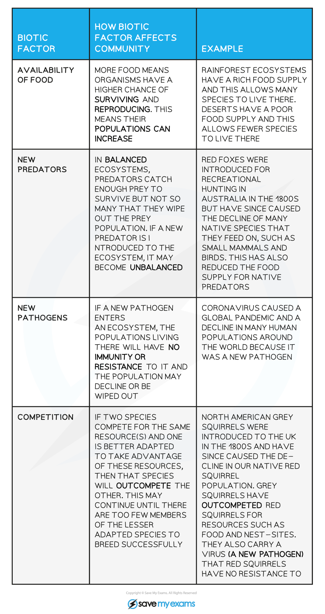
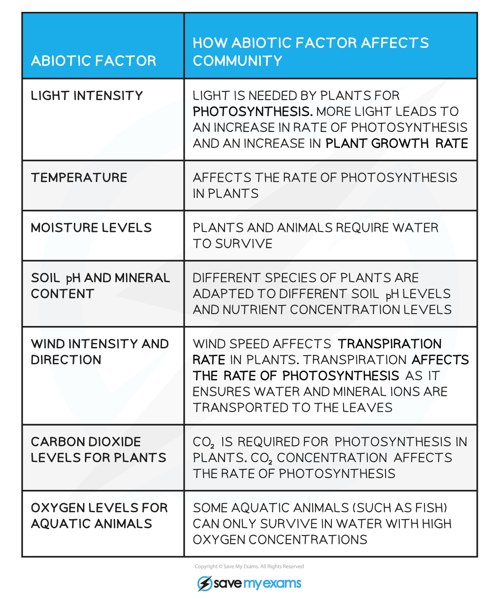

## Biotic Factors

* The abundance and distribution of a species within a habitat are determined by a combination of biotic and abiotic factors
* **Biotic factors** are **living** factors that influence populations within their community; biotic factors come about as a result of the **activity of other organisms** e.g.

  + Predation
  + Food availability
  + Intraspecific competition, arising when individuals of the **same** species compete for resources
  + Interspecific competition, arising when individuals of **different** species compete for resources
  + Cooperation between organisms
  + Parasitism
  + Disease

**The Impact of Biotic Factors on a Community Table**

## Abiotic Factors

* **Abiotic factors** are **non-living** factors that influence populations within their community e.g.

  + Light intensity and wavelength
  + Temperature
  + Turbidity, or cloudiness, of water
  + Humidity
  + Soil or water pH
  + Soil or water salinity
  + Soil composition
  + Oxygen or Carbon dioxide concentration

**The Impact of Abiotic Factors on a Community Table**

