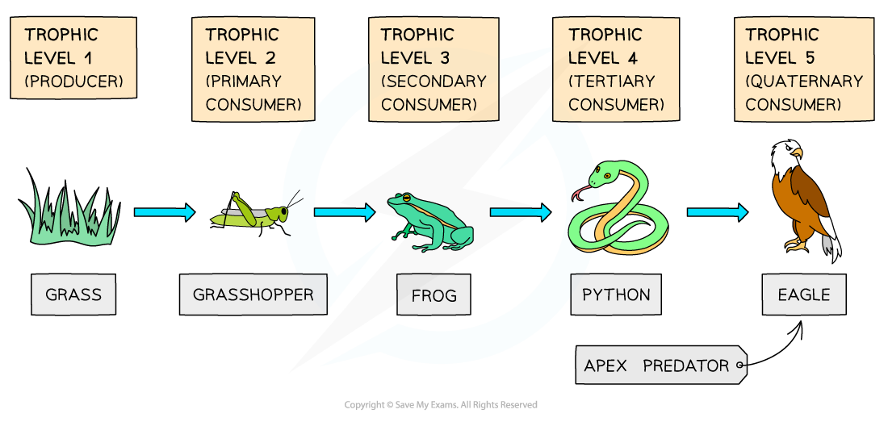
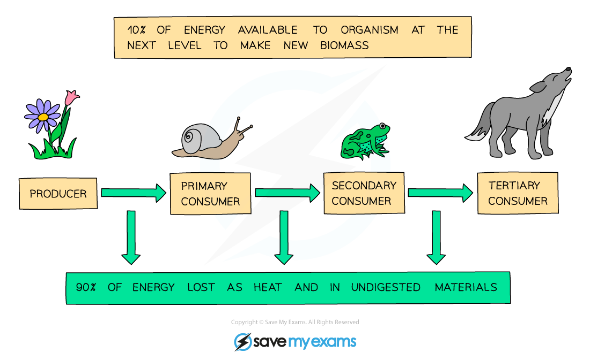

## Calculating the Efficiency of Biomass & Energy Transfers

#### Transfer of energy through a food chain

* During photosynthesis organisms such as plants convert**light energy** into **chemical energy** stored in biological molecules

  + Organisms that do this are known as **producers**
* The chemical energy stored in plant biomass is passed to **primary consumers** when the plant is**ingested**

  + **Primary consumers** are animals that eat plant material; they can be herbivores or omnivores
* The primary consumer **digests** the plant tissues and uses the stored chemical energy either to fuel **respiration** or to build up **biomass**; this latter means that the **stored chemical energy is transferred** to the **tissues** of the primary consumer
* When the primary consumer is ingested by a **secondary consumer** the **stored chemical energy** passes to the secondary consumer, and so on up the food chain

  + When an organism dies, the chemical energy stored in its tissues passes to **decomposers** such as bacteria and fungi
* In a food chain the arrows represent the **transfer of energy** from one trophic level to the next by the process of **feeding**

  + The term **trophic** **level** refers to the stage in a food chain

***The light energy converted into chemical energy by producers is passed up the food chain by the process of feeding***

#### Energy losses in a food chain

* The transfer of energy in a food chain is not 100 % efficient; **energy is lost to the environment** at every trophic level
* A large proportion of the sun's energy is not available to **producers** for building **biomass**

  + Light **passes through leaves** or is **reflected** away
  + Light hits non-photosynthetic parts of the plant e.g. bark or flowers
  + Light is a mixture of wavelengths and **only certain wavelengths** are absorbed in photosynthesis
  + Plants release energy during respiration, some of which is lost to the environment in the form of **heat**
* When a consumer ingests another organism, **not all the chemical energy in the consumer's food is transferred to the consumer's biomass**

  + **Only around 10 %** of the energy is available to the consumer to store in their tissues
  + This is because **around 90 %** of the energy is **lost to the environment**
* Around 90 % of the energy is lost to the environment because

  + **Not every part of the food organism is** **eaten,** e.g. the roots and woody parts of plants or the bones of animals, meaning that the stored energy in these uneaten tissues is **lost** to the **environment**
  + Consumers are **not able** **to** **digest** all of the food they ingest, e.g. cellulose in plants or the fur of animals, so some is **egested** as **faeces**; the chemical energy in this undigested food is also lost to the environment
  + Energy is lost to the environment in the form of **heat** when consumers **respire**
  + Energy is lost to the environment when organisms **excrete** the waste products of metabolism e.g. urea in urine
* The energy that is left after these losses **is available to the consumer** to fuel their **life functions,**including being stored in **biomass during growth**
* The **rate** at which energy is converted into **biomass** in the body of a **consumer** is known as **net productivity**

  + Note that this is slightly different to the rate at which energy is converted into biomass in **producers**, which is known as net **primary** productivity

***Energy is lost to the environment at every trophic level of a food chain***

#### Calculating the efficiency of energy transfer

* The efficiency of energy transfer in a food chain can be calculated using the following equation

**Energy efficiency = (net productivity** ![divided by](data:image/svg+xml;charset=utf8,%3Csvg%20xmlns%3D%22http%3A%2F%2Fwww.w3.org%2F2000%2Fsvg%22%20xmlns%3Awrs%3D%22http%3A%2F%2Fwww.wiris.com%2Fxml%2Fmathml-extension%22%20height%3D%2219%22%20width%3D%2219%22%20wrs%3Abaseline%3D%2216%22%3E%3C!--MathML%3A%20%3Cmath%20xmlns%3D%22http%3A%2F%2Fwww.w3.org%2F1998%2FMath%2FMathML%22%3E%3Cmo%3E%26%23xF7%3B%3C%2Fmo%3E%3C%2Fmath%3E--%3E%3Cdefs%3E%3Cstyle%20type%3D%22text%2Fcss%22%3E%40font-face%7Bfont-family%3A'math13cec07e9ba5f5bb252d13f5f43'%3Bsrc%3Aurl(data%3Afont%2Ftruetype%3Bcharset%3Dutf-8%3Bbase64%2CAAEAAAAMAIAAAwBAT1MvMi7iBBMAAADMAAAATmNtYXDEvmKUAAABHAAAADRjdnQgDVUNBwAAAVAAAAA6Z2x5ZoPi2VsAAAGMAAAAm2hlYWQQC2qxAAACKAAAADZoaGVhCGsXSAAAAmAAAAAkaG10eE2rRkcAAAKEAAAACGxvY2EAHTwYAAACjAAAAAxtYXhwBT0FPgAAApgAAAAgbmFtZaBxlY4AAAK4AAABn3Bvc3QB9wD6AAAEWAAAACBwcmVwa1uragAABHgAAAAUAAADSwGQAAUAAAQABAAAAAAABAAEAAAAAAAAAQEAAAAAAAAAAAAAAAAAAAAAAAAAAAAAAAAAAAAAACAgICAAAAAg1UADev96AAAD6ACWAAAAAAACAAEAAQAAABQAAwABAAAAFAAEACAAAAAEAAQAAQAAAPf%2F%2FwAAAPf%2F%2F%2F8KAAEAAAAAAAABVAMsAIABAABWACoCWAIeAQ4BLAIsAFoBgAKAAKAA1ACAAAAAAAAAACsAVQCAAKsA1QEAASsABwAAAAIAVQAAAwADqwADAAcAADMRIRElIREhVQKr%2FasCAP4AA6v8VVUDAAADAIAAgAMAAoAAAwAHAAsAQRgBsAQQsQAD9LEEB%2FSwCDyxBRH0sAo8sQEH9LEMA%2BYAsQMMENWxAAX1sAMQsQgF9bELEfWwABCxBwX1sQQR9TAxEyEVIQEzFSMRMxUjgAKA%2FYABAICAgIABq1YBK4D%2FAIAAAAEAAAABAADVeM5BXw889QADBAD%2F%2F%2F%2F%2F1joTc%2F%2F%2F%2F%2F%2FWOhNzAAD%2FIASAA6sAAAAKAAIAAQAAAAAAAQAAA%2Bj%2FagAAF3AAAP%2B2BIAAAQAAAAAAAAAAAAAAAAAAAAIDUgBVA4AAgAAAAAAAAAAoAAAAmwABAAAAAgBeAAUAAAAAAAIAgAQAAAAAAAQAAN4AAAAAAAAAFQECAAAAAAAAAAEAEgAAAAAAAAAAAAIADgASAAAAAAAAAAMAMAAgAAAAAAAAAAQAEgBQAAAAAAAAAAUAFgBiAAAAAAAAAAYACQB4AAAAAAAAAAgAHACBAAEAAAAAAAEAEgAAAAEAAAAAAAIADgASAAEAAAAAAAMAMAAgAAEAAAAAAAQAEgBQAAEAAAAAAAUAFgBiAAEAAAAAAAYACQB4AAEAAAAAAAgAHACBAAMAAQQJAAEAEgAAAAMAAQQJAAIADgASAAMAAQQJAAMAMAAgAAMAAQQJAAQAEgBQAAMAAQQJAAUAFgBiAAMAAQQJAAYACQB4AAMAAQQJAAgAHACBAE0AYQB0AGgAIABGAG8AbgB0AFIAZQBnAHUAbABhAHIATQBhAHQAaABzACAARgBvAHIAIABNAG8AcgBlACAATQBhAHQAaAAgAEYAbwBuAHQATQBhAHQAaAAgAEYAbwBuAHQAVgBlAHIAcwBpAG8AbgAgADEALgAwTWF0aF9Gb250AE0AYQB0AGgAcwAgAEYAbwByACAATQBvAHIAZQAAAwAAAAAAAAH0APoAAAAAAAAAAAAAAAAAAAAAAAAAALkHEQAAjYUYALIAAAAVFBOxAAE%2F)format('truetype')%3Bfont-weight%3Anormal%3Bfont-style%3Anormal%3B%7D%3C%2Fstyle%3E%3C%2Fdefs%3E%3Ctext%20font-family%3D%22math13cec07e9ba5f5bb252d13f5f43%22%20font-size%3D%2216%22%20text-anchor%3D%22middle%22%20x%3D%229.5%22%20y%3D%2216%22%3E%26%23xF7%3B%3C%2Ftext%3E%3C%2Fsvg%3E) **energy received)**![cross times](data:image/svg+xml;charset=utf8,%3Csvg%20xmlns%3D%22http%3A%2F%2Fwww.w3.org%2F2000%2Fsvg%22%20xmlns%3Awrs%3D%22http%3A%2F%2Fwww.wiris.com%2Fxml%2Fmathml-extension%22%20height%3D%2219%22%20width%3D%2218%22%20wrs%3Abaseline%3D%2216%22%3E%3C!--MathML%3A%20%3Cmath%20xmlns%3D%22http%3A%2F%2Fwww.w3.org%2F1998%2FMath%2FMathML%22%3E%3Cmo%3E%26%23xD7%3B%3C%2Fmo%3E%3C%2Fmath%3E--%3E%3Cdefs%3E%3Cstyle%20type%3D%22text%2Fcss%22%3E%40font-face%7Bfont-family%3A'math13b8a614226a953a8cd9526fca6'%3Bsrc%3Aurl(data%3Afont%2Ftruetype%3Bcharset%3Dutf-8%3Bbase64%2CAAEAAAAMAIAAAwBAT1MvMi7iBBMAAADMAAAATmNtYXDEvmKUAAABHAAAADRjdnQgDVUNBwAAAVAAAAA6Z2x5ZoPi2VsAAAGMAAAAl2hlYWQQC2qxAAACJAAAADZoaGVhCGsXSAAAAlwAAAAkaG10eE2rRkcAAAKAAAAACGxvY2EAHTwYAAACiAAAAAxtYXhwBT0FPgAAApQAAAAgbmFtZaBxlY4AAAK0AAABn3Bvc3QB9wD6AAAEVAAAACBwcmVwa1uragAABHQAAAAUAAADSwGQAAUAAAQABAAAAAAABAAEAAAAAAAAAQEAAAAAAAAAAAAAAAAAAAAAAAAAAAAAAAAAAAAAACAgICAAAAAg1UADev96AAAD6ACWAAAAAAACAAEAAQAAABQAAwABAAAAFAAEACAAAAAEAAQAAQAAANf%2F%2FwAAANf%2F%2F%2F8qAAEAAAAAAAABVAMsAIABAABWACoCWAIeAQ4BLAIsAFoBgAKAAKAA1ACAAAAAAAAAACsAVQCAAKsA1QEAASsABwAAAAIAVQAAAwADqwADAAcAADMRIRElIREhVQKr%2FasCAP4AA6v8VVUDAAACAIAAVQLVAoAAAwAHAEYYsAEUALEAABMQsQAJ5LEAARMQsAQ8sQYI9LACPDABsQgBExCxAAP2sAc8sQEF9bAGPLIFBwAQ9LACPLEJA%2BaxBAX1sAM8EzMBIxEzASOAVQIAVVX%2BAFUCgP3VAiv91QAAAQAAAAEAANV4zkFfDzz1AAMEAP%2F%2F%2F%2F%2FWOhNz%2F%2F%2F%2F%2F9Y6E3MAAP8gBIADqwAAAAoAAgABAAAAAAABAAAD6P9qAAAXcAAA%2F7YEgAABAAAAAAAAAAAAAAAAAAAAAgNSAFUDVgCAAAAAAAAAACgAAACXAAEAAAACAF4ABQAAAAAAAgCABAAAAAAABAAA3gAAAAAAAAAVAQIAAAAAAAAAAQASAAAAAAAAAAAAAgAOABIAAAAAAAAAAwAwACAAAAAAAAAABAASAFAAAAAAAAAABQAWAGIAAAAAAAAABgAJAHgAAAAAAAAACAAcAIEAAQAAAAAAAQASAAAAAQAAAAAAAgAOABIAAQAAAAAAAwAwACAAAQAAAAAABAASAFAAAQAAAAAABQAWAGIAAQAAAAAABgAJAHgAAQAAAAAACAAcAIEAAwABBAkAAQASAAAAAwABBAkAAgAOABIAAwABBAkAAwAwACAAAwABBAkABAASAFAAAwABBAkABQAWAGIAAwABBAkABgAJAHgAAwABBAkACAAcAIEATQBhAHQAaAAgAEYAbwBuAHQAUgBlAGcAdQBsAGEAcgBNAGEAdABoAHMAIABGAG8AcgAgAE0AbwByAGUAIABNAGEAdABoACAARgBvAG4AdABNAGEAdABoACAARgBvAG4AdABWAGUAcgBzAGkAbwBuACAAMQAuADBNYXRoX0ZvbnQATQBhAHQAaABzACAARgBvAHIAIABNAG8AcgBlAAADAAAAAAAAAfQA%2BgAAAAAAAAAAAAAAAAAAAAAAAAAAuQcRAACNhRgAsgAAABUUE7EAAT8%3D)format('truetype')%3Bfont-weight%3Anormal%3Bfont-style%3Anormal%3B%7D%3C%2Fstyle%3E%3C%2Fdefs%3E%3Ctext%20font-family%3D%22math13b8a614226a953a8cd9526fca6%22%20font-size%3D%2216%22%20text-anchor%3D%22middle%22%20x%3D%228.5%22%20y%3D%2216%22%3E%26%23xD7%3B%3C%2Ftext%3E%3C%2Fsvg%3E) **100**

* Note that net productivity can be calculated by **subtracting energy losses from energy received**
* Efficiency of energy transfer is given as a **percentage**

#### Worked Example

A wheat farmer decides to use biological control against insect pests that are eating her wheat crop. The farmer introduces a species of toad. By eating the insect pests the toads ingest 10 000 kJ m-2 yr-1 of energy. The toads lose 7 000 kJ m-2 yr-1 of this energy as heat from respiration and 2 000 kJ m-2 yr-1 of energy in faeces and urine. Calculate the efficiency of energy transfer from the insects to the toads.  
  
**Answer:**  
  
**Step 1: Calculate the net productivity of the toads**

Toad energy received= 10 000 kJ m-2 yr-1

Toad energy losses = 7 000 + 2 000 = 9 000 kJ m-2 yr-1

Toad net productivity = 10 000 - 9 000 = 1 000

Toad net productivity = 1 000 kJ m-2 yr-1

**Step 2: Substitute values into the equation**

Energy efficiency = (net productivity ![divided by](data:image/svg+xml;charset=utf8,%3Csvg%20xmlns%3D%22http%3A%2F%2Fwww.w3.org%2F2000%2Fsvg%22%20xmlns%3Awrs%3D%22http%3A%2F%2Fwww.wiris.com%2Fxml%2Fmathml-extension%22%20height%3D%2219%22%20width%3D%2219%22%20wrs%3Abaseline%3D%2216%22%3E%3C!--MathML%3A%20%3Cmath%20xmlns%3D%22http%3A%2F%2Fwww.w3.org%2F1998%2FMath%2FMathML%22%3E%3Cmo%3E%26%23xF7%3B%3C%2Fmo%3E%3C%2Fmath%3E--%3E%3Cdefs%3E%3Cstyle%20type%3D%22text%2Fcss%22%3E%40font-face%7Bfont-family%3A'math13cec07e9ba5f5bb252d13f5f43'%3Bsrc%3Aurl(data%3Afont%2Ftruetype%3Bcharset%3Dutf-8%3Bbase64%2CAAEAAAAMAIAAAwBAT1MvMi7iBBMAAADMAAAATmNtYXDEvmKUAAABHAAAADRjdnQgDVUNBwAAAVAAAAA6Z2x5ZoPi2VsAAAGMAAAAm2hlYWQQC2qxAAACKAAAADZoaGVhCGsXSAAAAmAAAAAkaG10eE2rRkcAAAKEAAAACGxvY2EAHTwYAAACjAAAAAxtYXhwBT0FPgAAApgAAAAgbmFtZaBxlY4AAAK4AAABn3Bvc3QB9wD6AAAEWAAAACBwcmVwa1uragAABHgAAAAUAAADSwGQAAUAAAQABAAAAAAABAAEAAAAAAAAAQEAAAAAAAAAAAAAAAAAAAAAAAAAAAAAAAAAAAAAACAgICAAAAAg1UADev96AAAD6ACWAAAAAAACAAEAAQAAABQAAwABAAAAFAAEACAAAAAEAAQAAQAAAPf%2F%2FwAAAPf%2F%2F%2F8KAAEAAAAAAAABVAMsAIABAABWACoCWAIeAQ4BLAIsAFoBgAKAAKAA1ACAAAAAAAAAACsAVQCAAKsA1QEAASsABwAAAAIAVQAAAwADqwADAAcAADMRIRElIREhVQKr%2FasCAP4AA6v8VVUDAAADAIAAgAMAAoAAAwAHAAsAQRgBsAQQsQAD9LEEB%2FSwCDyxBRH0sAo8sQEH9LEMA%2BYAsQMMENWxAAX1sAMQsQgF9bELEfWwABCxBwX1sQQR9TAxEyEVIQEzFSMRMxUjgAKA%2FYABAICAgIABq1YBK4D%2FAIAAAAEAAAABAADVeM5BXw889QADBAD%2F%2F%2F%2F%2F1joTc%2F%2F%2F%2F%2F%2FWOhNzAAD%2FIASAA6sAAAAKAAIAAQAAAAAAAQAAA%2Bj%2FagAAF3AAAP%2B2BIAAAQAAAAAAAAAAAAAAAAAAAAIDUgBVA4AAgAAAAAAAAAAoAAAAmwABAAAAAgBeAAUAAAAAAAIAgAQAAAAAAAQAAN4AAAAAAAAAFQECAAAAAAAAAAEAEgAAAAAAAAAAAAIADgASAAAAAAAAAAMAMAAgAAAAAAAAAAQAEgBQAAAAAAAAAAUAFgBiAAAAAAAAAAYACQB4AAAAAAAAAAgAHACBAAEAAAAAAAEAEgAAAAEAAAAAAAIADgASAAEAAAAAAAMAMAAgAAEAAAAAAAQAEgBQAAEAAAAAAAUAFgBiAAEAAAAAAAYACQB4AAEAAAAAAAgAHACBAAMAAQQJAAEAEgAAAAMAAQQJAAIADgASAAMAAQQJAAMAMAAgAAMAAQQJAAQAEgBQAAMAAQQJAAUAFgBiAAMAAQQJAAYACQB4AAMAAQQJAAgAHACBAE0AYQB0AGgAIABGAG8AbgB0AFIAZQBnAHUAbABhAHIATQBhAHQAaABzACAARgBvAHIAIABNAG8AcgBlACAATQBhAHQAaAAgAEYAbwBuAHQATQBhAHQAaAAgAEYAbwBuAHQAVgBlAHIAcwBpAG8AbgAgADEALgAwTWF0aF9Gb250AE0AYQB0AGgAcwAgAEYAbwByACAATQBvAHIAZQAAAwAAAAAAAAH0APoAAAAAAAAAAAAAAAAAAAAAAAAAALkHEQAAjYUYALIAAAAVFBOxAAE%2F)format('truetype')%3Bfont-weight%3Anormal%3Bfont-style%3Anormal%3B%7D%3C%2Fstyle%3E%3C%2Fdefs%3E%3Ctext%20font-family%3D%22math13cec07e9ba5f5bb252d13f5f43%22%20font-size%3D%2216%22%20text-anchor%3D%22middle%22%20x%3D%229.5%22%20y%3D%2216%22%3E%26%23xF7%3B%3C%2Ftext%3E%3C%2Fsvg%3E) energy received) x 100

Energy efficiency = (1 000 ![divided by](data:image/svg+xml;charset=utf8,%3Csvg%20xmlns%3D%22http%3A%2F%2Fwww.w3.org%2F2000%2Fsvg%22%20xmlns%3Awrs%3D%22http%3A%2F%2Fwww.wiris.com%2Fxml%2Fmathml-extension%22%20height%3D%2219%22%20width%3D%2219%22%20wrs%3Abaseline%3D%2216%22%3E%3C!--MathML%3A%20%3Cmath%20xmlns%3D%22http%3A%2F%2Fwww.w3.org%2F1998%2FMath%2FMathML%22%3E%3Cmo%3E%26%23xF7%3B%3C%2Fmo%3E%3C%2Fmath%3E--%3E%3Cdefs%3E%3Cstyle%20type%3D%22text%2Fcss%22%3E%40font-face%7Bfont-family%3A'math13cec07e9ba5f5bb252d13f5f43'%3Bsrc%3Aurl(data%3Afont%2Ftruetype%3Bcharset%3Dutf-8%3Bbase64%2CAAEAAAAMAIAAAwBAT1MvMi7iBBMAAADMAAAATmNtYXDEvmKUAAABHAAAADRjdnQgDVUNBwAAAVAAAAA6Z2x5ZoPi2VsAAAGMAAAAm2hlYWQQC2qxAAACKAAAADZoaGVhCGsXSAAAAmAAAAAkaG10eE2rRkcAAAKEAAAACGxvY2EAHTwYAAACjAAAAAxtYXhwBT0FPgAAApgAAAAgbmFtZaBxlY4AAAK4AAABn3Bvc3QB9wD6AAAEWAAAACBwcmVwa1uragAABHgAAAAUAAADSwGQAAUAAAQABAAAAAAABAAEAAAAAAAAAQEAAAAAAAAAAAAAAAAAAAAAAAAAAAAAAAAAAAAAACAgICAAAAAg1UADev96AAAD6ACWAAAAAAACAAEAAQAAABQAAwABAAAAFAAEACAAAAAEAAQAAQAAAPf%2F%2FwAAAPf%2F%2F%2F8KAAEAAAAAAAABVAMsAIABAABWACoCWAIeAQ4BLAIsAFoBgAKAAKAA1ACAAAAAAAAAACsAVQCAAKsA1QEAASsABwAAAAIAVQAAAwADqwADAAcAADMRIRElIREhVQKr%2FasCAP4AA6v8VVUDAAADAIAAgAMAAoAAAwAHAAsAQRgBsAQQsQAD9LEEB%2FSwCDyxBRH0sAo8sQEH9LEMA%2BYAsQMMENWxAAX1sAMQsQgF9bELEfWwABCxBwX1sQQR9TAxEyEVIQEzFSMRMxUjgAKA%2FYABAICAgIABq1YBK4D%2FAIAAAAEAAAABAADVeM5BXw889QADBAD%2F%2F%2F%2F%2F1joTc%2F%2F%2F%2F%2F%2FWOhNzAAD%2FIASAA6sAAAAKAAIAAQAAAAAAAQAAA%2Bj%2FagAAF3AAAP%2B2BIAAAQAAAAAAAAAAAAAAAAAAAAIDUgBVA4AAgAAAAAAAAAAoAAAAmwABAAAAAgBeAAUAAAAAAAIAgAQAAAAAAAQAAN4AAAAAAAAAFQECAAAAAAAAAAEAEgAAAAAAAAAAAAIADgASAAAAAAAAAAMAMAAgAAAAAAAAAAQAEgBQAAAAAAAAAAUAFgBiAAAAAAAAAAYACQB4AAAAAAAAAAgAHACBAAEAAAAAAAEAEgAAAAEAAAAAAAIADgASAAEAAAAAAAMAMAAgAAEAAAAAAAQAEgBQAAEAAAAAAAUAFgBiAAEAAAAAAAYACQB4AAEAAAAAAAgAHACBAAMAAQQJAAEAEgAAAAMAAQQJAAIADgASAAMAAQQJAAMAMAAgAAMAAQQJAAQAEgBQAAMAAQQJAAUAFgBiAAMAAQQJAAYACQB4AAMAAQQJAAgAHACBAE0AYQB0AGgAIABGAG8AbgB0AFIAZQBnAHUAbABhAHIATQBhAHQAaABzACAARgBvAHIAIABNAG8AcgBlACAATQBhAHQAaAAgAEYAbwBuAHQATQBhAHQAaAAgAEYAbwBuAHQAVgBlAHIAcwBpAG8AbgAgADEALgAwTWF0aF9Gb250AE0AYQB0AGgAcwAgAEYAbwByACAATQBvAHIAZQAAAwAAAAAAAAH0APoAAAAAAAAAAAAAAAAAAAAAAAAAALkHEQAAjYUYALIAAAAVFBOxAAE%2F)format('truetype')%3Bfont-weight%3Anormal%3Bfont-style%3Anormal%3B%7D%3C%2Fstyle%3E%3C%2Fdefs%3E%3Ctext%20font-family%3D%22math13cec07e9ba5f5bb252d13f5f43%22%20font-size%3D%2216%22%20text-anchor%3D%22middle%22%20x%3D%229.5%22%20y%3D%2216%22%3E%26%23xF7%3B%3C%2Ftext%3E%3C%2Fsvg%3E)10 000) ![cross times](data:image/svg+xml;charset=utf8,%3Csvg%20xmlns%3D%22http%3A%2F%2Fwww.w3.org%2F2000%2Fsvg%22%20xmlns%3Awrs%3D%22http%3A%2F%2Fwww.wiris.com%2Fxml%2Fmathml-extension%22%20height%3D%2219%22%20width%3D%2218%22%20wrs%3Abaseline%3D%2216%22%3E%3C!--MathML%3A%20%3Cmath%20xmlns%3D%22http%3A%2F%2Fwww.w3.org%2F1998%2FMath%2FMathML%22%3E%3Cmo%3E%26%23xD7%3B%3C%2Fmo%3E%3C%2Fmath%3E--%3E%3Cdefs%3E%3Cstyle%20type%3D%22text%2Fcss%22%3E%40font-face%7Bfont-family%3A'math13b8a614226a953a8cd9526fca6'%3Bsrc%3Aurl(data%3Afont%2Ftruetype%3Bcharset%3Dutf-8%3Bbase64%2CAAEAAAAMAIAAAwBAT1MvMi7iBBMAAADMAAAATmNtYXDEvmKUAAABHAAAADRjdnQgDVUNBwAAAVAAAAA6Z2x5ZoPi2VsAAAGMAAAAl2hlYWQQC2qxAAACJAAAADZoaGVhCGsXSAAAAlwAAAAkaG10eE2rRkcAAAKAAAAACGxvY2EAHTwYAAACiAAAAAxtYXhwBT0FPgAAApQAAAAgbmFtZaBxlY4AAAK0AAABn3Bvc3QB9wD6AAAEVAAAACBwcmVwa1uragAABHQAAAAUAAADSwGQAAUAAAQABAAAAAAABAAEAAAAAAAAAQEAAAAAAAAAAAAAAAAAAAAAAAAAAAAAAAAAAAAAACAgICAAAAAg1UADev96AAAD6ACWAAAAAAACAAEAAQAAABQAAwABAAAAFAAEACAAAAAEAAQAAQAAANf%2F%2FwAAANf%2F%2F%2F8qAAEAAAAAAAABVAMsAIABAABWACoCWAIeAQ4BLAIsAFoBgAKAAKAA1ACAAAAAAAAAACsAVQCAAKsA1QEAASsABwAAAAIAVQAAAwADqwADAAcAADMRIRElIREhVQKr%2FasCAP4AA6v8VVUDAAACAIAAVQLVAoAAAwAHAEYYsAEUALEAABMQsQAJ5LEAARMQsAQ8sQYI9LACPDABsQgBExCxAAP2sAc8sQEF9bAGPLIFBwAQ9LACPLEJA%2BaxBAX1sAM8EzMBIxEzASOAVQIAVVX%2BAFUCgP3VAiv91QAAAQAAAAEAANV4zkFfDzz1AAMEAP%2F%2F%2F%2F%2FWOhNz%2F%2F%2F%2F%2F9Y6E3MAAP8gBIADqwAAAAoAAgABAAAAAAABAAAD6P9qAAAXcAAA%2F7YEgAABAAAAAAAAAAAAAAAAAAAAAgNSAFUDVgCAAAAAAAAAACgAAACXAAEAAAACAF4ABQAAAAAAAgCABAAAAAAABAAA3gAAAAAAAAAVAQIAAAAAAAAAAQASAAAAAAAAAAAAAgAOABIAAAAAAAAAAwAwACAAAAAAAAAABAASAFAAAAAAAAAABQAWAGIAAAAAAAAABgAJAHgAAAAAAAAACAAcAIEAAQAAAAAAAQASAAAAAQAAAAAAAgAOABIAAQAAAAAAAwAwACAAAQAAAAAABAASAFAAAQAAAAAABQAWAGIAAQAAAAAABgAJAHgAAQAAAAAACAAcAIEAAwABBAkAAQASAAAAAwABBAkAAgAOABIAAwABBAkAAwAwACAAAwABBAkABAASAFAAAwABBAkABQAWAGIAAwABBAkABgAJAHgAAwABBAkACAAcAIEATQBhAHQAaAAgAEYAbwBuAHQAUgBlAGcAdQBsAGEAcgBNAGEAdABoAHMAIABGAG8AcgAgAE0AbwByAGUAIABNAGEAdABoACAARgBvAG4AdABNAGEAdABoACAARgBvAG4AdABWAGUAcgBzAGkAbwBuACAAMQAuADBNYXRoX0ZvbnQATQBhAHQAaABzACAARgBvAHIAIABNAG8AcgBlAAADAAAAAAAAAfQA%2BgAAAAAAAAAAAAAAAAAAAAAAAAAAuQcRAACNhRgAsgAAABUUE7EAAT8%3D)format('truetype')%3Bfont-weight%3Anormal%3Bfont-style%3Anormal%3B%7D%3C%2Fstyle%3E%3C%2Fdefs%3E%3Ctext%20font-family%3D%22math13b8a614226a953a8cd9526fca6%22%20font-size%3D%2216%22%20text-anchor%3D%22middle%22%20x%3D%228.5%22%20y%3D%2216%22%3E%26%23xD7%3B%3C%2Ftext%3E%3C%2Fsvg%3E) 100

**Step 3: Complete calculation**

Energy efficiency = (1 000 ![divided by](data:image/svg+xml;charset=utf8,%3Csvg%20xmlns%3D%22http%3A%2F%2Fwww.w3.org%2F2000%2Fsvg%22%20xmlns%3Awrs%3D%22http%3A%2F%2Fwww.wiris.com%2Fxml%2Fmathml-extension%22%20height%3D%2219%22%20width%3D%2219%22%20wrs%3Abaseline%3D%2216%22%3E%3C!--MathML%3A%20%3Cmath%20xmlns%3D%22http%3A%2F%2Fwww.w3.org%2F1998%2FMath%2FMathML%22%3E%3Cmo%3E%26%23xF7%3B%3C%2Fmo%3E%3C%2Fmath%3E--%3E%3Cdefs%3E%3Cstyle%20type%3D%22text%2Fcss%22%3E%40font-face%7Bfont-family%3A'math13cec07e9ba5f5bb252d13f5f43'%3Bsrc%3Aurl(data%3Afont%2Ftruetype%3Bcharset%3Dutf-8%3Bbase64%2CAAEAAAAMAIAAAwBAT1MvMi7iBBMAAADMAAAATmNtYXDEvmKUAAABHAAAADRjdnQgDVUNBwAAAVAAAAA6Z2x5ZoPi2VsAAAGMAAAAm2hlYWQQC2qxAAACKAAAADZoaGVhCGsXSAAAAmAAAAAkaG10eE2rRkcAAAKEAAAACGxvY2EAHTwYAAACjAAAAAxtYXhwBT0FPgAAApgAAAAgbmFtZaBxlY4AAAK4AAABn3Bvc3QB9wD6AAAEWAAAACBwcmVwa1uragAABHgAAAAUAAADSwGQAAUAAAQABAAAAAAABAAEAAAAAAAAAQEAAAAAAAAAAAAAAAAAAAAAAAAAAAAAAAAAAAAAACAgICAAAAAg1UADev96AAAD6ACWAAAAAAACAAEAAQAAABQAAwABAAAAFAAEACAAAAAEAAQAAQAAAPf%2F%2FwAAAPf%2F%2F%2F8KAAEAAAAAAAABVAMsAIABAABWACoCWAIeAQ4BLAIsAFoBgAKAAKAA1ACAAAAAAAAAACsAVQCAAKsA1QEAASsABwAAAAIAVQAAAwADqwADAAcAADMRIRElIREhVQKr%2FasCAP4AA6v8VVUDAAADAIAAgAMAAoAAAwAHAAsAQRgBsAQQsQAD9LEEB%2FSwCDyxBRH0sAo8sQEH9LEMA%2BYAsQMMENWxAAX1sAMQsQgF9bELEfWwABCxBwX1sQQR9TAxEyEVIQEzFSMRMxUjgAKA%2FYABAICAgIABq1YBK4D%2FAIAAAAEAAAABAADVeM5BXw889QADBAD%2F%2F%2F%2F%2F1joTc%2F%2F%2F%2F%2F%2FWOhNzAAD%2FIASAA6sAAAAKAAIAAQAAAAAAAQAAA%2Bj%2FagAAF3AAAP%2B2BIAAAQAAAAAAAAAAAAAAAAAAAAIDUgBVA4AAgAAAAAAAAAAoAAAAmwABAAAAAgBeAAUAAAAAAAIAgAQAAAAAAAQAAN4AAAAAAAAAFQECAAAAAAAAAAEAEgAAAAAAAAAAAAIADgASAAAAAAAAAAMAMAAgAAAAAAAAAAQAEgBQAAAAAAAAAAUAFgBiAAAAAAAAAAYACQB4AAAAAAAAAAgAHACBAAEAAAAAAAEAEgAAAAEAAAAAAAIADgASAAEAAAAAAAMAMAAgAAEAAAAAAAQAEgBQAAEAAAAAAAUAFgBiAAEAAAAAAAYACQB4AAEAAAAAAAgAHACBAAMAAQQJAAEAEgAAAAMAAQQJAAIADgASAAMAAQQJAAMAMAAgAAMAAQQJAAQAEgBQAAMAAQQJAAUAFgBiAAMAAQQJAAYACQB4AAMAAQQJAAgAHACBAE0AYQB0AGgAIABGAG8AbgB0AFIAZQBnAHUAbABhAHIATQBhAHQAaABzACAARgBvAHIAIABNAG8AcgBlACAATQBhAHQAaAAgAEYAbwBuAHQATQBhAHQAaAAgAEYAbwBuAHQAVgBlAHIAcwBpAG8AbgAgADEALgAwTWF0aF9Gb250AE0AYQB0AGgAcwAgAEYAbwByACAATQBvAHIAZQAAAwAAAAAAAAH0APoAAAAAAAAAAAAAAAAAAAAAAAAAALkHEQAAjYUYALIAAAAVFBOxAAE%2F)format('truetype')%3Bfont-weight%3Anormal%3Bfont-style%3Anormal%3B%7D%3C%2Fstyle%3E%3C%2Fdefs%3E%3Ctext%20font-family%3D%22math13cec07e9ba5f5bb252d13f5f43%22%20font-size%3D%2216%22%20text-anchor%3D%22middle%22%20x%3D%229.5%22%20y%3D%2216%22%3E%26%23xF7%3B%3C%2Ftext%3E%3C%2Fsvg%3E)10 000) ![cross times](data:image/svg+xml;charset=utf8,%3Csvg%20xmlns%3D%22http%3A%2F%2Fwww.w3.org%2F2000%2Fsvg%22%20xmlns%3Awrs%3D%22http%3A%2F%2Fwww.wiris.com%2Fxml%2Fmathml-extension%22%20height%3D%2219%22%20width%3D%2218%22%20wrs%3Abaseline%3D%2216%22%3E%3C!--MathML%3A%20%3Cmath%20xmlns%3D%22http%3A%2F%2Fwww.w3.org%2F1998%2FMath%2FMathML%22%3E%3Cmo%3E%26%23xD7%3B%3C%2Fmo%3E%3C%2Fmath%3E--%3E%3Cdefs%3E%3Cstyle%20type%3D%22text%2Fcss%22%3E%40font-face%7Bfont-family%3A'math13b8a614226a953a8cd9526fca6'%3Bsrc%3Aurl(data%3Afont%2Ftruetype%3Bcharset%3Dutf-8%3Bbase64%2CAAEAAAAMAIAAAwBAT1MvMi7iBBMAAADMAAAATmNtYXDEvmKUAAABHAAAADRjdnQgDVUNBwAAAVAAAAA6Z2x5ZoPi2VsAAAGMAAAAl2hlYWQQC2qxAAACJAAAADZoaGVhCGsXSAAAAlwAAAAkaG10eE2rRkcAAAKAAAAACGxvY2EAHTwYAAACiAAAAAxtYXhwBT0FPgAAApQAAAAgbmFtZaBxlY4AAAK0AAABn3Bvc3QB9wD6AAAEVAAAACBwcmVwa1uragAABHQAAAAUAAADSwGQAAUAAAQABAAAAAAABAAEAAAAAAAAAQEAAAAAAAAAAAAAAAAAAAAAAAAAAAAAAAAAAAAAACAgICAAAAAg1UADev96AAAD6ACWAAAAAAACAAEAAQAAABQAAwABAAAAFAAEACAAAAAEAAQAAQAAANf%2F%2FwAAANf%2F%2F%2F8qAAEAAAAAAAABVAMsAIABAABWACoCWAIeAQ4BLAIsAFoBgAKAAKAA1ACAAAAAAAAAACsAVQCAAKsA1QEAASsABwAAAAIAVQAAAwADqwADAAcAADMRIRElIREhVQKr%2FasCAP4AA6v8VVUDAAACAIAAVQLVAoAAAwAHAEYYsAEUALEAABMQsQAJ5LEAARMQsAQ8sQYI9LACPDABsQgBExCxAAP2sAc8sQEF9bAGPLIFBwAQ9LACPLEJA%2BaxBAX1sAM8EzMBIxEzASOAVQIAVVX%2BAFUCgP3VAiv91QAAAQAAAAEAANV4zkFfDzz1AAMEAP%2F%2F%2F%2F%2FWOhNz%2F%2F%2F%2F%2F9Y6E3MAAP8gBIADqwAAAAoAAgABAAAAAAABAAAD6P9qAAAXcAAA%2F7YEgAABAAAAAAAAAAAAAAAAAAAAAgNSAFUDVgCAAAAAAAAAACgAAACXAAEAAAACAF4ABQAAAAAAAgCABAAAAAAABAAA3gAAAAAAAAAVAQIAAAAAAAAAAQASAAAAAAAAAAAAAgAOABIAAAAAAAAAAwAwACAAAAAAAAAABAASAFAAAAAAAAAABQAWAGIAAAAAAAAABgAJAHgAAAAAAAAACAAcAIEAAQAAAAAAAQASAAAAAQAAAAAAAgAOABIAAQAAAAAAAwAwACAAAQAAAAAABAASAFAAAQAAAAAABQAWAGIAAQAAAAAABgAJAHgAAQAAAAAACAAcAIEAAwABBAkAAQASAAAAAwABBAkAAgAOABIAAwABBAkAAwAwACAAAwABBAkABAASAFAAAwABBAkABQAWAGIAAwABBAkABgAJAHgAAwABBAkACAAcAIEATQBhAHQAaAAgAEYAbwBuAHQAUgBlAGcAdQBsAGEAcgBNAGEAdABoAHMAIABGAG8AcgAgAE0AbwByAGUAIABNAGEAdABoACAARgBvAG4AdABNAGEAdABoACAARgBvAG4AdABWAGUAcgBzAGkAbwBuACAAMQAuADBNYXRoX0ZvbnQATQBhAHQAaABzACAARgBvAHIAIABNAG8AcgBlAAADAAAAAAAAAfQA%2BgAAAAAAAAAAAAAAAAAAAAAAAAAAuQcRAACNhRgAsgAAABUUE7EAAT8%3D)format('truetype')%3Bfont-weight%3Anormal%3Bfont-style%3Anormal%3B%7D%3C%2Fstyle%3E%3C%2Fdefs%3E%3Ctext%20font-family%3D%22math13b8a614226a953a8cd9526fca6%22%20font-size%3D%2216%22%20text-anchor%3D%22middle%22%20x%3D%228.5%22%20y%3D%2216%22%3E%26%23xD7%3B%3C%2Ftext%3E%3C%2Fsvg%3E) 100

Energy efficiency = 10 %

#### Calculating the efficiency of biomass transfer

* It is also possible to calculate the **efficiency of biomass transfer** from one trophic level to the next in a food chain
* In order to calculate this scientists need to know the **biomass** of the organisms concerned

  + **Dry biomass** is used, as the amount of water stored in tissues can vary
  + Dry biomass can be measured by **drying a sample** **of the organism** in an oven at a low heat and **weighing the sample** at regular intervals until the mass becomes constant; this will be the dry biomass

    - The organism needs to be dead for this process to be carried out, so an estimate is often used
  + Depending on the transfer being studied, it may then be necessary to multiply up the sample to take into account the size of the area or number of organisms being studied
* The efficiency of biomass transfer can be calculated using the following equation

**Efficiency of biomass transfer = (biomass transferred** ![divided by](data:image/svg+xml;charset=utf8,%3Csvg%20xmlns%3D%22http%3A%2F%2Fwww.w3.org%2F2000%2Fsvg%22%20xmlns%3Awrs%3D%22http%3A%2F%2Fwww.wiris.com%2Fxml%2Fmathml-extension%22%20height%3D%2219%22%20width%3D%2219%22%20wrs%3Abaseline%3D%2216%22%3E%3C!--MathML%3A%20%3Cmath%20xmlns%3D%22http%3A%2F%2Fwww.w3.org%2F1998%2FMath%2FMathML%22%3E%3Cmo%3E%26%23xF7%3B%3C%2Fmo%3E%3C%2Fmath%3E--%3E%3Cdefs%3E%3Cstyle%20type%3D%22text%2Fcss%22%3E%40font-face%7Bfont-family%3A'math13cec07e9ba5f5bb252d13f5f43'%3Bsrc%3Aurl(data%3Afont%2Ftruetype%3Bcharset%3Dutf-8%3Bbase64%2CAAEAAAAMAIAAAwBAT1MvMi7iBBMAAADMAAAATmNtYXDEvmKUAAABHAAAADRjdnQgDVUNBwAAAVAAAAA6Z2x5ZoPi2VsAAAGMAAAAm2hlYWQQC2qxAAACKAAAADZoaGVhCGsXSAAAAmAAAAAkaG10eE2rRkcAAAKEAAAACGxvY2EAHTwYAAACjAAAAAxtYXhwBT0FPgAAApgAAAAgbmFtZaBxlY4AAAK4AAABn3Bvc3QB9wD6AAAEWAAAACBwcmVwa1uragAABHgAAAAUAAADSwGQAAUAAAQABAAAAAAABAAEAAAAAAAAAQEAAAAAAAAAAAAAAAAAAAAAAAAAAAAAAAAAAAAAACAgICAAAAAg1UADev96AAAD6ACWAAAAAAACAAEAAQAAABQAAwABAAAAFAAEACAAAAAEAAQAAQAAAPf%2F%2FwAAAPf%2F%2F%2F8KAAEAAAAAAAABVAMsAIABAABWACoCWAIeAQ4BLAIsAFoBgAKAAKAA1ACAAAAAAAAAACsAVQCAAKsA1QEAASsABwAAAAIAVQAAAwADqwADAAcAADMRIRElIREhVQKr%2FasCAP4AA6v8VVUDAAADAIAAgAMAAoAAAwAHAAsAQRgBsAQQsQAD9LEEB%2FSwCDyxBRH0sAo8sQEH9LEMA%2BYAsQMMENWxAAX1sAMQsQgF9bELEfWwABCxBwX1sQQR9TAxEyEVIQEzFSMRMxUjgAKA%2FYABAICAgIABq1YBK4D%2FAIAAAAEAAAABAADVeM5BXw889QADBAD%2F%2F%2F%2F%2F1joTc%2F%2F%2F%2F%2F%2FWOhNzAAD%2FIASAA6sAAAAKAAIAAQAAAAAAAQAAA%2Bj%2FagAAF3AAAP%2B2BIAAAQAAAAAAAAAAAAAAAAAAAAIDUgBVA4AAgAAAAAAAAAAoAAAAmwABAAAAAgBeAAUAAAAAAAIAgAQAAAAAAAQAAN4AAAAAAAAAFQECAAAAAAAAAAEAEgAAAAAAAAAAAAIADgASAAAAAAAAAAMAMAAgAAAAAAAAAAQAEgBQAAAAAAAAAAUAFgBiAAAAAAAAAAYACQB4AAAAAAAAAAgAHACBAAEAAAAAAAEAEgAAAAEAAAAAAAIADgASAAEAAAAAAAMAMAAgAAEAAAAAAAQAEgBQAAEAAAAAAAUAFgBiAAEAAAAAAAYACQB4AAEAAAAAAAgAHACBAAMAAQQJAAEAEgAAAAMAAQQJAAIADgASAAMAAQQJAAMAMAAgAAMAAQQJAAQAEgBQAAMAAQQJAAUAFgBiAAMAAQQJAAYACQB4AAMAAQQJAAgAHACBAE0AYQB0AGgAIABGAG8AbgB0AFIAZQBnAHUAbABhAHIATQBhAHQAaABzACAARgBvAHIAIABNAG8AcgBlACAATQBhAHQAaAAgAEYAbwBuAHQATQBhAHQAaAAgAEYAbwBuAHQAVgBlAHIAcwBpAG8AbgAgADEALgAwTWF0aF9Gb250AE0AYQB0AGgAcwAgAEYAbwByACAATQBvAHIAZQAAAwAAAAAAAAH0APoAAAAAAAAAAAAAAAAAAAAAAAAAALkHEQAAjYUYALIAAAAVFBOxAAE%2F)format('truetype')%3Bfont-weight%3Anormal%3Bfont-style%3Anormal%3B%7D%3C%2Fstyle%3E%3C%2Fdefs%3E%3Ctext%20font-family%3D%22math13cec07e9ba5f5bb252d13f5f43%22%20font-size%3D%2216%22%20text-anchor%3D%22middle%22%20x%3D%229.5%22%20y%3D%2216%22%3E%26%23xF7%3B%3C%2Ftext%3E%3C%2Fsvg%3E) **biomass intake)** ![cross times](data:image/svg+xml;charset=utf8,%3Csvg%20xmlns%3D%22http%3A%2F%2Fwww.w3.org%2F2000%2Fsvg%22%20xmlns%3Awrs%3D%22http%3A%2F%2Fwww.wiris.com%2Fxml%2Fmathml-extension%22%20height%3D%2219%22%20width%3D%2218%22%20wrs%3Abaseline%3D%2216%22%3E%3C!--MathML%3A%20%3Cmath%20xmlns%3D%22http%3A%2F%2Fwww.w3.org%2F1998%2FMath%2FMathML%22%3E%3Cmo%3E%26%23xD7%3B%3C%2Fmo%3E%3C%2Fmath%3E--%3E%3Cdefs%3E%3Cstyle%20type%3D%22text%2Fcss%22%3E%40font-face%7Bfont-family%3A'math13b8a614226a953a8cd9526fca6'%3Bsrc%3Aurl(data%3Afont%2Ftruetype%3Bcharset%3Dutf-8%3Bbase64%2CAAEAAAAMAIAAAwBAT1MvMi7iBBMAAADMAAAATmNtYXDEvmKUAAABHAAAADRjdnQgDVUNBwAAAVAAAAA6Z2x5ZoPi2VsAAAGMAAAAl2hlYWQQC2qxAAACJAAAADZoaGVhCGsXSAAAAlwAAAAkaG10eE2rRkcAAAKAAAAACGxvY2EAHTwYAAACiAAAAAxtYXhwBT0FPgAAApQAAAAgbmFtZaBxlY4AAAK0AAABn3Bvc3QB9wD6AAAEVAAAACBwcmVwa1uragAABHQAAAAUAAADSwGQAAUAAAQABAAAAAAABAAEAAAAAAAAAQEAAAAAAAAAAAAAAAAAAAAAAAAAAAAAAAAAAAAAACAgICAAAAAg1UADev96AAAD6ACWAAAAAAACAAEAAQAAABQAAwABAAAAFAAEACAAAAAEAAQAAQAAANf%2F%2FwAAANf%2F%2F%2F8qAAEAAAAAAAABVAMsAIABAABWACoCWAIeAQ4BLAIsAFoBgAKAAKAA1ACAAAAAAAAAACsAVQCAAKsA1QEAASsABwAAAAIAVQAAAwADqwADAAcAADMRIRElIREhVQKr%2FasCAP4AA6v8VVUDAAACAIAAVQLVAoAAAwAHAEYYsAEUALEAABMQsQAJ5LEAARMQsAQ8sQYI9LACPDABsQgBExCxAAP2sAc8sQEF9bAGPLIFBwAQ9LACPLEJA%2BaxBAX1sAM8EzMBIxEzASOAVQIAVVX%2BAFUCgP3VAiv91QAAAQAAAAEAANV4zkFfDzz1AAMEAP%2F%2F%2F%2F%2FWOhNz%2F%2F%2F%2F%2F9Y6E3MAAP8gBIADqwAAAAoAAgABAAAAAAABAAAD6P9qAAAXcAAA%2F7YEgAABAAAAAAAAAAAAAAAAAAAAAgNSAFUDVgCAAAAAAAAAACgAAACXAAEAAAACAF4ABQAAAAAAAgCABAAAAAAABAAA3gAAAAAAAAAVAQIAAAAAAAAAAQASAAAAAAAAAAAAAgAOABIAAAAAAAAAAwAwACAAAAAAAAAABAASAFAAAAAAAAAABQAWAGIAAAAAAAAABgAJAHgAAAAAAAAACAAcAIEAAQAAAAAAAQASAAAAAQAAAAAAAgAOABIAAQAAAAAAAwAwACAAAQAAAAAABAASAFAAAQAAAAAABQAWAGIAAQAAAAAABgAJAHgAAQAAAAAACAAcAIEAAwABBAkAAQASAAAAAwABBAkAAgAOABIAAwABBAkAAwAwACAAAwABBAkABAASAFAAAwABBAkABQAWAGIAAwABBAkABgAJAHgAAwABBAkACAAcAIEATQBhAHQAaAAgAEYAbwBuAHQAUgBlAGcAdQBsAGEAcgBNAGEAdABoAHMAIABGAG8AcgAgAE0AbwByAGUAIABNAGEAdABoACAARgBvAG4AdABNAGEAdABoACAARgBvAG4AdABWAGUAcgBzAGkAbwBuACAAMQAuADBNYXRoX0ZvbnQATQBhAHQAaABzACAARgBvAHIAIABNAG8AcgBlAAADAAAAAAAAAfQA%2BgAAAAAAAAAAAAAAAAAAAAAAAAAAuQcRAACNhRgAsgAAABUUE7EAAT8%3D)format('truetype')%3Bfont-weight%3Anormal%3Bfont-style%3Anormal%3B%7D%3C%2Fstyle%3E%3C%2Fdefs%3E%3Ctext%20font-family%3D%22math13b8a614226a953a8cd9526fca6%22%20font-size%3D%2216%22%20text-anchor%3D%22middle%22%20x%3D%228.5%22%20y%3D%2216%22%3E%26%23xD7%3B%3C%2Ftext%3E%3C%2Fsvg%3E) **100**

* **Biomass transferred**refers to biomass that has passed to the higher trophic level while **biomass intake** refers to biomass of the lower trophic level that has been consumed
* Efficiency of biomass transfer is given as a **percentage**

#### Worked Example

A blackberry bush with a dry mass of 35 kg is fed upon by aphids with a collective dry mass of 4.1 kg. Calculate the percentage efficiency of biomass transfer in this step of the food chain.  
  
**Answer:**  
  
**Step 1: Ensure both units are the same**

In this case, both are expressed in kg so the units do not need to be converted

**Step 2: Substitute the values into the equation**

Efficiency of biomass transfer = (biomass transferred ![divided by](data:image/svg+xml;charset=utf8,%3Csvg%20xmlns%3D%22http%3A%2F%2Fwww.w3.org%2F2000%2Fsvg%22%20xmlns%3Awrs%3D%22http%3A%2F%2Fwww.wiris.com%2Fxml%2Fmathml-extension%22%20height%3D%2219%22%20width%3D%2219%22%20wrs%3Abaseline%3D%2216%22%3E%3C!--MathML%3A%20%3Cmath%20xmlns%3D%22http%3A%2F%2Fwww.w3.org%2F1998%2FMath%2FMathML%22%3E%3Cmo%3E%26%23xF7%3B%3C%2Fmo%3E%3C%2Fmath%3E--%3E%3Cdefs%3E%3Cstyle%20type%3D%22text%2Fcss%22%3E%40font-face%7Bfont-family%3A'math13cec07e9ba5f5bb252d13f5f43'%3Bsrc%3Aurl(data%3Afont%2Ftruetype%3Bcharset%3Dutf-8%3Bbase64%2CAAEAAAAMAIAAAwBAT1MvMi7iBBMAAADMAAAATmNtYXDEvmKUAAABHAAAADRjdnQgDVUNBwAAAVAAAAA6Z2x5ZoPi2VsAAAGMAAAAm2hlYWQQC2qxAAACKAAAADZoaGVhCGsXSAAAAmAAAAAkaG10eE2rRkcAAAKEAAAACGxvY2EAHTwYAAACjAAAAAxtYXhwBT0FPgAAApgAAAAgbmFtZaBxlY4AAAK4AAABn3Bvc3QB9wD6AAAEWAAAACBwcmVwa1uragAABHgAAAAUAAADSwGQAAUAAAQABAAAAAAABAAEAAAAAAAAAQEAAAAAAAAAAAAAAAAAAAAAAAAAAAAAAAAAAAAAACAgICAAAAAg1UADev96AAAD6ACWAAAAAAACAAEAAQAAABQAAwABAAAAFAAEACAAAAAEAAQAAQAAAPf%2F%2FwAAAPf%2F%2F%2F8KAAEAAAAAAAABVAMsAIABAABWACoCWAIeAQ4BLAIsAFoBgAKAAKAA1ACAAAAAAAAAACsAVQCAAKsA1QEAASsABwAAAAIAVQAAAwADqwADAAcAADMRIRElIREhVQKr%2FasCAP4AA6v8VVUDAAADAIAAgAMAAoAAAwAHAAsAQRgBsAQQsQAD9LEEB%2FSwCDyxBRH0sAo8sQEH9LEMA%2BYAsQMMENWxAAX1sAMQsQgF9bELEfWwABCxBwX1sQQR9TAxEyEVIQEzFSMRMxUjgAKA%2FYABAICAgIABq1YBK4D%2FAIAAAAEAAAABAADVeM5BXw889QADBAD%2F%2F%2F%2F%2F1joTc%2F%2F%2F%2F%2F%2FWOhNzAAD%2FIASAA6sAAAAKAAIAAQAAAAAAAQAAA%2Bj%2FagAAF3AAAP%2B2BIAAAQAAAAAAAAAAAAAAAAAAAAIDUgBVA4AAgAAAAAAAAAAoAAAAmwABAAAAAgBeAAUAAAAAAAIAgAQAAAAAAAQAAN4AAAAAAAAAFQECAAAAAAAAAAEAEgAAAAAAAAAAAAIADgASAAAAAAAAAAMAMAAgAAAAAAAAAAQAEgBQAAAAAAAAAAUAFgBiAAAAAAAAAAYACQB4AAAAAAAAAAgAHACBAAEAAAAAAAEAEgAAAAEAAAAAAAIADgASAAEAAAAAAAMAMAAgAAEAAAAAAAQAEgBQAAEAAAAAAAUAFgBiAAEAAAAAAAYACQB4AAEAAAAAAAgAHACBAAMAAQQJAAEAEgAAAAMAAQQJAAIADgASAAMAAQQJAAMAMAAgAAMAAQQJAAQAEgBQAAMAAQQJAAUAFgBiAAMAAQQJAAYACQB4AAMAAQQJAAgAHACBAE0AYQB0AGgAIABGAG8AbgB0AFIAZQBnAHUAbABhAHIATQBhAHQAaABzACAARgBvAHIAIABNAG8AcgBlACAATQBhAHQAaAAgAEYAbwBuAHQATQBhAHQAaAAgAEYAbwBuAHQAVgBlAHIAcwBpAG8AbgAgADEALgAwTWF0aF9Gb250AE0AYQB0AGgAcwAgAEYAbwByACAATQBvAHIAZQAAAwAAAAAAAAH0APoAAAAAAAAAAAAAAAAAAAAAAAAAALkHEQAAjYUYALIAAAAVFBOxAAE%2F)format('truetype')%3Bfont-weight%3Anormal%3Bfont-style%3Anormal%3B%7D%3C%2Fstyle%3E%3C%2Fdefs%3E%3Ctext%20font-family%3D%22math13cec07e9ba5f5bb252d13f5f43%22%20font-size%3D%2216%22%20text-anchor%3D%22middle%22%20x%3D%229.5%22%20y%3D%2216%22%3E%26%23xF7%3B%3C%2Ftext%3E%3C%2Fsvg%3E) biomass intake) ![cross times](data:image/svg+xml;charset=utf8,%3Csvg%20xmlns%3D%22http%3A%2F%2Fwww.w3.org%2F2000%2Fsvg%22%20xmlns%3Awrs%3D%22http%3A%2F%2Fwww.wiris.com%2Fxml%2Fmathml-extension%22%20height%3D%2219%22%20width%3D%2218%22%20wrs%3Abaseline%3D%2216%22%3E%3C!--MathML%3A%20%3Cmath%20xmlns%3D%22http%3A%2F%2Fwww.w3.org%2F1998%2FMath%2FMathML%22%3E%3Cmo%3E%26%23xD7%3B%3C%2Fmo%3E%3C%2Fmath%3E--%3E%3Cdefs%3E%3Cstyle%20type%3D%22text%2Fcss%22%3E%40font-face%7Bfont-family%3A'math13b8a614226a953a8cd9526fca6'%3Bsrc%3Aurl(data%3Afont%2Ftruetype%3Bcharset%3Dutf-8%3Bbase64%2CAAEAAAAMAIAAAwBAT1MvMi7iBBMAAADMAAAATmNtYXDEvmKUAAABHAAAADRjdnQgDVUNBwAAAVAAAAA6Z2x5ZoPi2VsAAAGMAAAAl2hlYWQQC2qxAAACJAAAADZoaGVhCGsXSAAAAlwAAAAkaG10eE2rRkcAAAKAAAAACGxvY2EAHTwYAAACiAAAAAxtYXhwBT0FPgAAApQAAAAgbmFtZaBxlY4AAAK0AAABn3Bvc3QB9wD6AAAEVAAAACBwcmVwa1uragAABHQAAAAUAAADSwGQAAUAAAQABAAAAAAABAAEAAAAAAAAAQEAAAAAAAAAAAAAAAAAAAAAAAAAAAAAAAAAAAAAACAgICAAAAAg1UADev96AAAD6ACWAAAAAAACAAEAAQAAABQAAwABAAAAFAAEACAAAAAEAAQAAQAAANf%2F%2FwAAANf%2F%2F%2F8qAAEAAAAAAAABVAMsAIABAABWACoCWAIeAQ4BLAIsAFoBgAKAAKAA1ACAAAAAAAAAACsAVQCAAKsA1QEAASsABwAAAAIAVQAAAwADqwADAAcAADMRIRElIREhVQKr%2FasCAP4AA6v8VVUDAAACAIAAVQLVAoAAAwAHAEYYsAEUALEAABMQsQAJ5LEAARMQsAQ8sQYI9LACPDABsQgBExCxAAP2sAc8sQEF9bAGPLIFBwAQ9LACPLEJA%2BaxBAX1sAM8EzMBIxEzASOAVQIAVVX%2BAFUCgP3VAiv91QAAAQAAAAEAANV4zkFfDzz1AAMEAP%2F%2F%2F%2F%2FWOhNz%2F%2F%2F%2F%2F9Y6E3MAAP8gBIADqwAAAAoAAgABAAAAAAABAAAD6P9qAAAXcAAA%2F7YEgAABAAAAAAAAAAAAAAAAAAAAAgNSAFUDVgCAAAAAAAAAACgAAACXAAEAAAACAF4ABQAAAAAAAgCABAAAAAAABAAA3gAAAAAAAAAVAQIAAAAAAAAAAQASAAAAAAAAAAAAAgAOABIAAAAAAAAAAwAwACAAAAAAAAAABAASAFAAAAAAAAAABQAWAGIAAAAAAAAABgAJAHgAAAAAAAAACAAcAIEAAQAAAAAAAQASAAAAAQAAAAAAAgAOABIAAQAAAAAAAwAwACAAAQAAAAAABAASAFAAAQAAAAAABQAWAGIAAQAAAAAABgAJAHgAAQAAAAAACAAcAIEAAwABBAkAAQASAAAAAwABBAkAAgAOABIAAwABBAkAAwAwACAAAwABBAkABAASAFAAAwABBAkABQAWAGIAAwABBAkABgAJAHgAAwABBAkACAAcAIEATQBhAHQAaAAgAEYAbwBuAHQAUgBlAGcAdQBsAGEAcgBNAGEAdABoAHMAIABGAG8AcgAgAE0AbwByAGUAIABNAGEAdABoACAARgBvAG4AdABNAGEAdABoACAARgBvAG4AdABWAGUAcgBzAGkAbwBuACAAMQAuADBNYXRoX0ZvbnQATQBhAHQAaABzACAARgBvAHIAIABNAG8AcgBlAAADAAAAAAAAAfQA%2BgAAAAAAAAAAAAAAAAAAAAAAAAAAuQcRAACNhRgAsgAAABUUE7EAAT8%3D)format('truetype')%3Bfont-weight%3Anormal%3Bfont-style%3Anormal%3B%7D%3C%2Fstyle%3E%3C%2Fdefs%3E%3Ctext%20font-family%3D%22math13b8a614226a953a8cd9526fca6%22%20font-size%3D%2216%22%20text-anchor%3D%22middle%22%20x%3D%228.5%22%20y%3D%2216%22%3E%26%23xD7%3B%3C%2Ftext%3E%3C%2Fsvg%3E) 100

Efficiency of biomass transfer = (4.1 ![divided by](data:image/svg+xml;charset=utf8,%3Csvg%20xmlns%3D%22http%3A%2F%2Fwww.w3.org%2F2000%2Fsvg%22%20xmlns%3Awrs%3D%22http%3A%2F%2Fwww.wiris.com%2Fxml%2Fmathml-extension%22%20height%3D%2219%22%20width%3D%2219%22%20wrs%3Abaseline%3D%2216%22%3E%3C!--MathML%3A%20%3Cmath%20xmlns%3D%22http%3A%2F%2Fwww.w3.org%2F1998%2FMath%2FMathML%22%3E%3Cmo%3E%26%23xF7%3B%3C%2Fmo%3E%3C%2Fmath%3E--%3E%3Cdefs%3E%3Cstyle%20type%3D%22text%2Fcss%22%3E%40font-face%7Bfont-family%3A'math13cec07e9ba5f5bb252d13f5f43'%3Bsrc%3Aurl(data%3Afont%2Ftruetype%3Bcharset%3Dutf-8%3Bbase64%2CAAEAAAAMAIAAAwBAT1MvMi7iBBMAAADMAAAATmNtYXDEvmKUAAABHAAAADRjdnQgDVUNBwAAAVAAAAA6Z2x5ZoPi2VsAAAGMAAAAm2hlYWQQC2qxAAACKAAAADZoaGVhCGsXSAAAAmAAAAAkaG10eE2rRkcAAAKEAAAACGxvY2EAHTwYAAACjAAAAAxtYXhwBT0FPgAAApgAAAAgbmFtZaBxlY4AAAK4AAABn3Bvc3QB9wD6AAAEWAAAACBwcmVwa1uragAABHgAAAAUAAADSwGQAAUAAAQABAAAAAAABAAEAAAAAAAAAQEAAAAAAAAAAAAAAAAAAAAAAAAAAAAAAAAAAAAAACAgICAAAAAg1UADev96AAAD6ACWAAAAAAACAAEAAQAAABQAAwABAAAAFAAEACAAAAAEAAQAAQAAAPf%2F%2FwAAAPf%2F%2F%2F8KAAEAAAAAAAABVAMsAIABAABWACoCWAIeAQ4BLAIsAFoBgAKAAKAA1ACAAAAAAAAAACsAVQCAAKsA1QEAASsABwAAAAIAVQAAAwADqwADAAcAADMRIRElIREhVQKr%2FasCAP4AA6v8VVUDAAADAIAAgAMAAoAAAwAHAAsAQRgBsAQQsQAD9LEEB%2FSwCDyxBRH0sAo8sQEH9LEMA%2BYAsQMMENWxAAX1sAMQsQgF9bELEfWwABCxBwX1sQQR9TAxEyEVIQEzFSMRMxUjgAKA%2FYABAICAgIABq1YBK4D%2FAIAAAAEAAAABAADVeM5BXw889QADBAD%2F%2F%2F%2F%2F1joTc%2F%2F%2F%2F%2F%2FWOhNzAAD%2FIASAA6sAAAAKAAIAAQAAAAAAAQAAA%2Bj%2FagAAF3AAAP%2B2BIAAAQAAAAAAAAAAAAAAAAAAAAIDUgBVA4AAgAAAAAAAAAAoAAAAmwABAAAAAgBeAAUAAAAAAAIAgAQAAAAAAAQAAN4AAAAAAAAAFQECAAAAAAAAAAEAEgAAAAAAAAAAAAIADgASAAAAAAAAAAMAMAAgAAAAAAAAAAQAEgBQAAAAAAAAAAUAFgBiAAAAAAAAAAYACQB4AAAAAAAAAAgAHACBAAEAAAAAAAEAEgAAAAEAAAAAAAIADgASAAEAAAAAAAMAMAAgAAEAAAAAAAQAEgBQAAEAAAAAAAUAFgBiAAEAAAAAAAYACQB4AAEAAAAAAAgAHACBAAMAAQQJAAEAEgAAAAMAAQQJAAIADgASAAMAAQQJAAMAMAAgAAMAAQQJAAQAEgBQAAMAAQQJAAUAFgBiAAMAAQQJAAYACQB4AAMAAQQJAAgAHACBAE0AYQB0AGgAIABGAG8AbgB0AFIAZQBnAHUAbABhAHIATQBhAHQAaABzACAARgBvAHIAIABNAG8AcgBlACAATQBhAHQAaAAgAEYAbwBuAHQATQBhAHQAaAAgAEYAbwBuAHQAVgBlAHIAcwBpAG8AbgAgADEALgAwTWF0aF9Gb250AE0AYQB0AGgAcwAgAEYAbwByACAATQBvAHIAZQAAAwAAAAAAAAH0APoAAAAAAAAAAAAAAAAAAAAAAAAAALkHEQAAjYUYALIAAAAVFBOxAAE%2F)format('truetype')%3Bfont-weight%3Anormal%3Bfont-style%3Anormal%3B%7D%3C%2Fstyle%3E%3C%2Fdefs%3E%3Ctext%20font-family%3D%22math13cec07e9ba5f5bb252d13f5f43%22%20font-size%3D%2216%22%20text-anchor%3D%22middle%22%20x%3D%229.5%22%20y%3D%2216%22%3E%26%23xF7%3B%3C%2Ftext%3E%3C%2Fsvg%3E) 35) ![cross times](data:image/svg+xml;charset=utf8,%3Csvg%20xmlns%3D%22http%3A%2F%2Fwww.w3.org%2F2000%2Fsvg%22%20xmlns%3Awrs%3D%22http%3A%2F%2Fwww.wiris.com%2Fxml%2Fmathml-extension%22%20height%3D%2219%22%20width%3D%2218%22%20wrs%3Abaseline%3D%2216%22%3E%3C!--MathML%3A%20%3Cmath%20xmlns%3D%22http%3A%2F%2Fwww.w3.org%2F1998%2FMath%2FMathML%22%3E%3Cmo%3E%26%23xD7%3B%3C%2Fmo%3E%3C%2Fmath%3E--%3E%3Cdefs%3E%3Cstyle%20type%3D%22text%2Fcss%22%3E%40font-face%7Bfont-family%3A'math13b8a614226a953a8cd9526fca6'%3Bsrc%3Aurl(data%3Afont%2Ftruetype%3Bcharset%3Dutf-8%3Bbase64%2CAAEAAAAMAIAAAwBAT1MvMi7iBBMAAADMAAAATmNtYXDEvmKUAAABHAAAADRjdnQgDVUNBwAAAVAAAAA6Z2x5ZoPi2VsAAAGMAAAAl2hlYWQQC2qxAAACJAAAADZoaGVhCGsXSAAAAlwAAAAkaG10eE2rRkcAAAKAAAAACGxvY2EAHTwYAAACiAAAAAxtYXhwBT0FPgAAApQAAAAgbmFtZaBxlY4AAAK0AAABn3Bvc3QB9wD6AAAEVAAAACBwcmVwa1uragAABHQAAAAUAAADSwGQAAUAAAQABAAAAAAABAAEAAAAAAAAAQEAAAAAAAAAAAAAAAAAAAAAAAAAAAAAAAAAAAAAACAgICAAAAAg1UADev96AAAD6ACWAAAAAAACAAEAAQAAABQAAwABAAAAFAAEACAAAAAEAAQAAQAAANf%2F%2FwAAANf%2F%2F%2F8qAAEAAAAAAAABVAMsAIABAABWACoCWAIeAQ4BLAIsAFoBgAKAAKAA1ACAAAAAAAAAACsAVQCAAKsA1QEAASsABwAAAAIAVQAAAwADqwADAAcAADMRIRElIREhVQKr%2FasCAP4AA6v8VVUDAAACAIAAVQLVAoAAAwAHAEYYsAEUALEAABMQsQAJ5LEAARMQsAQ8sQYI9LACPDABsQgBExCxAAP2sAc8sQEF9bAGPLIFBwAQ9LACPLEJA%2BaxBAX1sAM8EzMBIxEzASOAVQIAVVX%2BAFUCgP3VAiv91QAAAQAAAAEAANV4zkFfDzz1AAMEAP%2F%2F%2F%2F%2FWOhNz%2F%2F%2F%2F%2F9Y6E3MAAP8gBIADqwAAAAoAAgABAAAAAAABAAAD6P9qAAAXcAAA%2F7YEgAABAAAAAAAAAAAAAAAAAAAAAgNSAFUDVgCAAAAAAAAAACgAAACXAAEAAAACAF4ABQAAAAAAAgCABAAAAAAABAAA3gAAAAAAAAAVAQIAAAAAAAAAAQASAAAAAAAAAAAAAgAOABIAAAAAAAAAAwAwACAAAAAAAAAABAASAFAAAAAAAAAABQAWAGIAAAAAAAAABgAJAHgAAAAAAAAACAAcAIEAAQAAAAAAAQASAAAAAQAAAAAAAgAOABIAAQAAAAAAAwAwACAAAQAAAAAABAASAFAAAQAAAAAABQAWAGIAAQAAAAAABgAJAHgAAQAAAAAACAAcAIEAAwABBAkAAQASAAAAAwABBAkAAgAOABIAAwABBAkAAwAwACAAAwABBAkABAASAFAAAwABBAkABQAWAGIAAwABBAkABgAJAHgAAwABBAkACAAcAIEATQBhAHQAaAAgAEYAbwBuAHQAUgBlAGcAdQBsAGEAcgBNAGEAdABoAHMAIABGAG8AcgAgAE0AbwByAGUAIABNAGEAdABoACAARgBvAG4AdABNAGEAdABoACAARgBvAG4AdABWAGUAcgBzAGkAbwBuACAAMQAuADBNYXRoX0ZvbnQATQBhAHQAaABzACAARgBvAHIAIABNAG8AcgBlAAADAAAAAAAAAfQA%2BgAAAAAAAAAAAAAAAAAAAAAAAAAAuQcRAACNhRgAsgAAABUUE7EAAT8%3D)format('truetype')%3Bfont-weight%3Anormal%3Bfont-style%3Anormal%3B%7D%3C%2Fstyle%3E%3C%2Fdefs%3E%3Ctext%20font-family%3D%22math13b8a614226a953a8cd9526fca6%22%20font-size%3D%2216%22%20text-anchor%3D%22middle%22%20x%3D%228.5%22%20y%3D%2216%22%3E%26%23xD7%3B%3C%2Ftext%3E%3C%2Fsvg%3E) 100

**Step 3: Complete calculation**

Efficiency of biomass transfer = (4.1 ![divided by](data:image/svg+xml;charset=utf8,%3Csvg%20xmlns%3D%22http%3A%2F%2Fwww.w3.org%2F2000%2Fsvg%22%20xmlns%3Awrs%3D%22http%3A%2F%2Fwww.wiris.com%2Fxml%2Fmathml-extension%22%20height%3D%2219%22%20width%3D%2219%22%20wrs%3Abaseline%3D%2216%22%3E%3C!--MathML%3A%20%3Cmath%20xmlns%3D%22http%3A%2F%2Fwww.w3.org%2F1998%2FMath%2FMathML%22%3E%3Cmo%3E%26%23xF7%3B%3C%2Fmo%3E%3C%2Fmath%3E--%3E%3Cdefs%3E%3Cstyle%20type%3D%22text%2Fcss%22%3E%40font-face%7Bfont-family%3A'math13cec07e9ba5f5bb252d13f5f43'%3Bsrc%3Aurl(data%3Afont%2Ftruetype%3Bcharset%3Dutf-8%3Bbase64%2CAAEAAAAMAIAAAwBAT1MvMi7iBBMAAADMAAAATmNtYXDEvmKUAAABHAAAADRjdnQgDVUNBwAAAVAAAAA6Z2x5ZoPi2VsAAAGMAAAAm2hlYWQQC2qxAAACKAAAADZoaGVhCGsXSAAAAmAAAAAkaG10eE2rRkcAAAKEAAAACGxvY2EAHTwYAAACjAAAAAxtYXhwBT0FPgAAApgAAAAgbmFtZaBxlY4AAAK4AAABn3Bvc3QB9wD6AAAEWAAAACBwcmVwa1uragAABHgAAAAUAAADSwGQAAUAAAQABAAAAAAABAAEAAAAAAAAAQEAAAAAAAAAAAAAAAAAAAAAAAAAAAAAAAAAAAAAACAgICAAAAAg1UADev96AAAD6ACWAAAAAAACAAEAAQAAABQAAwABAAAAFAAEACAAAAAEAAQAAQAAAPf%2F%2FwAAAPf%2F%2F%2F8KAAEAAAAAAAABVAMsAIABAABWACoCWAIeAQ4BLAIsAFoBgAKAAKAA1ACAAAAAAAAAACsAVQCAAKsA1QEAASsABwAAAAIAVQAAAwADqwADAAcAADMRIRElIREhVQKr%2FasCAP4AA6v8VVUDAAADAIAAgAMAAoAAAwAHAAsAQRgBsAQQsQAD9LEEB%2FSwCDyxBRH0sAo8sQEH9LEMA%2BYAsQMMENWxAAX1sAMQsQgF9bELEfWwABCxBwX1sQQR9TAxEyEVIQEzFSMRMxUjgAKA%2FYABAICAgIABq1YBK4D%2FAIAAAAEAAAABAADVeM5BXw889QADBAD%2F%2F%2F%2F%2F1joTc%2F%2F%2F%2F%2F%2FWOhNzAAD%2FIASAA6sAAAAKAAIAAQAAAAAAAQAAA%2Bj%2FagAAF3AAAP%2B2BIAAAQAAAAAAAAAAAAAAAAAAAAIDUgBVA4AAgAAAAAAAAAAoAAAAmwABAAAAAgBeAAUAAAAAAAIAgAQAAAAAAAQAAN4AAAAAAAAAFQECAAAAAAAAAAEAEgAAAAAAAAAAAAIADgASAAAAAAAAAAMAMAAgAAAAAAAAAAQAEgBQAAAAAAAAAAUAFgBiAAAAAAAAAAYACQB4AAAAAAAAAAgAHACBAAEAAAAAAAEAEgAAAAEAAAAAAAIADgASAAEAAAAAAAMAMAAgAAEAAAAAAAQAEgBQAAEAAAAAAAUAFgBiAAEAAAAAAAYACQB4AAEAAAAAAAgAHACBAAMAAQQJAAEAEgAAAAMAAQQJAAIADgASAAMAAQQJAAMAMAAgAAMAAQQJAAQAEgBQAAMAAQQJAAUAFgBiAAMAAQQJAAYACQB4AAMAAQQJAAgAHACBAE0AYQB0AGgAIABGAG8AbgB0AFIAZQBnAHUAbABhAHIATQBhAHQAaABzACAARgBvAHIAIABNAG8AcgBlACAATQBhAHQAaAAgAEYAbwBuAHQATQBhAHQAaAAgAEYAbwBuAHQAVgBlAHIAcwBpAG8AbgAgADEALgAwTWF0aF9Gb250AE0AYQB0AGgAcwAgAEYAbwByACAATQBvAHIAZQAAAwAAAAAAAAH0APoAAAAAAAAAAAAAAAAAAAAAAAAAALkHEQAAjYUYALIAAAAVFBOxAAE%2F)format('truetype')%3Bfont-weight%3Anormal%3Bfont-style%3Anormal%3B%7D%3C%2Fstyle%3E%3C%2Fdefs%3E%3Ctext%20font-family%3D%22math13cec07e9ba5f5bb252d13f5f43%22%20font-size%3D%2216%22%20text-anchor%3D%22middle%22%20x%3D%229.5%22%20y%3D%2216%22%3E%26%23xF7%3B%3C%2Ftext%3E%3C%2Fsvg%3E) 35) ![cross times](data:image/svg+xml;charset=utf8,%3Csvg%20xmlns%3D%22http%3A%2F%2Fwww.w3.org%2F2000%2Fsvg%22%20xmlns%3Awrs%3D%22http%3A%2F%2Fwww.wiris.com%2Fxml%2Fmathml-extension%22%20height%3D%2219%22%20width%3D%2218%22%20wrs%3Abaseline%3D%2216%22%3E%3C!--MathML%3A%20%3Cmath%20xmlns%3D%22http%3A%2F%2Fwww.w3.org%2F1998%2FMath%2FMathML%22%3E%3Cmo%3E%26%23xD7%3B%3C%2Fmo%3E%3C%2Fmath%3E--%3E%3Cdefs%3E%3Cstyle%20type%3D%22text%2Fcss%22%3E%40font-face%7Bfont-family%3A'math13b8a614226a953a8cd9526fca6'%3Bsrc%3Aurl(data%3Afont%2Ftruetype%3Bcharset%3Dutf-8%3Bbase64%2CAAEAAAAMAIAAAwBAT1MvMi7iBBMAAADMAAAATmNtYXDEvmKUAAABHAAAADRjdnQgDVUNBwAAAVAAAAA6Z2x5ZoPi2VsAAAGMAAAAl2hlYWQQC2qxAAACJAAAADZoaGVhCGsXSAAAAlwAAAAkaG10eE2rRkcAAAKAAAAACGxvY2EAHTwYAAACiAAAAAxtYXhwBT0FPgAAApQAAAAgbmFtZaBxlY4AAAK0AAABn3Bvc3QB9wD6AAAEVAAAACBwcmVwa1uragAABHQAAAAUAAADSwGQAAUAAAQABAAAAAAABAAEAAAAAAAAAQEAAAAAAAAAAAAAAAAAAAAAAAAAAAAAAAAAAAAAACAgICAAAAAg1UADev96AAAD6ACWAAAAAAACAAEAAQAAABQAAwABAAAAFAAEACAAAAAEAAQAAQAAANf%2F%2FwAAANf%2F%2F%2F8qAAEAAAAAAAABVAMsAIABAABWACoCWAIeAQ4BLAIsAFoBgAKAAKAA1ACAAAAAAAAAACsAVQCAAKsA1QEAASsABwAAAAIAVQAAAwADqwADAAcAADMRIRElIREhVQKr%2FasCAP4AA6v8VVUDAAACAIAAVQLVAoAAAwAHAEYYsAEUALEAABMQsQAJ5LEAARMQsAQ8sQYI9LACPDABsQgBExCxAAP2sAc8sQEF9bAGPLIFBwAQ9LACPLEJA%2BaxBAX1sAM8EzMBIxEzASOAVQIAVVX%2BAFUCgP3VAiv91QAAAQAAAAEAANV4zkFfDzz1AAMEAP%2F%2F%2F%2F%2FWOhNz%2F%2F%2F%2F%2F9Y6E3MAAP8gBIADqwAAAAoAAgABAAAAAAABAAAD6P9qAAAXcAAA%2F7YEgAABAAAAAAAAAAAAAAAAAAAAAgNSAFUDVgCAAAAAAAAAACgAAACXAAEAAAACAF4ABQAAAAAAAgCABAAAAAAABAAA3gAAAAAAAAAVAQIAAAAAAAAAAQASAAAAAAAAAAAAAgAOABIAAAAAAAAAAwAwACAAAAAAAAAABAASAFAAAAAAAAAABQAWAGIAAAAAAAAABgAJAHgAAAAAAAAACAAcAIEAAQAAAAAAAQASAAAAAQAAAAAAAgAOABIAAQAAAAAAAwAwACAAAQAAAAAABAASAFAAAQAAAAAABQAWAGIAAQAAAAAABgAJAHgAAQAAAAAACAAcAIEAAwABBAkAAQASAAAAAwABBAkAAgAOABIAAwABBAkAAwAwACAAAwABBAkABAASAFAAAwABBAkABQAWAGIAAwABBAkABgAJAHgAAwABBAkACAAcAIEATQBhAHQAaAAgAEYAbwBuAHQAUgBlAGcAdQBsAGEAcgBNAGEAdABoAHMAIABGAG8AcgAgAE0AbwByAGUAIABNAGEAdABoACAARgBvAG4AdABNAGEAdABoACAARgBvAG4AdABWAGUAcgBzAGkAbwBuACAAMQAuADBNYXRoX0ZvbnQATQBhAHQAaABzACAARgBvAHIAIABNAG8AcgBlAAADAAAAAAAAAfQA%2BgAAAAAAAAAAAAAAAAAAAAAAAAAAuQcRAACNhRgAsgAAABUUE7EAAT8%3D)format('truetype')%3Bfont-weight%3Anormal%3Bfont-style%3Anormal%3B%7D%3C%2Fstyle%3E%3C%2Fdefs%3E%3Ctext%20font-family%3D%22math13b8a614226a953a8cd9526fca6%22%20font-size%3D%2216%22%20text-anchor%3D%22middle%22%20x%3D%228.5%22%20y%3D%2216%22%3E%26%23xD7%3B%3C%2Ftext%3E%3C%2Fsvg%3E) 100

Efficiency of biomass transfer = 11.7 %

#### Examiner Tips and Tricks

It is worth bearing in mind that the **biomass** of an organism is effectively a measure of how much **chemical energy** is stored within it, so a calculation of the efficiency of biomass transfer essentially provides the same information as a calculation of the efficiency of energy transfer.