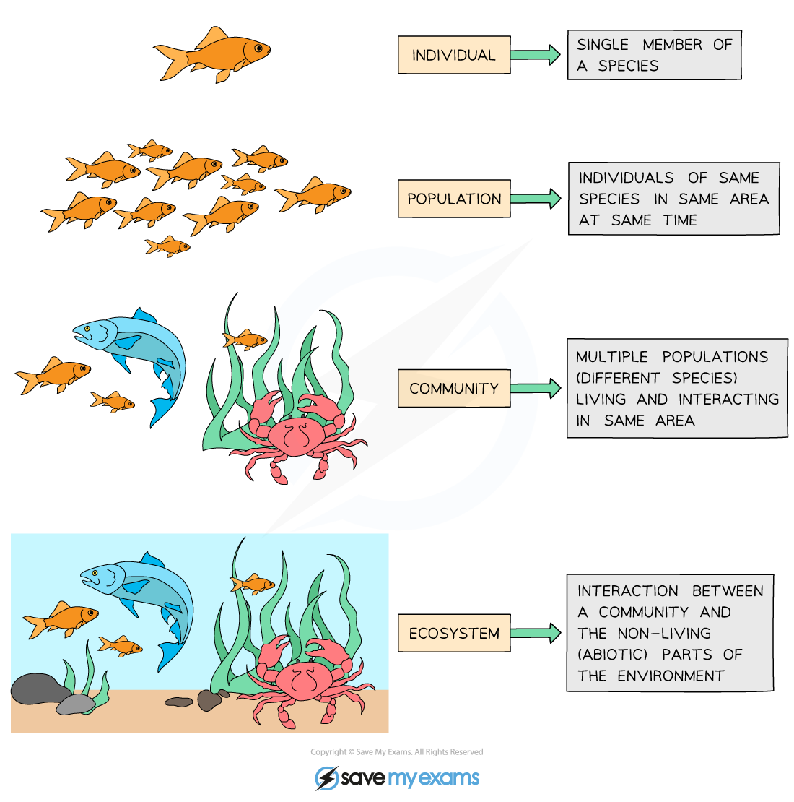

## Ecosystems: Key Terms

#### Habitat

* Species are adapted, or well-suited, to life in a particular habitat
* A habitat can be defined as **the place where an organism lives**

  + A habitat can be **large,** e.g. a desert, or **small,** e.g. an individual tree

    - Small habitats are sometimes referred to as **microhabitats**
  + Some species are habitat **specialists,** meaning that they can only survive in a very specific type of habitat, while others are **generalists** and can survive in a range of habitats

    - Generalists are more likely to be able to invade and take over a new habitat; such species are known as invasive species

      * Humans sometime release new species into a habitat, either accidentally or on purpose; these species can disrupt the normal species interactions in a habitat and cause serious problems

#### Population

* When a species is found in a habitat, that habitat is said to support a **population**
* A population can be defined as **all of the individuals of one species living in a habitat**

  + The size of a population can be measured; this is the **abundance** of a species in a habitat
  + The exact location of a population within a habitat is a species' **distribution** within that habitat

#### Community

* Species do not exist by themselves in their own isolated environment; they **interact** with **other species**, forming **communities**
* A community can be defined as **multiple populations living and interacting in the same area**

  + For example, a garden pond **community** is made up of populations of fish, frogs, newts, pond snails, damselflies and dragonflies and their larvae, pondweed, water lilies, and all other populations living in the pond

#### Ecosystem

* Communities interact with the **non-living components** of the **habitat** they live in, forming **ecosystems**
* An ecosystem can be defined as **a community and its interactions with the non-living parts of its habitat**

  + There is aflow of energywithin an ecosystem and nutrients within it are recycled
  + There are both biotic and abiotic **components** within an ecosystem
  + Ecosystems **vary greatly in size and scale**

    - A small pond in a back garden and the open ocean could both be described as ecosystems
  + Ecosystems **vary in complexity**

    - A desert is a relatively simple ecosystem
    - A tropical rainforest is a very complex ecosystem
  + No ecosystem is completely self-contained as organisms from one ecosystem can often move to another

    - E.g. birds and aquatic animals are able to migrate long distances to feed from multiple ecosystems

***Individual members of a species together in a habitat form a population, populations interact within a community, and communities interact with each other and with non-living components of their habitat to form an ecosystem.***