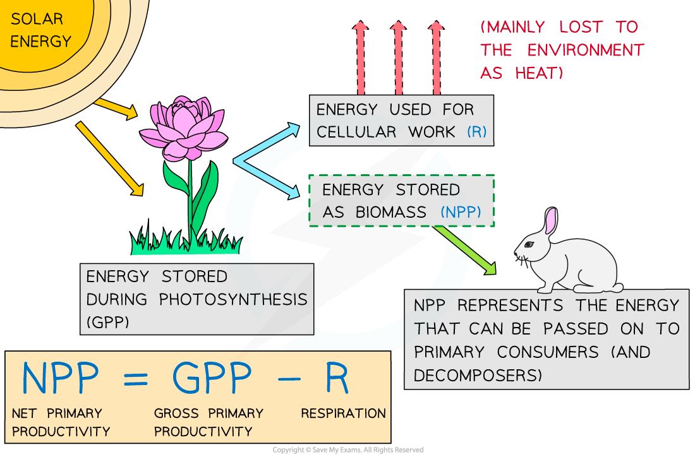

## Net Primary Productivity

* During photosynthesis organisms such as plants convert **light energy** into **chemical energy** stored in biological molecules

  + Organisms that do this are known as **producers**
* The **rate** at which producers convert light energy into chemical energy is known as **primary productivity**
* **Gross primary productivity,** or **GPP,** can be defined as the **rate** **at which chemical energy is** **converted into carbohydrates** during photosynthesis
* **Net primary productivity,** or **NPP,** is the **GPP minus plant respiratory losses**

  + Of the total energy stored in glucose during photosynthesis, 90 % will be released from glucose to create ATP for the plant during respiration
  + 90% of the energy originally converted by the plant will therefore **not be stored as new plant** biomass and will **not be available to be passed on** to **herbivores**, also known as **primary consumers**
* The NPP can therefore be defined as the **rate at which energy is stored in plant biomass**

  + NPP is important because it represents the energy that is available to organisms at **higher** trophic levels in the ecosystem, such as **primary consumers** and **decomposers**
* Net primary productivity can be calculated using the equation

**NPP = GPP - R**

* NPP is expressed in **units of** **energy per unit area or volume** **per unit time** e.g.

  + Using area: J m–2 yr-1 (joules per square metre per year)
  + Using volume: J m–3 yr-1 (joules per cubic metre per year)

    - Volume would be used when calculating NPP in aquatic habitats

***Net primary productivity, or NPP, is the rate at which energy is stored in plant biomass and made available to primary consumers.***

#### Worked Example

The grass in a meadow habitat converts light energy into carbohydrates at a rate of 17 500 kJ m-2 yr-1. The grass releases 14 000 kJ m-2 yr-1 of that energy during respiration. Calculate the net primary productivity of the grass in the meadow habitat.  
  
**Answer:**  
  
**Step 1: Work out which numbers correspond to which parts of the equation**

The meadow grass converts 17 500 kJ m-2 yr-1 into carbohydrates; this is its GPP

The meadow grass releases 14 000 kJ m-2 yr-1 of that energy in respiration; this is R

**Step 2: Substitute numbers into the equation**

NPP = GPP - R

NPP = 17 500 - 14 000

**Step 3: Complete calculation**

17 500 - 14 000 = 3 500  
  
NPP = 3 500 kJ m-2 yr-1

#### Examiner Tips and Tricks

The worked example above uses the equation in its basic form, but you may also be expected to rearrange the equation e.g. to calculate GPP or R

* If a question provides you with the **NPP** and **R** and asks you to calculate **GPP**, you will need to use the equation

**GPP = NPP + R**

* If a question provides you with the **NPP** and the **GPP** and asks you to calculate **R**, you will need to use the equation

**R = GPP - NPP**