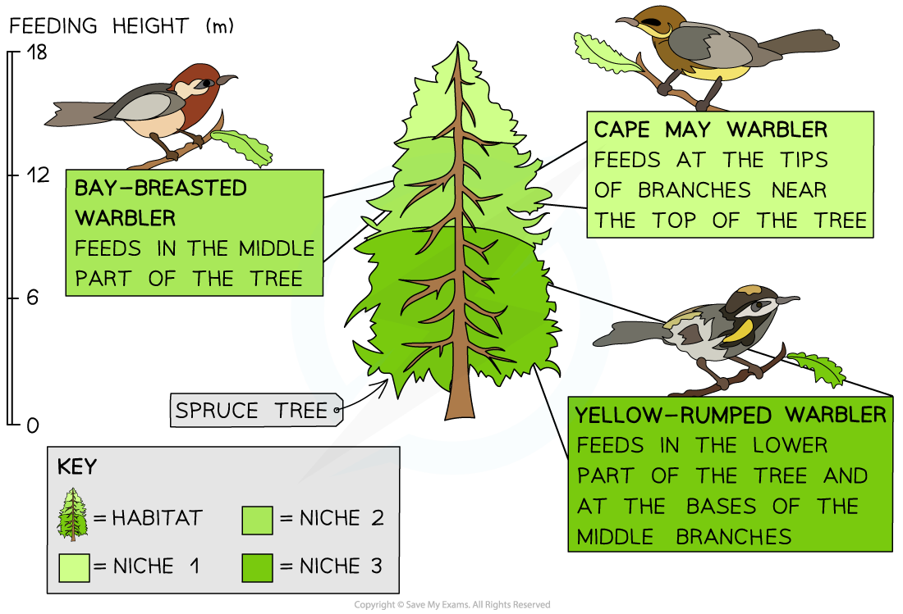

## Niches: Distribution & Abundance

* The place where a species lives is known as its **habitat**
* Species will occupy a specific **niche** within a habitat
* The term niche can be defined as **the role of a species within its habitat**
* The role of a species includes

  + What it eats
  + Which other species depend on it for food
  + What time of day a species is active
  + Exactly where in a habitat a species lives
  + Exactly where in a habitat a species feeds
* **No two species can fill the same niche within a habitat**; if this ever happens the two species will be in **direct competition** with each other for resources, and one of the two species will **out-compete** the other, causing it to die out in that particular habitat

  + It can sometimes seem as though species are occupying the same niche, but there will still be subtle differences in their role; e.g. they might feed at **different times of day**, or have **different food sources**
* The niche filled by a species determines its **abundance** within a habitat

  + The term abundance can be defined as **the number of individuals of a particular species living in a habitat**
  + If two species occupy a similar niche within a habitat, they will be **competing with each other**, so their **populations will be smaller**, and their **abundance will therefore be lower**
* The niche filled by a species determines its **distribution**

  + The term distribution can be defined as **where a species lives**
  + Species can only survive in habitats to which they are **well adapted**; if they are not well suited to a habitat's **biotic** and **abiotic** factors then they will move to a more suitable habitat and their **distribution** will change

***Feeding location is an example of a feature that may differ between niches.***