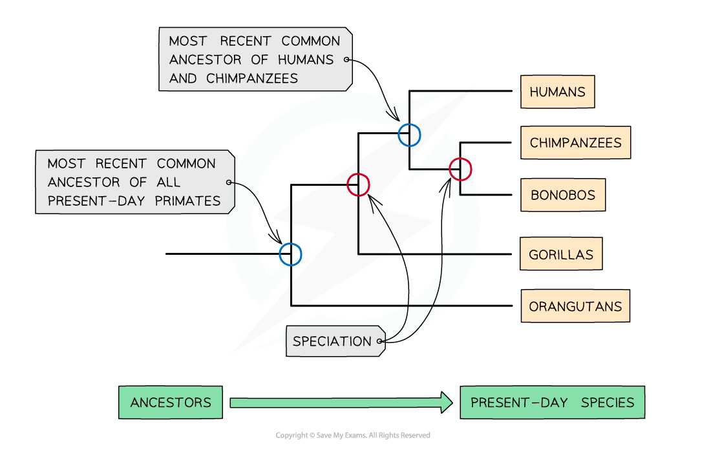

## Evidence of Evolution & the Scientific Community

* The theory of **evolution** by **natural selection** is now **widely accepted** by the scientific community due to its being supported by a great deal of **evidence**
* Evidence for evolution includes

  + The **fossil record**

    - We can tell from fossils that organisms have **changed significantly over millions of years**
    - Fossils can show evidence for **transitional species**, showing how **one species could evolve into another**
  + Real life observation e.g. the development of **antibiotic resistance**

    - If a bacterial infection is treated with an antibiotic, a bacterial individual with a random mutation for antibiotic resistance is likely to **survive**and **reproduce**
    - The antibiotic in this situation acts as a **selection pressure** in the same way that a predator would in a rabbit population
    - The bacterial cell with the resistance mutation will **pass on the mutation** and cause antibiotic resistance to **increase in frequency** in the population; this is **evolution by natural selection**
  + **Molecular evidence**

    - Analysis of biological molecules such as **DNA** and **proteins** show similarities between species that indicate evolution of species from a **common ancestor**

      * A common ancestor is an ancestor shared by more than one species or individual
      * The theory of evolution states that **all species on Earth have descended from a single common ancestor**, meaning that we would expect to find similarities between organisms

#### Evidence from gene sequences

* It is possible to carry out **DNA sequencing** to **determine the sequence of bases** that make up a gene

  + This branch of science is known as **genomics**
* Comparing the sequences of equivalent genes in different species can show

  + The base sequences of some genes are very similar across many different species; this indicates **common ancestry**
  + The level of similarity between base sequences of equivalent genes can give a measure of **how long ago two species diverged from each other** during **speciation**

    - Genes with very similar base sequences are likely to have diverged recently
    - Genes with very different base sequences are likely to have diverged a long time ago
  + Knowing how long ago a species diverged from a common ancestor enables scientists to **establish the relationships between organisms**

    - Species that share a recent common ancestor are more closely related than species that share a common ancestor far back in evolutionary history

#### Evidence from protein sequences

* The study of proteins is known as **proteomics**
* In proteomics it is possible to **sequence proteins;** this determines the **order of amino acids** in the primary structure of a protein
* Because the **order of amino acids** is determined by the **DNA base sequence** of the gene that codes for a protein, amino acid sequences can be used to determine evolutionary relationships **in the same way as DNA sequences**

  + The amino acid sequences of some proteins are very similar across many different species; this indicates **common ancestry**
  + The level of similarity between amino acid sequences of equivalent proteins can give a measure of **how long ago two species diverged from each other**
  + Knowing how long ago a species diverged from a common ancestor enables scientists to **establish the relationships between organisms**

***The results of DNA and protein sequencing enable evolutionary trees to be built that show the evolutionary relationships between species***

#### Theories are validated by the scientific community

* The **scientific community** is made up of **scientists** working in **many different fields** of expertise **all around the world**
* One of the roles of the scientific community is to **assess evidence** from scientific research in order to **validate or reject scientific theories**

  + E.g. Evidence from DNA and proteins sequencing studies will be seen by many scientists with expertise in the field of evolutionary biology, so any conclusions drawn from such studies will be critiqued and either confirmed or questioned by many different experts
  + This means that we can be confident that **theories accepted by the scientific community** have been **rigorously tested and checked**
* The scientific community is able to assess new ideas by

  + Reading **scientific journals**

    - Scientists carry out research as part of their job; this may involve experiments in the laboratory or in the field, or may involve analysis of existing research
    - Scientific research is **written up** and **assessed by a panel of experts** before being **published in scientific journals**

      * Writing up scientific research looks very much like writing up an experiment in the classroom, with an introduction, method, conclusion, and discussion; this allows other scientists to **assess the quality of an experiment and its findings**, and **repeat it** if necessary
      * The panel of experts that assess potential journal entries carry out a process called **peer review**, during which they check that studies are carried out in such a way that **results will be valid**, and that results have been **analysed appropriately** e.g. by the use of the correct **statistical tests**
    - Journals will be read and evaluated by **many other scientists** working in the relevant field of study
    - Published studies can be **repeated to check that their results are reliable**
    - If problems are spotted with a study it can be discussed, and sometimes studies might be withdrawn by a journal if they are found to be flawed
  + Attending **scientific conferences**

    - A conference is a gathering of scientists in a particular field of study from all over the world
    - Scientists can **presen**t their findings for **questions and discussion**
    - Conference members have the opportunity to speak with each other about their work and to **share ideas and concerns**