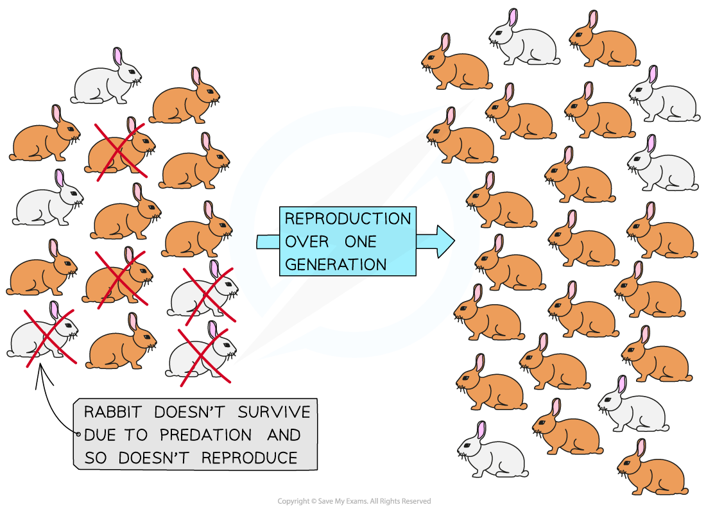

## Evolution by Natural Selection

* Species **do not stay the same over time**; the species that we see around us today have developed over millions of years

  + This process of species change is known as **evolution**
* Evolution can be defined as **changes in the heritable characteristics of organisms over generations**

  + **Heritable** characteristics are those that can be**inherited by,** or **passed on to, the next generation**

    - Changes in characteristics that are not inherited, e.g. a plant having its leaves eaten, do not lead to evolution
  + Heritable characteristics are determined by the alleles of genes that are present in an individual
  + Alleles may change as a result of **random** mutation, causing them to become more or less advantageous
* Heritable characteristics that are **advantageous** are **more likely to be passed on** to offspring, leading to a **gradual change** in a species over time

  + This is the process of **natural selection**

#### Natural Selection

* **Natural selection** can be defined as **the process by which organisms that are better adapted to their environment survive, reproduce, and pass on their advantageous alleles, causing advantageous characteristics to increase in frequency within a population**
* Natural selection involves the following stages

  + Variation exists between individuals in a population

    - Natural selection can only take place if variation is present
    - **Variation** results from small differences in **DNA base sequences** between individual organisms within a population
    - Sources of variation include

      * Mutation
      * Meiosis
      * Random fertilisation during sexual reproduction
  + In any habitat there are **environmental factors** that **affect survival chances**

    - E.g. predation, competition for food, and disease
    - Environmental factors that influence survival chances are said to act as **selection pressures**
  + In any population, due to the variation present, some individuals will have **characteristics** that make them **better adapted** for survival in the face of any selection pressures

    - This is sometimes described as '**survival of the fittest**'
  + Individuals that are well adapted and **survive into adulthood** are **more likely to find a mate**and **reproduce**, producing **many offspring**

    - Individuals that are less well adapted **do not survive long**into adulthood are likely to **reproduce less often** than those that survive for longer, so producing**fewer offspring**

      * These individuals may not reach adulthood and so do **not get the chance to reproduce** at all
  + This means that they are more likely to **pass on the alleles**that code for these **advantageous characteristics** to their offspring

    - Note that **non-heritable characteristics are not passed on to offspring**

      * Non-heritable characteristics are those**acquired during the lifetime** of an organism e.g. gaining weight after eating lots of nuts and berries in autumn, or being injured by a predator
  + The number of individuals in a population with a particular favourable characteristic will increase over time; the characteristic is said to**increase in frequency**
  + Eventually this favourable characteristic will become the **most common** of its kind in the population; the population can be said to have **adapted** to its environment by the process of **natural selection**

    - While favourable characteristics increase in frequency by natural selection, **unfavourable characteristics decrease in frequency** by the same process
    - Individuals with unfavourable characteristics are **less likely to survive**, **reproduce**, and **pass on the alleles** for their characteristics, so unfavourable characteristics are eventually **lost from the population**

#### An example of natural selection in rabbits

* **Variation**in fur colour exists within a rabbit population

  + One **allele** codes for brown fur and another for white fur
* Rabbits have natural predators, such as foxes, which act as a **selection pressure**
* The brown rabbits are **more likely to** **survive** and **reproduce** due to having more effective camouflage
* When the brown rabbits reproduce, they **pass on their alleles** to their offspring
* The **frequency** of brown fur alleles in the population will increase
* **Over many generations,** the **frequency** of **brown** fur will **increase** and the frequency of white fur will decrease

***Selection pressures acting on a rabbit population for one generation; predation by foxes causes the frequency of brown fur in rabbits to increase and the frequency of white fur in rabbits to decrease***

#### Examiner Tips and Tricks

Remember that evolution occurs as a result of **natural selection,** a process that acts on **randomly occurring variation;** it does **not** occur as a direct, purposeful response to an environment. Avoid any statements that imply that evolution occurs 'so that' an organism can survive in its environment. Instead, it is correct to say that evolution occurs by **natural selection** as a result of **random** **variation** in populations.

You should be able to apply the process of natural selection to any scenario that you are presented with in an exam, as with the rabbit example above. Remember the following essential stages

1. **Variation** is present in a population
2. **Selection pressures** affect a population
3. Those with advantageous alleles are more likely to **survive** and **reproduce**
4. Advantageous alleles are **passed to offspring**
5. Advantageous alleles become **more frequent** in the population