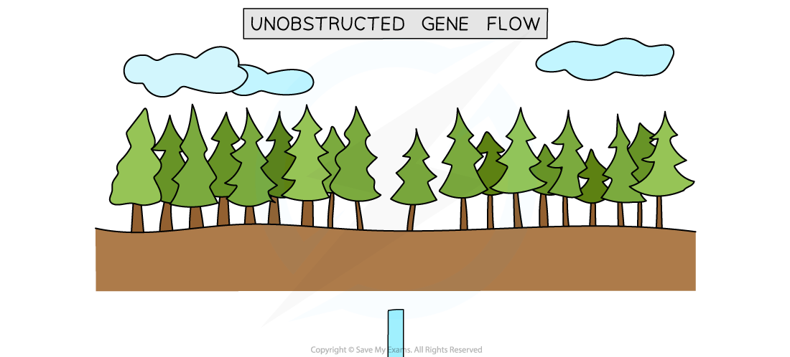
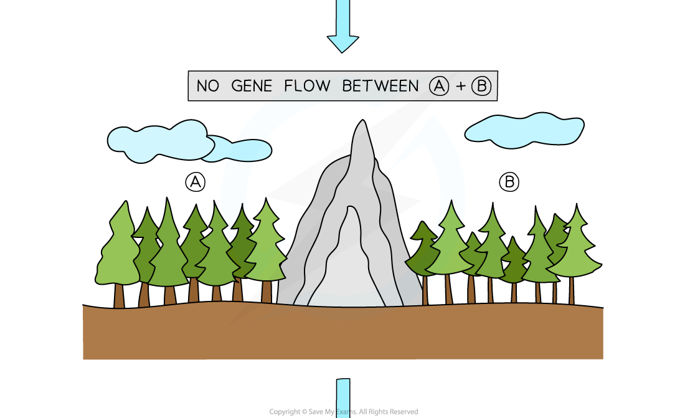
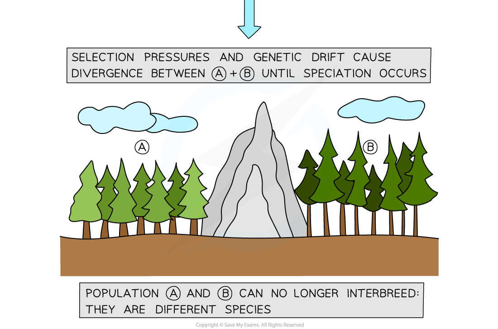
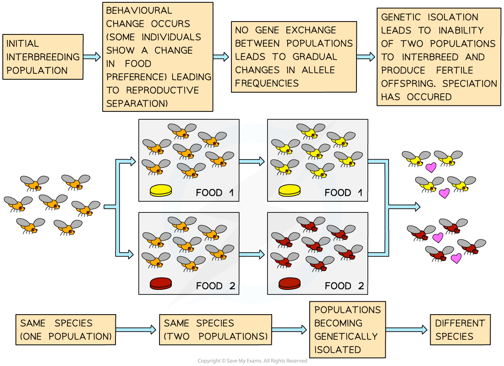

## Speciation

* The**theory of evolution** states that species **do not stay the same**, but change over time; this can lead to the process of **speciation**
* Speciation can be defined as **the development of new species from pre-existing species over time**
* In order for speciation to occur two populations of the same species must be **isolated** from each other in some way

  + When this happens, there can no longer be an **exchange** of **genes** between the two populations
  + The exchange of genes is sometimes known as **gene flow**
* Isolation of populations may occur as a result of

  + **Geographical isolation**

    - This leads to a type of speciation known as **allopatric speciation**
  + **Random mutations** that **prevent them from interbreeding** with each other

    - This leads to a type of speciation known as **sympatric speciation**
* Populations that are isolated from each other may face different **selection pressures** in their environment e.g. different predators or sources of food
* The different environmental conditions for the two populations might mean that **different alleles are advantageous**, so different alleles are more likely to be passed on and become **more frequent** in each population; this is the process of **natural selection**

  + The allele frequencies in the two populations change over time
  + Note that a process known as genetic drift can also affect allele frequencies
* Over time the two populations may begin to differ **physiologically**, **behaviourally** and morphologically to such an extent that they can no longer interbreed to produce **fertile offspring**; speciation has occurred

#### Allopatric speciation

* Allopatric speciation occurs as a result of **geographical isolation**

  + It is the most common type of speciation
* Allopatric speciation occurs when populations of a species become **separated** from each other by **geographical** **barriers**

  + The barrier could be **natural**, e.g. a body of water or a mountain range
  + It can also be man-made, e.g. a motorway
* This creates two populations of the same species between which no **gene flow** is taking place
* Allele frequencies in the gene pools of the two populations may change in different ways due to

  + Different **selection pressures** acting on them
  + The **accumulation of random changes** resulting from genetic drift
* Changing allele frequencies will lead to changes in the phenotypes of the two populations
* If enough allele frequency differences arise between the two populations then they will eventually no longer be able to **breed with each other** and **produce fertile offspring**, and can be said to be **separate species**

#### E.g. allopatric speciation in trees

* A population of trees exists in a mountainous habitat
* A new mountain range forms that **divides the species** into **two populations**
* The geographical barrier prevents the two populations from **interbreeding** so there is **no gene flow** between them
* The two populations experience **different environments**, so different **alleles** become**advantageous**
* Different alleles are therefore more likely to be **passed on** in each population
* Different alleles become **more frequent** in each population
* Over thousands of years the divided populations **form two distinct species** that can no longer interbreed to produce fertile offspring

***The geographical barrier of a mountain range can lead to allopatric speciation in trees***

#### Sympatric speciation

* Sympatric speciation takes place with **no geographical barrier**
* Isolation instead occurs when random changes in the **alleles** and therefore **phenotypes** of some individuals in a population **prevent** them from successfully **breeding** with other individuals in the population
* Examples of phenotype changes that can lead to isolation include

  + **Seasonal** **changes**

    - Some individuals in a population may develop different **mating** or **flowering** seasons to the rest of the population, i.e their **reproductive timings** no longer match up
  + **Mechanical changes**

    - Some individuals in a population may develop changes in their **genitalia** that prevent them from **mating** successfully with individuals of the opposite sex, i.e. their **reproductive body parts** no longer match up
  + **Behavioural changes**

    - Some individuals in a population may develop changes in their **courtship behaviours** meaning they can no longer **attract** individuals of the opposite sex for **mating,** i.e. their methods of attracting a mate are no longer effective
* The populations may still **live in the same habitat** but they are isolated from each other in the sense that they **do not interbreed**
* The lack of gene flow between the two populations means that allele frequencies in the gene pools of the two populations may change in different ways
* Changing allele frequencies will lead to changes in the phenotypes of the two populations
* If enough allele frequency differences arise between the two populations then they will eventually no longer be able to **breed with each other** and **produce fertile offspring**, and can be said to be **separate species**

#### E.g. sympatric speciation in fruit flies

* A population of fruit flies exists in a laboratory
* A random allele change resulting from mutation **divides the species** into **two populations**

  + The allele changes leads to a change in phenotype, e.g. food preference
* The difference in phenotype prevents the two populations from **interbreeding** so there is **no gene flow** between them
* Different alleles are therefore **passed on** in each population

  + This could be due to difference in selection pressure, e.g. certain enzymes are advantageous for the digestion of different foods or due to random passing on of different alleles
* Different alleles become **more frequent** in each population
* Over time the divided populations **form two distinct species** that can no longer interbreed to produce fertile offspring

***Isolation mechanisms other than geographical isolation can also lead to speciation***

#### Examiner Tips and Tricks

Note that you need to be able to apply the principles of **natural selection** to the process of speciation; the difference here is that natural selection will be acting differently on **two** isolated populations;

1. Variation is present
2. Selection pressures act on a population

   * These may be different between two isolated populations
3. Advantageous alleles provide some individuals with increase survival and reproduction chances

   * Advantageous alleles may be different between two isolated populations
4. Advantageous alleles are passed on
5. Allele frequencies change

   * Different advantageous alleles will accumulate in the two isolated populations until they become so different that they can no longer interbreed