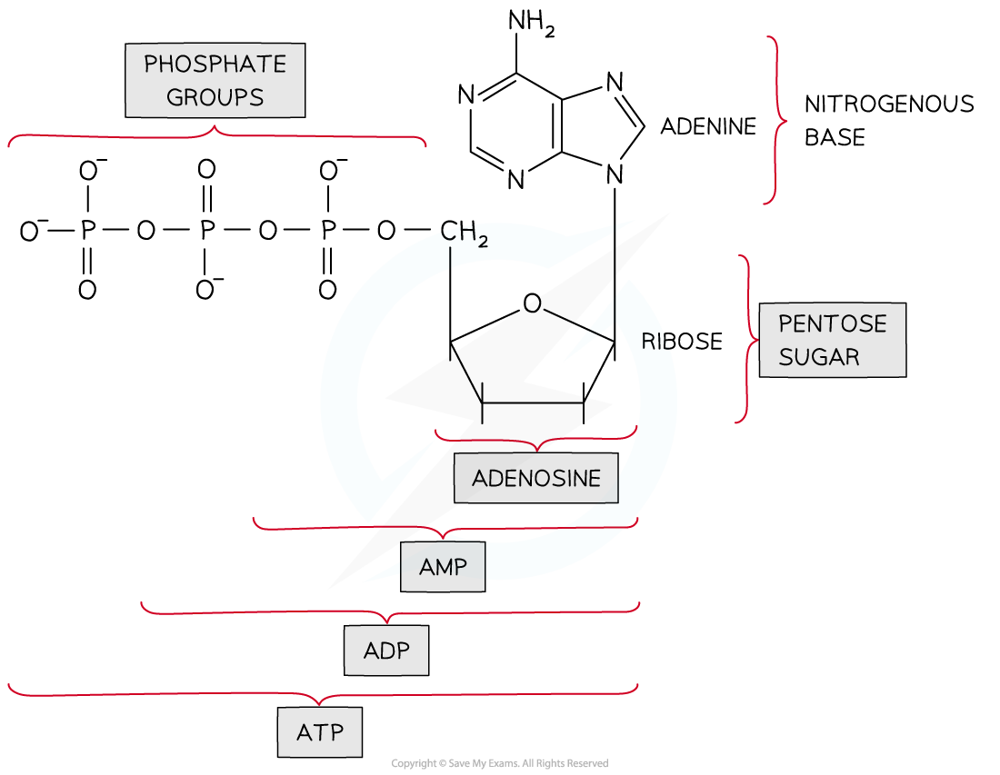
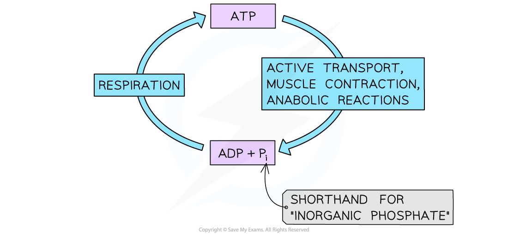

## ATP as a Supply of Energy

* All organisms require a **constant supply of energy** to maintain their cells and stay alive
* This energy is required e.g.

  + For building new molecules from the products of digestion during anabolic reactions
  + To move substances across cell membranes in active transport or to move substances within cells
  + For muscle contraction
  + In the conduction of nerve impulses
* In all known forms of life the molecule **adenosine triphosphate**, or **ATP**, is used to transfer and supply energy within cells

  + ATP is therefore known as the **universal energy currency**
  + ATP **diffuses** within cells to where it is needed

* ATP is atype of **nucleic acid** and is structurally very similar to the nucleotides that make up DNA and RNA

  + It is a phosphorylated**nucleotide**

    - A nucleotide consists of a nitrogenous base, a sugar, and a **single** phosphate group
    - ATP contains **three** phosphate groups, hence **tri**phosphate

***ATP contains adenine, a ribose sugar, and three phosphates molecules. Removal of one phosphate creates ADP, and removal of two phosphates creates AMP.***

* ATP is produced during respiration by the **addition of inorganic phosphate** (**P****i**), a type of phosphate group, to **adenosine diphosphate**, or **ADP**

  **ADP + P****i**![rightwards arrow](data:image/svg+xml;charset=utf8,%3Csvg%20xmlns%3D%22http%3A%2F%2Fwww.w3.org%2F2000%2Fsvg%22%20xmlns%3Awrs%3D%22http%3A%2F%2Fwww.wiris.com%2Fxml%2Fmathml-extension%22%20height%3D%2219%22%20width%3D%2221%22%20wrs%3Abaseline%3D%2216%22%3E%3C!--MathML%3A%20%3Cmath%20xmlns%3D%22http%3A%2F%2Fwww.w3.org%2F1998%2FMath%2FMathML%22%3E%3Cmo%3E%26%23x2192%3B%3C%2Fmo%3E%3C%2Fmath%3E--%3E%3Cdefs%3E%3Cstyle%20type%3D%22text%2Fcss%22%3E%40font-face%7Bfont-family%3A'math12bba9f4124283edd644799e0ce'%3Bsrc%3Aurl(data%3Afont%2Ftruetype%3Bcharset%3Dutf-8%3Bbase64%2CAAEAAAAMAIAAAwBAT1MvMi7iBBMAAADMAAAATmNtYXDEvmKUAAABHAAAADRjdnQgDVUNBwAAAVAAAAA6Z2x5ZoPi2VsAAAGMAAAAcWhlYWQQC2qxAAACAAAAADZoaGVhCGsXSAAAAjgAAAAkaG10eE2rRkcAAAJcAAAACGxvY2EAHTwYAAACZAAAAAxtYXhwBT0FPgAAAnAAAAAgbmFtZaBxlY4AAAKQAAABn3Bvc3QB9wD6AAAEMAAAACBwcmVwa1uragAABFAAAAAUAAADSwGQAAUAAAQABAAAAAAABAAEAAAAAAAAAQEAAAAAAAAAAAAAAAAAAAAAAAAAAAAAAAAAAAAAACAgICAAAAAg1UADev96AAAD6ACWAAAAAAACAAEAAQAAABQAAwABAAAAFAAEACAAAAAEAAQAAQAAIZL%2F%2FwAAIZL%2F%2F95vAAEAAAAAAAABVAMsAIABAABWACoCWAIeAQ4BLAIsAFoBgAKAAKAA1ACAAAAAAAAAACsAVQCAAKsA1QEAASsABwAAAAIAVQAAAwADqwADAAcAADMRIRElIREhVQKr%2FasCAP4AA6v8VVUDAAABAIAAqgOAAlUACAAfALEAABMQsQAG5bEAARMQsAE8sQMP5bEHBfWxBQ%2F1MBMhJzUNATU3IYACK1YBK%2F7VVv3VAapBatXWa0AAAAAAAQAAAAEAANV4zkFfDzz1AAMEAP%2F%2F%2F%2F%2FWOhNz%2F%2F%2F%2F%2F9Y6E3MAAP8gBIADqwAAAAoAAgABAAAAAAABAAAD6P9qAAAXcAAA%2F7YEgAABAAAAAAAAAAAAAAAAAAAAAgNSAFUEAACAAAAAAAAAACgAAABxAAEAAAACAF4ABQAAAAAAAgCABAAAAAAABAAA3gAAAAAAAAAVAQIAAAAAAAAAAQASAAAAAAAAAAAAAgAOABIAAAAAAAAAAwAwACAAAAAAAAAABAASAFAAAAAAAAAABQAWAGIAAAAAAAAABgAJAHgAAAAAAAAACAAcAIEAAQAAAAAAAQASAAAAAQAAAAAAAgAOABIAAQAAAAAAAwAwACAAAQAAAAAABAASAFAAAQAAAAAABQAWAGIAAQAAAAAABgAJAHgAAQAAAAAACAAcAIEAAwABBAkAAQASAAAAAwABBAkAAgAOABIAAwABBAkAAwAwACAAAwABBAkABAASAFAAAwABBAkABQAWAGIAAwABBAkABgAJAHgAAwABBAkACAAcAIEATQBhAHQAaAAgAEYAbwBuAHQAUgBlAGcAdQBsAGEAcgBNAGEAdABoAHMAIABGAG8AcgAgAE0AbwByAGUAIABNAGEAdABoACAARgBvAG4AdABNAGEAdABoACAARgBvAG4AdABWAGUAcgBzAGkAbwBuACAAMQAuADBNYXRoX0ZvbnQATQBhAHQAaABzACAARgBvAHIAIABNAG8AcgBlAAADAAAAAAAAAfQA%2BgAAAAAAAAAAAAAAAAAAAAAAAAAAuQcRAACNhRgAsgAAABUUE7EAAT8%3D)format('truetype')%3Bfont-weight%3Anormal%3Bfont-style%3Anormal%3B%7D%3C%2Fstyle%3E%3C%2Fdefs%3E%3Ctext%20font-family%3D%22math12bba9f4124283edd644799e0ce%22%20font-size%3D%2216%22%20text-anchor%3D%22middle%22%20x%3D%2210.5%22%20y%3D%2216%22%3E%26%23x2192%3B%3C%2Ftext%3E%3C%2Fsvg%3E)**ATP**

  + ADP contains **two** phosphate groups, hence **di**phosphate
  + The breakdown of glucose in respiration releases the energy needed to **phosphorylate ADP**
* The **hydrolysis**, or breakdown, of ATP releases an inorganic phosphate as well as a **small amount of energy** which can be used by the cell

  **ATP**![rightwards arrow](data:image/svg+xml;charset=utf8,%3Csvg%20xmlns%3D%22http%3A%2F%2Fwww.w3.org%2F2000%2Fsvg%22%20xmlns%3Awrs%3D%22http%3A%2F%2Fwww.wiris.com%2Fxml%2Fmathml-extension%22%20height%3D%2219%22%20width%3D%2221%22%20wrs%3Abaseline%3D%2216%22%3E%3C!--MathML%3A%20%3Cmath%20xmlns%3D%22http%3A%2F%2Fwww.w3.org%2F1998%2FMath%2FMathML%22%3E%3Cmo%3E%26%23x2192%3B%3C%2Fmo%3E%3C%2Fmath%3E--%3E%3Cdefs%3E%3Cstyle%20type%3D%22text%2Fcss%22%3E%40font-face%7Bfont-family%3A'math12bba9f4124283edd644799e0ce'%3Bsrc%3Aurl(data%3Afont%2Ftruetype%3Bcharset%3Dutf-8%3Bbase64%2CAAEAAAAMAIAAAwBAT1MvMi7iBBMAAADMAAAATmNtYXDEvmKUAAABHAAAADRjdnQgDVUNBwAAAVAAAAA6Z2x5ZoPi2VsAAAGMAAAAcWhlYWQQC2qxAAACAAAAADZoaGVhCGsXSAAAAjgAAAAkaG10eE2rRkcAAAJcAAAACGxvY2EAHTwYAAACZAAAAAxtYXhwBT0FPgAAAnAAAAAgbmFtZaBxlY4AAAKQAAABn3Bvc3QB9wD6AAAEMAAAACBwcmVwa1uragAABFAAAAAUAAADSwGQAAUAAAQABAAAAAAABAAEAAAAAAAAAQEAAAAAAAAAAAAAAAAAAAAAAAAAAAAAAAAAAAAAACAgICAAAAAg1UADev96AAAD6ACWAAAAAAACAAEAAQAAABQAAwABAAAAFAAEACAAAAAEAAQAAQAAIZL%2F%2FwAAIZL%2F%2F95vAAEAAAAAAAABVAMsAIABAABWACoCWAIeAQ4BLAIsAFoBgAKAAKAA1ACAAAAAAAAAACsAVQCAAKsA1QEAASsABwAAAAIAVQAAAwADqwADAAcAADMRIRElIREhVQKr%2FasCAP4AA6v8VVUDAAABAIAAqgOAAlUACAAfALEAABMQsQAG5bEAARMQsAE8sQMP5bEHBfWxBQ%2F1MBMhJzUNATU3IYACK1YBK%2F7VVv3VAapBatXWa0AAAAAAAQAAAAEAANV4zkFfDzz1AAMEAP%2F%2F%2F%2F%2FWOhNz%2F%2F%2F%2F%2F9Y6E3MAAP8gBIADqwAAAAoAAgABAAAAAAABAAAD6P9qAAAXcAAA%2F7YEgAABAAAAAAAAAAAAAAAAAAAAAgNSAFUEAACAAAAAAAAAACgAAABxAAEAAAACAF4ABQAAAAAAAgCABAAAAAAABAAA3gAAAAAAAAAVAQIAAAAAAAAAAQASAAAAAAAAAAAAAgAOABIAAAAAAAAAAwAwACAAAAAAAAAABAASAFAAAAAAAAAABQAWAGIAAAAAAAAABgAJAHgAAAAAAAAACAAcAIEAAQAAAAAAAQASAAAAAQAAAAAAAgAOABIAAQAAAAAAAwAwACAAAQAAAAAABAASAFAAAQAAAAAABQAWAGIAAQAAAAAABgAJAHgAAQAAAAAACAAcAIEAAwABBAkAAQASAAAAAwABBAkAAgAOABIAAwABBAkAAwAwACAAAwABBAkABAASAFAAAwABBAkABQAWAGIAAwABBAkABgAJAHgAAwABBAkACAAcAIEATQBhAHQAaAAgAEYAbwBuAHQAUgBlAGcAdQBsAGEAcgBNAGEAdABoAHMAIABGAG8AcgAgAE0AbwByAGUAIABNAGEAdABoACAARgBvAG4AdABNAGEAdABoACAARgBvAG4AdABWAGUAcgBzAGkAbwBuACAAMQAuADBNYXRoX0ZvbnQATQBhAHQAaABzACAARgBvAHIAIABNAG8AcgBlAAADAAAAAAAAAfQA%2BgAAAAAAAAAAAAAAAAAAAAAAAAAAuQcRAACNhRgAsgAAABUUE7EAAT8%3D)format('truetype')%3Bfont-weight%3Anormal%3Bfont-style%3Anormal%3B%7D%3C%2Fstyle%3E%3C%2Fdefs%3E%3Ctext%20font-family%3D%22math12bba9f4124283edd644799e0ce%22%20font-size%3D%2216%22%20text-anchor%3D%22middle%22%20x%3D%2210.5%22%20y%3D%2216%22%3E%26%23x2192%3B%3C%2Ftext%3E%3C%2Fsvg%3E) **ADP + P****i**

  + The removal of a phosphate group is known as **dephosphorylation**
  + The hydrolysis of ATP is catalysed by the enzyme **ATPase**
* The ADP and inorganic phosphate produced by the hydrolysis of ATP can be **recycled to make more ATP**

**ADP + P****i** ![rightwards arrow](data:image/svg+xml;charset=utf8,%3Csvg%20xmlns%3D%22http%3A%2F%2Fwww.w3.org%2F2000%2Fsvg%22%20xmlns%3Awrs%3D%22http%3A%2F%2Fwww.wiris.com%2Fxml%2Fmathml-extension%22%20height%3D%2219%22%20width%3D%2221%22%20wrs%3Abaseline%3D%2216%22%3E%3C!--MathML%3A%20%3Cmath%20xmlns%3D%22http%3A%2F%2Fwww.w3.org%2F1998%2FMath%2FMathML%22%3E%3Cmo%3E%26%23x2192%3B%3C%2Fmo%3E%3C%2Fmath%3E--%3E%3Cdefs%3E%3Cstyle%20type%3D%22text%2Fcss%22%3E%40font-face%7Bfont-family%3A'math12bba9f4124283edd644799e0ce'%3Bsrc%3Aurl(data%3Afont%2Ftruetype%3Bcharset%3Dutf-8%3Bbase64%2CAAEAAAAMAIAAAwBAT1MvMi7iBBMAAADMAAAATmNtYXDEvmKUAAABHAAAADRjdnQgDVUNBwAAAVAAAAA6Z2x5ZoPi2VsAAAGMAAAAcWhlYWQQC2qxAAACAAAAADZoaGVhCGsXSAAAAjgAAAAkaG10eE2rRkcAAAJcAAAACGxvY2EAHTwYAAACZAAAAAxtYXhwBT0FPgAAAnAAAAAgbmFtZaBxlY4AAAKQAAABn3Bvc3QB9wD6AAAEMAAAACBwcmVwa1uragAABFAAAAAUAAADSwGQAAUAAAQABAAAAAAABAAEAAAAAAAAAQEAAAAAAAAAAAAAAAAAAAAAAAAAAAAAAAAAAAAAACAgICAAAAAg1UADev96AAAD6ACWAAAAAAACAAEAAQAAABQAAwABAAAAFAAEACAAAAAEAAQAAQAAIZL%2F%2FwAAIZL%2F%2F95vAAEAAAAAAAABVAMsAIABAABWACoCWAIeAQ4BLAIsAFoBgAKAAKAA1ACAAAAAAAAAACsAVQCAAKsA1QEAASsABwAAAAIAVQAAAwADqwADAAcAADMRIRElIREhVQKr%2FasCAP4AA6v8VVUDAAABAIAAqgOAAlUACAAfALEAABMQsQAG5bEAARMQsAE8sQMP5bEHBfWxBQ%2F1MBMhJzUNATU3IYACK1YBK%2F7VVv3VAapBatXWa0AAAAAAAQAAAAEAANV4zkFfDzz1AAMEAP%2F%2F%2F%2F%2FWOhNz%2F%2F%2F%2F%2F9Y6E3MAAP8gBIADqwAAAAoAAgABAAAAAAABAAAD6P9qAAAXcAAA%2F7YEgAABAAAAAAAAAAAAAAAAAAAAAgNSAFUEAACAAAAAAAAAACgAAABxAAEAAAACAF4ABQAAAAAAAgCABAAAAAAABAAA3gAAAAAAAAAVAQIAAAAAAAAAAQASAAAAAAAAAAAAAgAOABIAAAAAAAAAAwAwACAAAAAAAAAABAASAFAAAAAAAAAABQAWAGIAAAAAAAAABgAJAHgAAAAAAAAACAAcAIEAAQAAAAAAAQASAAAAAQAAAAAAAgAOABIAAQAAAAAAAwAwACAAAQAAAAAABAASAFAAAQAAAAAABQAWAGIAAQAAAAAABgAJAHgAAQAAAAAACAAcAIEAAwABBAkAAQASAAAAAwABBAkAAgAOABIAAwABBAkAAwAwACAAAwABBAkABAASAFAAAwABBAkABQAWAGIAAwABBAkABgAJAHgAAwABBAkACAAcAIEATQBhAHQAaAAgAEYAbwBuAHQAUgBlAGcAdQBsAGEAcgBNAGEAdABoAHMAIABGAG8AcgAgAE0AbwByAGUAIABNAGEAdABoACAARgBvAG4AdABNAGEAdABoACAARgBvAG4AdABWAGUAcgBzAGkAbwBuACAAMQAuADBNYXRoX0ZvbnQATQBhAHQAaABzACAARgBvAHIAIABNAG8AcgBlAAADAAAAAAAAAfQA%2BgAAAAAAAAAAAAAAAAAAAAAAAAAAuQcRAACNhRgAsgAAABUUE7EAAT8%3D)format('truetype')%3Bfont-weight%3Anormal%3Bfont-style%3Anormal%3B%7D%3C%2Fstyle%3E%3C%2Fdefs%3E%3Ctext%20font-family%3D%22math12bba9f4124283edd644799e0ce%22%20font-size%3D%2216%22%20text-anchor%3D%22middle%22%20x%3D%2210.5%22%20y%3D%2216%22%3E%26%23x2192%3B%3C%2Ftext%3E%3C%2Fsvg%3E)**ATP**

***ATP is formed during respiration and can be hydrolysed to release energy for processes such as active transport, muscle contraction, and building new molecules (anabolic reactions). ATP can then be regenerated from ADP and phosphate.***