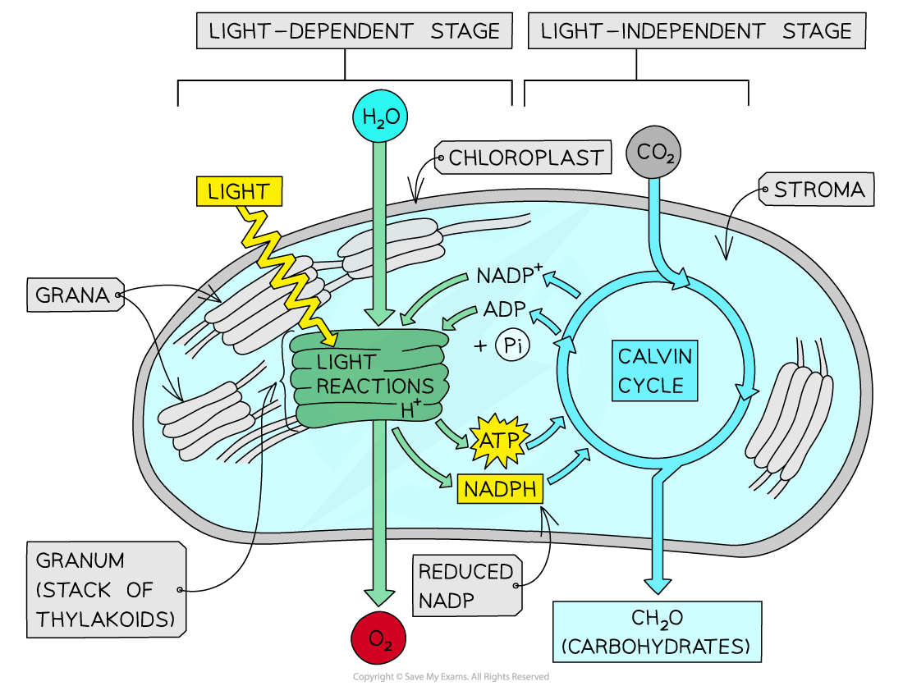
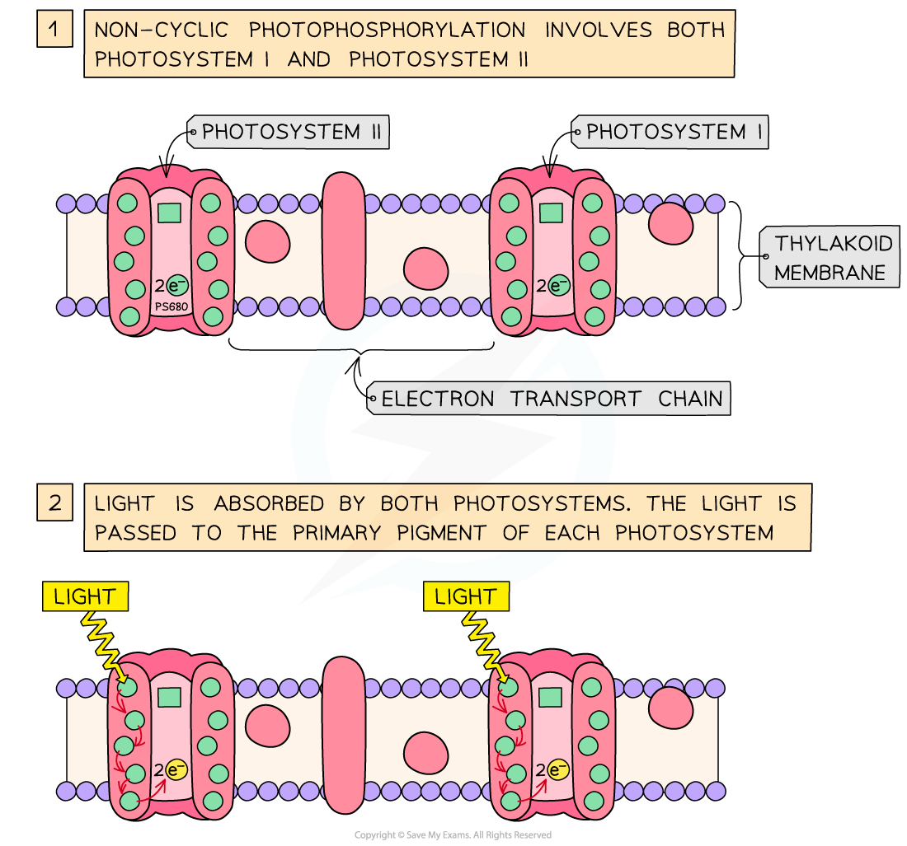
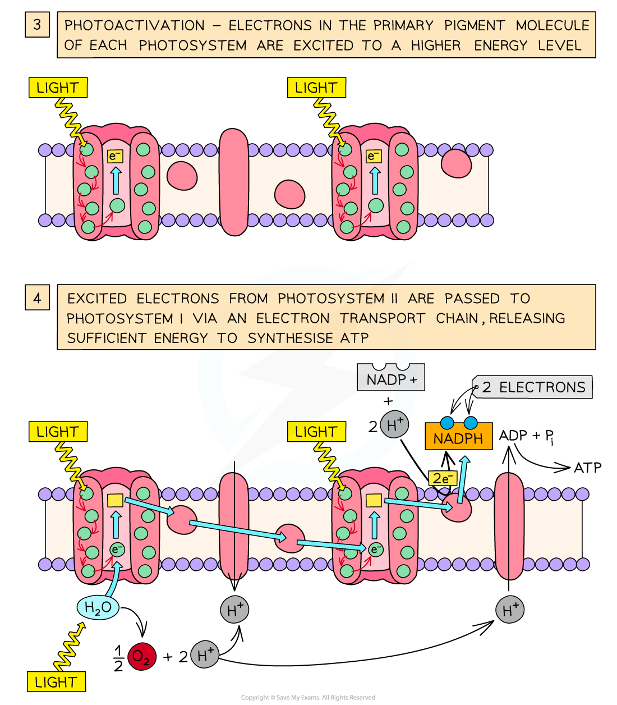
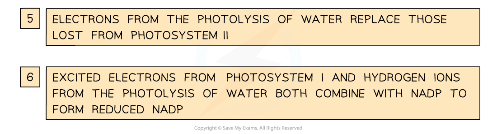
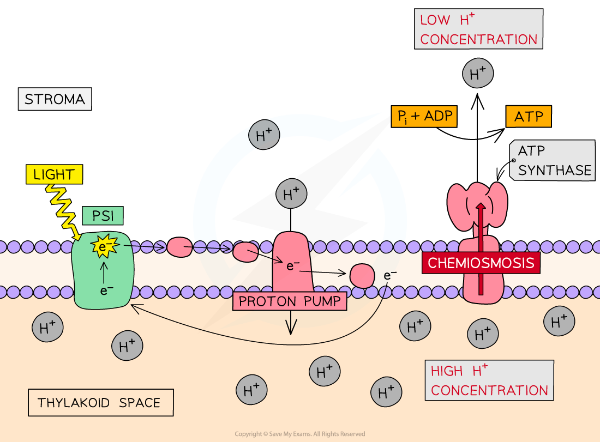

## Light-dependent Reactions

* Photosynthesis takes place in two distinct stages

  + The **light-dependent reactions**, which rely on light directly
  + The **light-independent reactions**, which do not use light directly, though do rely on the products of the light-dependent reactions
* Both these sets of reactions take place within the **chloroplast**

  + The light-dependent reactions take place across the **thylakoid membrane**
  + The light-independent reactions take place in the **stroma**
* Light energy in the light-dependent reactions enables the splitting of water molecules in a reaction known as **photolysis**

  + Photolysis of one molecule of water, or H2O, produces

    - 2 **hydrogen ions** (2H+), also known as **protons**
    - 2 **electrons** (2e-)
    - One atom of **oxygen** (O)
  + The hydrogen ions and electrons are used during the light-dependent reactions while the oxygen is given off as a waste product
* During the light-dependent reactions **light energy** is converted into **chemical energy** in the form of **ATP** and **reduced NADP**

  + NADP is a type of molecule called a coenzyme; its role is to **transfer hydrogen** from one molecule to another
  + When NADP gains hydrogen, it is **reduced** and can be known as either **reduced NADP** or **NADPH**
  + Remember that

    - **Reduction** is **gain of electrons**, **gain of hydrogen**, or **loss of oxygen**
    - **Oxidation** is **loss of electrons**, **loss of hydrogen**, or **gain of oxygen**
  + Reduced NADP can **reduce** other molecules by **giving away hydrogen**
  + NADP can **oxidise** other molecules by **receiving hydrogen**
* The **useful products of the light-dependent reactions, ATP and NADPH**, are transferred to the **light-independent reactions** within the chloroplast

***The products of the light-dependent reaction are ATP, NADPH, and oxygen. Oxygen is given off as a waste product while ATP and NADPH pass to the light-independent reactions. The ADP and NADP produced during the light-independent reaction can pass back to the light-dependent reactions to allow more ATP and NADPH to be produced.***

#### Production of ATP and NADPH

* ATP and NADPH are produced during the light-dependent reactions as a result of a series of events that occur on the thylakoid membrane known as **photophosphorylation**

  + Photo = light
  + Phosphorylation = the addition of phosphate; in this case to ADP to form ATP
* Two types of photophosphorylation take place

  + **Non-cyclic photophosphorylation**

    - This produces both ATP and NADPH
  + **Cyclic photophosphorylation**

    - This produces ATP only
* Both cyclic and non-cyclic photophosphorylation involve

  + A series of **membrane proteins** which together make up the **electron transport chain**

    - Electrons pass from one protein to another along the electron transport chain, releasing energy as they do so
  + **Chemiosmosis**

    - The energy released as electrons pass down the electron transport chain is used to produce ATP

#### Non-cyclic photophosphorylation

* **Light energy** hits **photosystem II** in the thylakoid membrane

  + It is slightly confusing that photosystem II comes first in this sequence; the numbers simply reflect the order in which the photosystems were discovered
* Two **electrons** gain energy and are said to be **excited** to a **higher energy level**
* The excited electrons leave the photosystem and pass to the first protein in the **electron transport chain**

  + As the excited electrons leave photosystem II they are **replaced** by electrons from the **photolysis** of water
* The electrons pass down the **chain of electron carriers** known as an **electron transport chain**
* **Energy is released** as the electrons pass down the electron transport chain which enables **chemiosmosis** to occur

  + **H­­****+** **ions** are **pumped** from a low concentration in the stroma to a high concentration in the thylakoid space, generating a concentration gradient across the thylakoid membrane
  + H­­+ ions **diffuse** back across the thylakoid membrane into the stroma **via ATP synthase enzymes** embedded in the membrane
  + The movement of H­­+ ions causes the ATP synthase enzyme to catalyse the **production of ATP**
* At the end of the electron transport chain the electrons from photosystem II are passed to photosystem I
* Light energy also hits photosystem I, exciting another pair of electrons which leave the photosystem
* The excited electrons from photosystem I also pass along an **electron transport chain**
* These electrons combine with **hydrogen ions** from the photolysis of water and the **coenzyme NADP** to form **reduced NADP**

**H****+****+ 2e****-****+ NADP****+** **→ NADPH**

* The reduced NADP and the ATP pass to the **light-independent reactions**

***Non-cyclic photophosphorylation involves photosystems I and II and produces both ATP and NADPH***

#### Cyclic photophosphorylation

* **Light** hits photosystem I
* Electrons are **excited** to a **higher energy level**and leave the photosystem
* The excited electrons pass along the **electron transport** **chain**, releasing energy as they do so
* The energy released as the electrons pass down the electron transport chain provides energy to drive the process of **chemiosmosis**

  + **H­­****+** **ions** are **pumped** from a low concentration in the stroma to a high concentration in the thylakoid space, generating a concentration gradient across the thylakoid membrane
  + H­­+ ions **diffuse** back across the thylakoid membrane into the stroma **via ATP synthase enzymes** embedded in the membrane
  + The movement of H­­+ ions cause the ATP synthase enzyme to catalyse the **production of ATP**
* At the end of the electron transport chain the electrons **rejoin photosystem I** in a complete cycle; hence the term **cyclic** photophosphorylation
* The ATP produced enters the light-independent reaction

***Cyclic photophosphorylation involves Photosystem I and produces ATP***