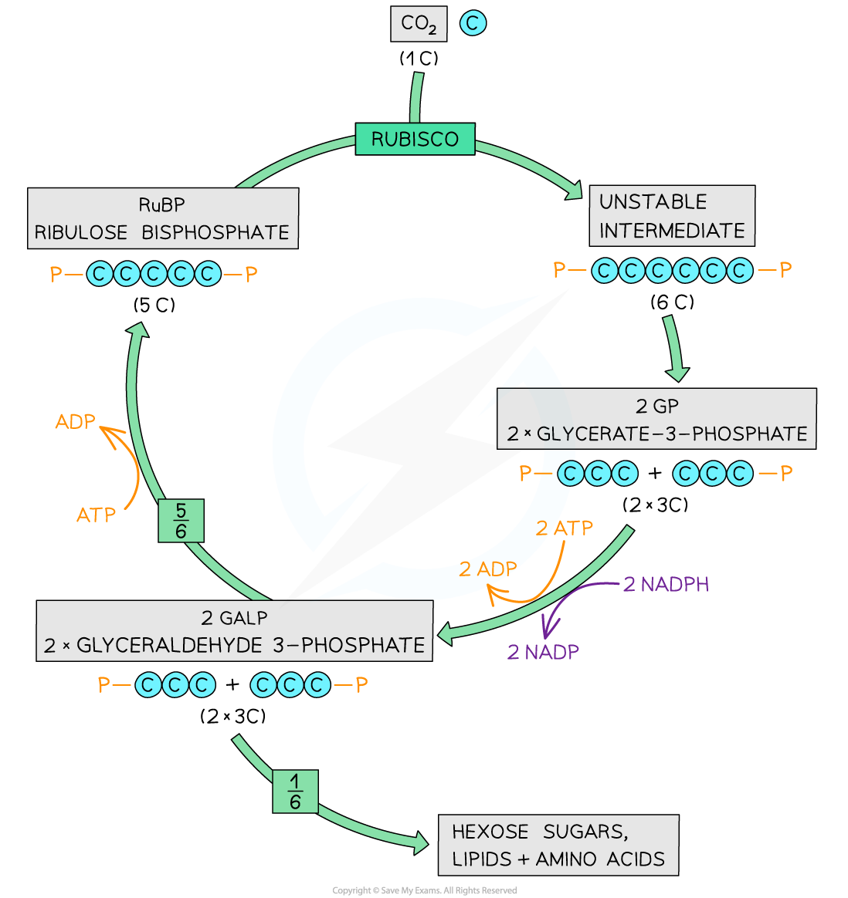

## Light-independent Reactions

* The **light-independent** **reactions** of photosynthesis are sometimes referred to as the **Calvin cycle**
* The reactions produce complex organic molecules such as

  + **Starch** for storage
  + **Sucrose** for transport
  + **Cellulose** for making cell walls
* The light-independent reactions do not require energy from light but do require **ATP** and **reduced NADP** from the light-dependent reactions
* There are three main steps within the light-independent reactions

  1. **Carbon dioxide** is combined with **ribulose bisphosphate** (RuBP), a 5-carbon (5C) compound; this yields two molecules of **glycerate 3-phosphate** (GP), a 3-carbon (3C) compound
  2. **GP is reduced** to **glyceraldehyde 3-phosphate** (GALP), another 3C compound,in a reaction involving reduced NADP and ATP
  3. **RuBP is** **regenerated** from GALP in reactions that use ATP

#### Carbon dioxide and RuBP are combined

* Carbon dioxide combines with a 5C sugar known as **RuBP** in a reaction catalysed by the enzyme **rubisco**
* The resulting 6-carbon (6C) compound is **unstable** and splits in two
* This results in two molecules of a 3C compound known as **glycerate 3-phosphate**(GP)
* The carbon dioxide has been **‘fixed’**, meaning thatit has been removed from the external environment and become part of a molecule inside the plant cell

#### Reduction of glycerate 3-phosphate

* **Energy from ATP** and **hydrogen from reduced NADP,** both produced during the light-dependent reactions, are used to **reduce** the two molecules of **GP** to two 3C molecule known as **GALP**
* Some of the carbons in GALP go towards the production of **useful organic molecules such as glucose**, while the rest remain in the Calvin cycle to allow the **regeneration of RuBP**

  + Two molecules of GALP contain six carbon atoms, five of which are needed to regenerate RuBP; this means that for every turn through the Calvin cycle only one sixth of a molecule of glucose is produced
  + Glucose is a 6-carbon molecule, so **six turns of the Calvin cycle are required to produce one molecule of glucose**

#### Regeneration of ribulose bisphosphate

* Five sixthsof the GALP molecules are used to **regenerate RuBP**
* This process**requires ATP**

***The Calvin cycle produces glucose and other important biological molecules.***