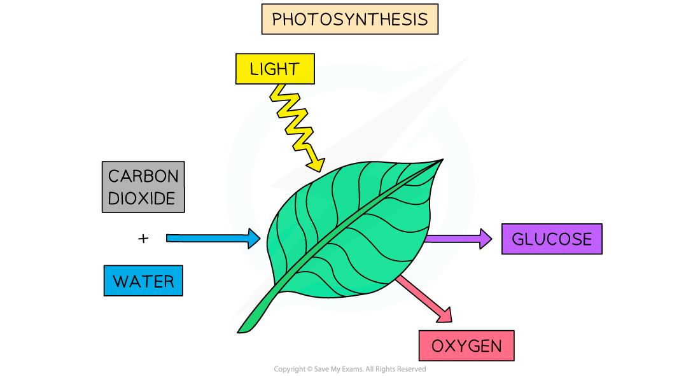
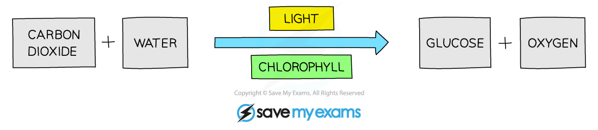
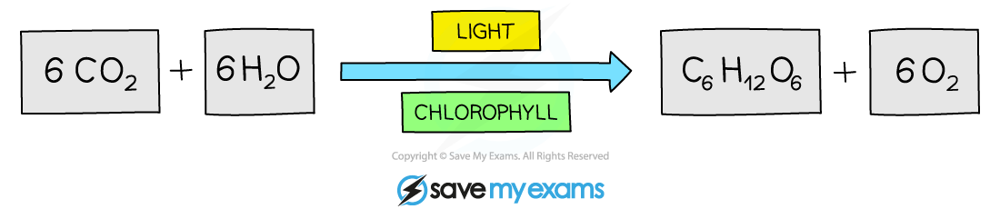

## Photosynthesis: An Overview

* **Photosynthesis** is a series of chemical reactions that occurs in **producers**such as plants and algae
* Photosynthesis converts **light energy** into **chemical energy** which is then stored in the biomass of producers
* The light energy is used to **split strong bonds** in **water molecules** (H2O), releasing **hydrogen** and **oxygen**
* Oxygen is **released into the atmosphere** as a waste product
* Hydrogen is **combined with carbon dioxide** to produce **glucose**

  + **Chemical energy is stored** within the **bonds** in glucose molecules; glucose can therefore function as a **fuel** for respiration
  + It can be said that **hydrogen is stored in glucose** molecules

***Photosynthesis requires energy from light to split water molecules. The resulting hydrogen combines with carbon dioxide and is stored in glucose, which fuels respiration. Oxygen is released as a waste product.***