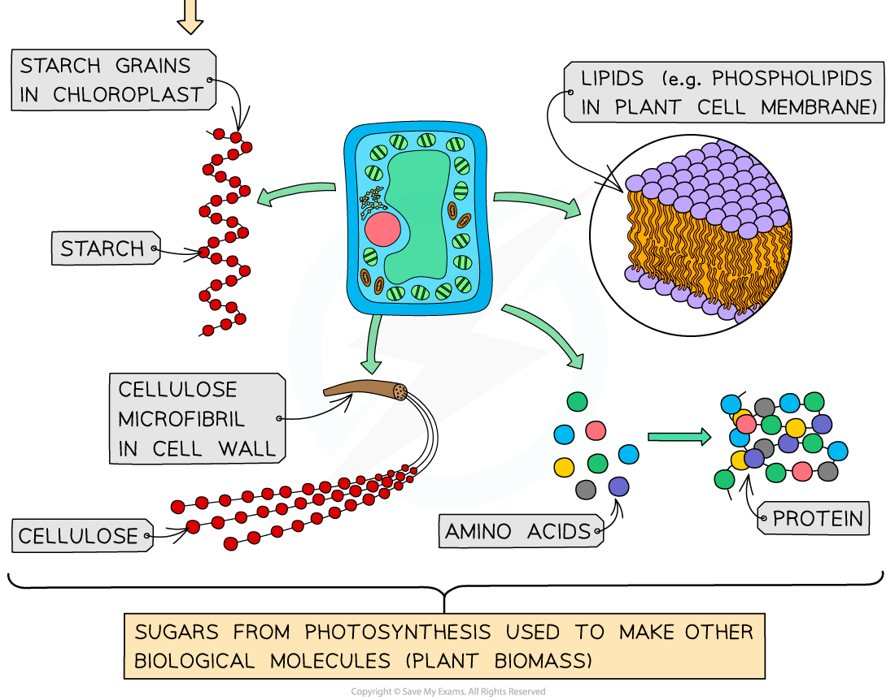

## Products of Photosynthesis

* Intermediate molecules of the Calvin cycle such as **glycerate 3-phosphate (GP)** and **glyceraldehyde 3-phosphate (GALP)** are used to produce **other biological molecules** needed by plants
* **GP** is used to produce

  + **Amino acids** which can be used in protein synthesis for building polypeptides
  + **Fatty acids** which form the tails of lipid molecules such as triglycerides and phospholipids
* **GALP** is used to produce:

  + **Hexose sugars** e.g. glucose

    - Hexose sugars can be converted into other hexose sugars e.g. glucose can be converted to **sucrose** for transport in the phloem
    - Hexose sugars can be joined to make polysaccharides such as **starch** and **cellulose**
  + **Glycerol** can be used for building **lipid** molecules such as triglycerides and phospholipids
  + **Nucleic acids** form the basis of DNA and RNA
* Glucose can be used by the plant in respiration while other biological molecules are used to **build new plant** biomass

  + The molecules that make up plant biomass are **passed on to consumers** when plant tissue is eaten

***The products of photosynthesis include amino acids, polysaccarides, lipids and nucleic acids***