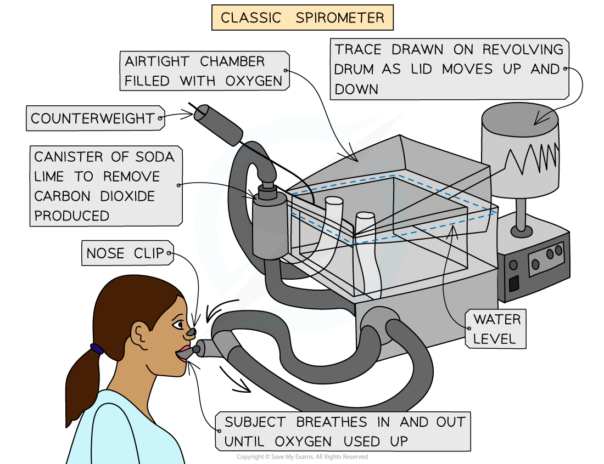
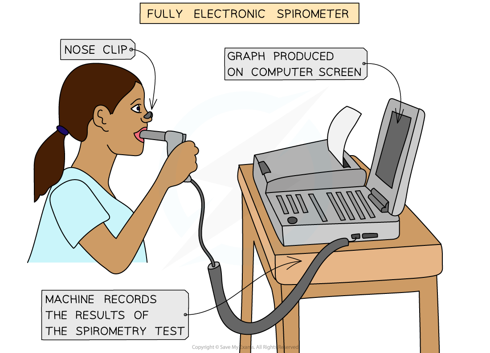
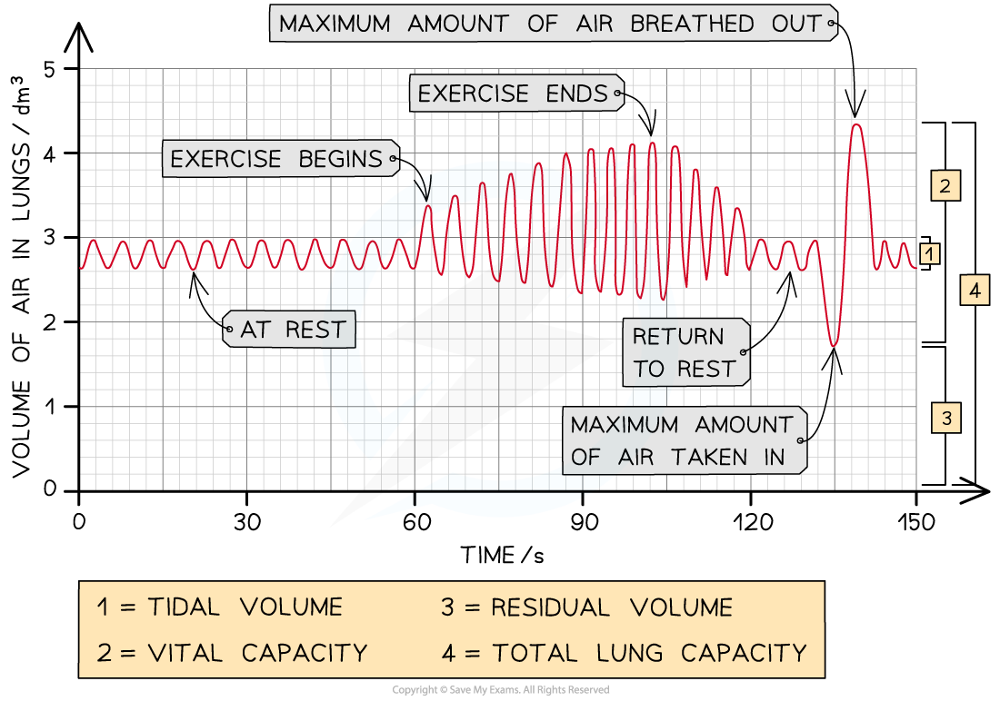
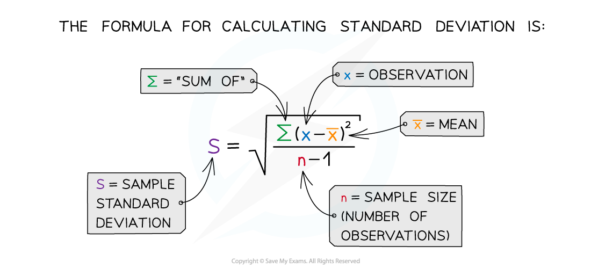
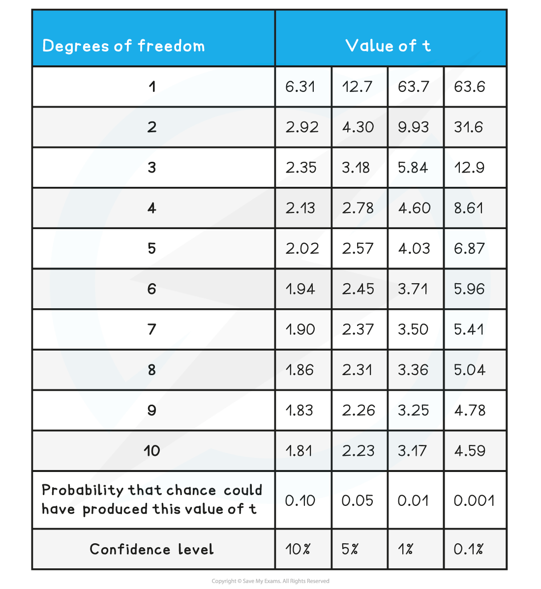

## Practical: Investigating the Effects of Exercise

#### Measuring breathing

* There are **four** main ways that breathing can be **scientifically measured**. These include:

  + **Tidal volume** - this is the **volume of air that is breathed in or out** during **normal breathing** (at rest)
  + **Breathing rate** - this is the **number of breaths taken in one minute** (one breath = taking air in and breathing it back out again)
  + **Oxygen consumption** - this is the **volume of oxygen** used up by someone **in a given time**
  + **Respiratory minute ventilation** - this is the **volume** **of air** that can be breathed **in** or **out** in a minute and can be calculated by means of the following formulae:

**Respiratory minute ventilation = tidal volume x breathing rate** (breaths per minute)

#### Spirometers

* The breathing measurements described above can all be made using a piece of apparatus known as a **spirometer**
* The person (subject) being examined breathes in and out **through** the spirometer
* **Carbon dioxide** is **absorbed** from the **exhaled air** by soda lime in order to stop the concentration of carbon dioxide in the re-breathed air from getting too high, as this can cause breathing distress
* As the subject breathes through the spirometer, a **trace** is drawn on a rotating drum of paper or a **graph** is formed digitally, which can be viewed on a computer
* From this trace, the subject's **respiratory minute ventilation**, **tidal volume** and **breathing rate** can all be **calculated**

***Spirometers are used to measure different aspects of breathing. There are different types of spirometers***

#### Investigating the effects of exercise

* Exercise can cause an increase in breathing rate and tidal volume, including an increase in oxygen consumption and ventilation rates.

#### Apparatus

* Spirometer
* Treadmill
* Stopwatch

#### Method

* A person at rest will breathe into the spirometer for one minute
* Record the results
* The person will then exercise for two minutes while the spirometer chamber is refilled with oxygen
* After they stop exercising, they will immediately breathe into the spirometer for one minute
* Record the results
* Compare the recordings taken before and after exercising

#### Analysing data from a spirometer

* The results from a spirometer (either in the form of a trace drawn on graph paper or a digital graph created by a computer) can be used to **calculate respiratory minute ventilation, tidal volume and breathing rate**

  + A small amount of air, known as the **residual volume**, is always retained in the lungs
* The following readings and calculations can be made:

  + To calculate the **breathing rate,** count the number of peaks on the trace in a minute
  + **Tidal volume** can be determined by calculating the average difference in the volume of gas between each peak and trough
  + **Oxygen consumption** can also be calculated using a spirometer

    - Carbon dioxide is removed from the exhaled air, meaning that the total volume of air available in the spirometer gradually **decreases**, as oxygen is extracted from it by the subject's breathing
    - This change in volume is used as a measure of oxygen consumption

***The changes in the volume of air present in the lungs are shown here. Note the vital capacity, this is the maximum volume of air that can be breathed in or out in one breath***

#### Worked Example

From the spirometer data in the image above, calculate the breathing rate during the first minute and then calculate the breathing rate during the second minute.

**Answer:**  
  
**Step One: Count the number of breaths in the first 60 seconds.**

One breath is shown by the trace going up and then down, so there are 12 breaths in the first 60 seconds.

**Step Two: Give appropriate units.**

Breathing rate should be given in breaths min⁻¹ (breaths per minute), so the breathing rate during the first minute

= 12 breaths min⁻¹.

**Step Three: Count the number of breaths in the second 60 seconds.**

There are 14 breaths in the second 60 seconds.

**Step Four: Give appropriate units.**

The breathing rate during the second minute = **14 breaths min⁻¹.**

#### Worked Example

Calculate the tidal volume during rest and the peak tidal volume during exercise.

**Answer:**  
  
**Step One: For the 'at rest' phase of the trace, measure the difference between the top and bottom of the trace in terms of the volume of air in the lungs.**

During rest, the tidal volume = 3 dm³ - 2.6 dm³

= 0.4 dm³

**Step Two: At the peak tidal volume during exercise, measure the difference between the top and bottom of the trace in terms of the volume of air in the lungs.**

The peak tidal volume during exercise occurs right at the end of the exercise period (at around 100 seconds):

= 4.1 dm³ - 2.3 dm³

= **1.8 dm³**

#### Worked Example

Calculate the respiratory minute ventilation during the first minute.

**Answer:**  
  
**Step One: Use the formula**

Respiratory minute ventilation = tidal volume x breathing rate

**Step Two: Substitute the values calculated from the first minute**

Respiratory minute ventilation = 0.4 x 12

= **4.8 dm****3** **min****-1**

#### Using a t-test to compare two sets of data

* You can use a **Student's t-test** to determine, for example, whether exercise has a **significant effect** on the tidal volume of people at rest
* To do a t-test, you will need **two sets of data** for which the **means/average** must be calculated
* The value determined from a t-test will be **compared to a critical value** to see if the differences in the means were likely due to chance or not
* A **null hypothesis**should be given

  + This is a statement of what we would expect if there is **no** **significant difference** between two means, and that any differences seen are due to **chance**
* If there is a statistically significant difference between the means of two sets of data, then the observation is not down to chance and the **null hypothesis** can be **rejected**
* The next step is to calculate the **standard deviation**

#### Using the t-test to compare two means

* The steps below outline the general steps in a *t* test; for a worked example see the next page
* **Null hypothesis**: there is no statistically significant difference between the means of sample 1 and sample 2
* **Step 1**:  Calculate the mean for each data set:

* **Step 2**:  Calculate the **standard deviation** for each set of data, s1 = standard deviation of sample 1 and s2 = standard deviation of sample 2

* **Step 3**:  Square the standard deviation and divide by *n* (the number of observations) in each sample, for both samples:

* **Step 4:**  Add the values from step 3 together and take the square root:

* **Step 5:**  Divide the difference between the two means (see step 1) with the value calculated in step 4 to get the *t* value:

* **Step 6:**  Calculate the **degrees of freedom** (*v*) for the whole data set

***v*** **= (*****n*****1** **- 1) + (*****n*****2** **- 1)**

* **Step 7:**  Look at a table that relates *t* values to the probability that the differences between data sets is due to chance to find where the *t* value for the degrees of freedom (*v*) calculated lies

**T values Table**

* **Step 8**:  The greater the *t* value calculated (for any degree of freedom), the lower the probability of chance causing any significant difference between the two sample means

  + Identify where the *t* value calculated lies with respect to the confidence levels provided
  + If the *t* value is **greater than the critical value** (obtained from the table at the critical probability of 0.05) then any difference between the two data sets is less likely to be **due to chance,** so the **null hypothesis can be rejected**
  + If the *t* value is less than the critical value given at a confidence of 5% / the probability that any difference is down to chance is above 0.05; then an assumption can be made that the differences between the means of the two sets of data are not significant and the **null hypothesis is accepted**
* Using the table above, if a value of *t* was calculated to be 2.38 at 5 degrees of freedom, then it lies between 2.02 and 2.57, so the probability that chance produced any differences between the two means is between 10% and 5%; the null hypothesis would be accepted in this situation

#### Examiner Tips and Tricks

If you need to calculate the t value you will be given the formula in the exam. Generally questions on the t-test require you to:

* Know why a *t*-test is being used to analyse the data
* State the null hypothesis
* Know how the degrees of freedom was calculated
* State the conclusion (are the differences between the two means significant or not)