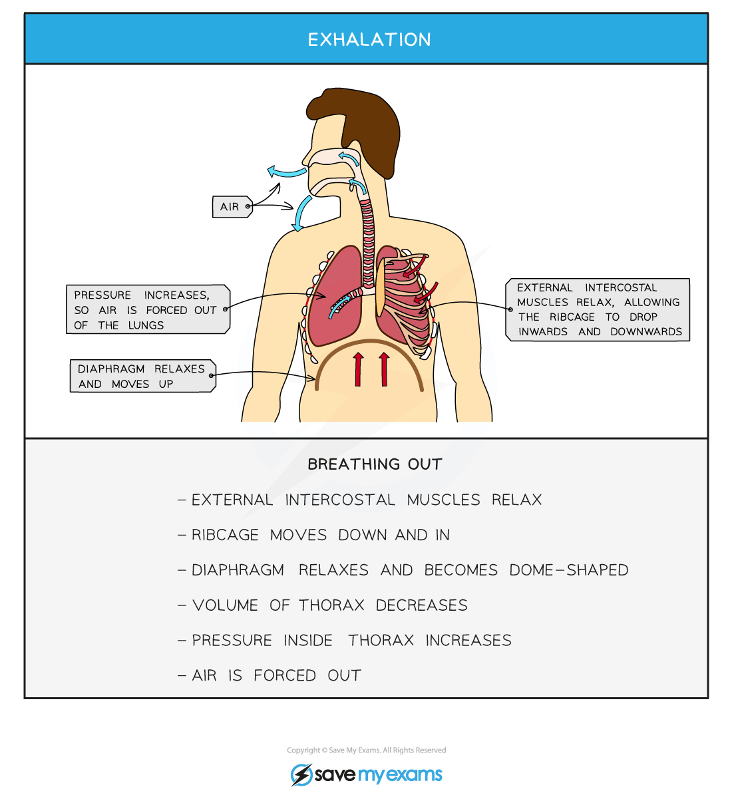
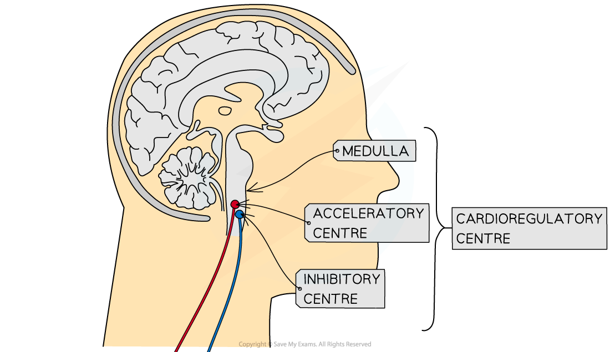
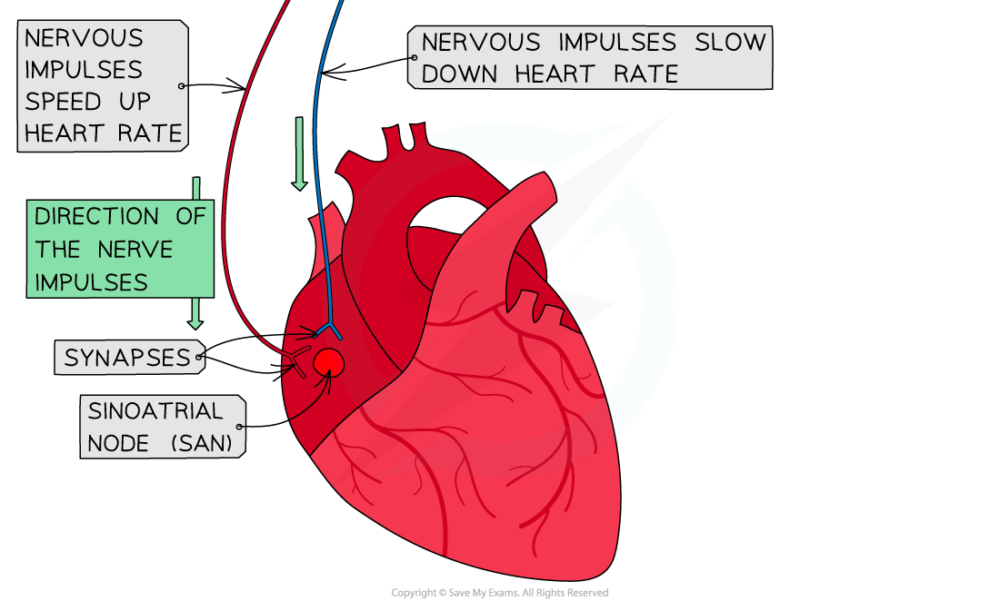

## Variations in Breathing Rate & Heart Rate

* During exercise, **muscle contraction** occurs **more frequently**, requiring **more energy**
* The **rate of** **aerobic respiration** **increases** to meet the increase in energy demand
* This means that cells **require more oxygen** to be delivered to them, while **producing more carbon dioxide** as a waste product of respiration
* The body will accommodate this by making the following changes:

  + **Increase the rate and depth of breathing** which will increase the amount of oxygen entering the lungs and bloodstream, while getting rid of more carbon dioxide
  + **Increase the heart rate** which will transport the oxygen (and glucose) to the muscles much faster, while removing the additional carbon dioxide produced due to the increased rate of respiration

#### Control of the breathing rate

* Breathing rate is controlled by the **ventilation centres** (also called respiratory centres) in the **medulla oblongata**

  + This is one of the three regions that make up the brainstem, it transfers nerve messages from the brain to the spinal cord
  + The **inspiratory centre** controls the movement of air into the lungs (inhalation)
  + The **expiratory centre** controls the movement of air out of the lungs (exhalation)
* The **inspiratory centre** in the medulla oblongata has the following effect on breathing:

  + It sends **nerve impulses** along motor neurons to the **intercostal** **muscles** of the ribs and **diaphragm muscles**
  + These muscles will **contract** and cause the **volume of the chest to increase**
  + This **lowers the air pressure in the lungs** to slightly below atmospheric pressure
  + An **impulse** is also sent to the **expiratory centre** to **inhibit** its action
  + Due to the difference in pressure between the lungs and outside air, **air will flow into** the lungs
* **Stretch receptors** in the lungs are stimulated as they inflate with air
* Nerve impulses are sent back to the medulla oblongata which will **inhibit the inspiratory centre**
* The **expiratory centre** is no longer inhibited and will bring about the following changes:

  + It sends **nerve impulses** to the **intercostal** and **diaphragm muscles**
  + These muscles will **relax** and cause the **volume of the chest to decrease**
  + This **increases the air pressure** in the lungs to slightly above atmospheric pressure
  + Due to the higher pressure in the lungs, **air will flow out** of the lungs
* As the lungs **deflate**, the **stretch receptors become inactive** which means that the inspiratory centre is **no longer inhibited** and the next breathing cycle can begin

***The process of breathing in (inhalation)***

***The process of breathing out (exhalation)***

#### Effect of exercise

* The **extra carbon dioxide** that is produced **due to the increase in the rate of respiration** during exercise dissolves in the blood to form **carbonic acid**
* This quickly **dissociates into hydrogen ions** (H+) and hydrogencarbonate ions (HCO3-)
* The increase in the concentration of H+ ions will **decrease the pH of the blood** (it becomes more acidic)
* The decrease in pH is **detected by receptors** sensitive to changes in the chemical composition of blood
* These are called **chemoreceptors** and they are located in several places

  + In the ventilation centre of the **medulla oblongata**
  + They are also present as clusters of cells in the aorta (**aortic bodies**) and the carotid arteries (**carotid bodies**)
* Once they are stimulated a **nerve impulse** is sent to the **medulla oblongata**
* The medulla oblongata will then send **more frequent nerve impulses** to the intercostal and diaphragm muscles to increase the rate and strength of contractions
* This **increases** the breathing rate and depth
* This results in **more oxygen** entering the lungs (and bloodstream), while **more carbon dioxide** can be exhaled and thus be removed from the bloodstream
* The **decrease in carbon dioxide** levels will result in the **blood pH returning back to normal**, which leads to the breathing rate returning to normal
* The volume of air that moves in and out of the lungs during a set time period (e.g. a minute) is known as the **ventilation rate**
* The ventilation rate **increases during exercise** due to the increase in breathing rate and depth

#### Control of the heart rate

* The **cardiovascular control centre** in the **medulla oblongata** unconsciously **controls the heart rate** by controlling the rate at which the **sinoatrial node** (**SAN**) generates electrical impulses
* These electrical impulses cause the atria to contract and therefore **determines the rhythm of a heartbeat**
* Changes in the internal environment of the body (e.g. blood pressure, oxygen levels) can result in a change in the heart rate
* These changes act as **stimuli** which is detected by **baroreceptors** and **chemoreceptors**

  + **Baroreceptors** are found in the **aortic** and **carotid bodies** and they are stimulated by **high and low blood pressure**
  + **Chemoreceptors** are found in the **medulla oblongata**, as well as in the **aortic** and **carotid bodies**
  + They are stimulated by changes in the **levels of carbon dioxide** and **oxygen** in the blood, as well as **blood pH**
* Once stimulated, these receptors will **send electrical impulses** to the medulla oblongata
* The cardiovascular control centre in the medulla oblongata will respond by sending impulses to the SAN along **sympathetic** or **parasympathetic neurones**
* Each of these neurones release different **neurotransmitters** which will affect the SAN in a different way

  + **Sympathetic neurones** will increase the rate at which the SAN generates electrical impulses, thus **speeding up** the heart rate

    - These neurones form part of the **sympathetic nervous system** which prepares the body for **action** ('fight or flight' response) and **increases the heart rate** during exercise
  + **Parasympathetic neurones** will decrease the rate at which the SAN fires, thus **slowing down** the heart rate

    - These neurones form part of the **parasympathetic nervous system** which **calms** the body down after action ('rest and digest' response) and **decreases the heart rate** after exercise

#### Changes in heart rate

* The heart will respond in different way depending on the stimulus that it receives
* **High blood pressure**

  + Detected by **baroreceptors** which send impulses to **cardiovascular control centre**
  + It sends impulses along **parasympathetic** neurones which secrete the neurotransmitter **acetylcholine**
  + Acetylcholine binds to receptors on **SAN** causing it to fire **less frequently**
  + Heart rate **slows down** and blood pressure decreases back to normal
* **Low blood pressure**

  + Detected by **baroreceptors** which send impulses to **cardiovascular control centre**
  + It sends impulses along **sympathetic** neurones which secrete the neurotransmitter **noradrenaline**
  + Noradrenaline binds to receptors on **SAN** causing it to fire **more frequently**
  + Heart rate **speeds up** and blood pressure increases back to normal
* **High blood O****2** **/ Low CO****2** **/ high pH levels**

  + Detected by **chemoreceptors** which send impulses to **cardiovascular control centre**
  + It sends impulses along **parasympathetic** neurones which secrete the neurotransmitter **acetylcholine**
  + Acetylcholine binds to receptors on **SAN** causing it to fire **less frequently**
  + Heart rate **slows down** and O2 / CO2 and pH levels return to normal
* **Low blood O****2** **/ High CO****2** **/ low pH levels** (during **exercise**)

  + Detected by **chemoreceptors** which send impulses to **cardiovascular control centre**
  + It sends impulses along **sympathetic** neurones which secrete the neurotransmitter **noradrenaline**
  + Noradrenaline binds to receptors on **SAN** causing it to fire **more frequently**
  + Heart rate **speeds up** and O2 / CO2 and pH levels return to normal

***Nervous control of the heart rate by the cardioregulatory centre (also known as the cardiovascular control centre). Sympathetic neurones (red) will speed up the heart rate while parasympathetic neurones (blue) will slow the heart rate down***