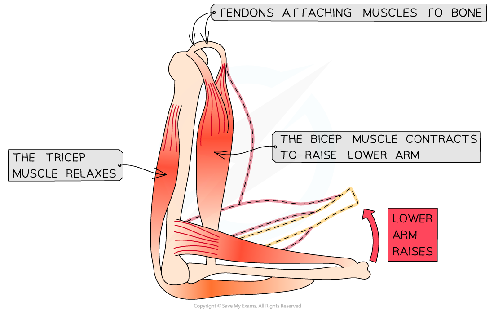

## Movement of the Skeleton

* The **effective movement** of the human body requires both **muscle** and an **incompressible skeleton**

  + This is because muscles will only produce effective movement if they**pull on a structure** that does not shorten or bend - bone
* There are over 600 skeletal muscles in the human body
* Muscles are**effectors**, stimulated by nerve impulses from motor neurones
* The muscular system is complex, with multiple muscles crossing over each other in multiple directions
* Lengths of **strong connective tissue** called **tendons, connect muscles to bones**

  + They are flexible but do not stretch when a muscle is contracting and pulling on a bone
  + There are a few muscles with very long tendons and also a few that are directly attached to the bone
* **Ligaments** are also lengths of **strong connective tissue** but they **connect bones to other bones**, which keep the skeleton intact

#### Antagonistic muscle action

* Muscles are only capable of **contracting** or **pulling,** they **cannot push**
* As a result of this limitation muscles generally operate in **pairs**
* A muscle pulls in one direction **at a joint** and the other muscle **pulls in the opposite direction**

  + This is described as **antagonistic** muscle action
* An example of this can be seen in the biceps and triceps of the arm
* To raise the lower arm

  + The **bicep contracts** and the **tricep relaxes**
  + As the bone can't be stretched the arm**flexes around the joint**
  + A muscle that bends a joint during contraction is known as a **flexor** (the bicep in this case)
  + This brings the tricep into its full length so that it can contract again
* To lower the lower arm

  + The **tricep contracts** and **bicep relaxes**
  + As the bone can't be stretched the arm**flexes around the joint**
  + A muscle that straightens a joint during contraction is known as an **extensor** (the tricep in this case)

***Antagonistic muscle action: the two muscles work together by pulling in opposite directions***