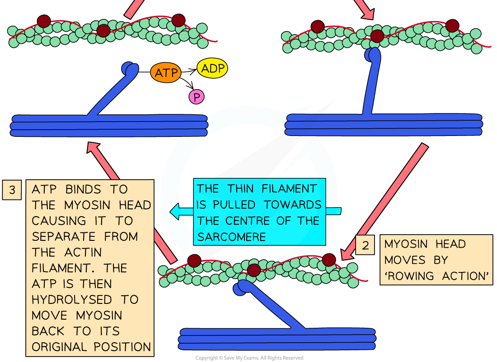

## Sliding Filament Theory

#### Structure of thick & thin filaments in a myofibril

* The **thick filaments** within a myofibril are made up of **myosin molecules**

  + These are **fibrous protein molecules** with a **globular head**
  + The **fibrous part** of the myosin molecule **anchors** the molecule into the thick filament
  + In the thick filament, many myosin molecules lie next to each other with their **globular heads all pointing away from the M line**
* The **thin filaments** within a myofibril are made up of **actin molecules**

  + These are **globular protein molecules**
  + Many actin molecules link together to form a **chain**
  + **Two** actin chains **twist** together to form one**thin filament**
  + A **fibrous** protein known as **tropomyosin** is twisted around the two actin chains
  + Another protein known as **troponin** is attached to the actin chains at regular intervals

#### How muscles contract - the sliding filament theory

* Muscles cause movement by **contracting**
* During muscle contraction, **sarcomeres** within myofibrils **shorten** as the **Z discs are pulled closer together**
* It is **not** the myofilaments that contract as the myosin and actin molecules remain the **same length**
* Myosin and actin filaments **slide over one another**
* This is known as the **sliding filament theory of muscle contraction** and occurs via the following process:

  + An **action potential arrives**at the **neuromuscular junction** (a specialised synapse between a motor neuron nerve terminal and its muscle fiber)
  + **Calcium ions** are **released** from the **sarcoplasmic reticulum** (SR)
  + Calcium ions **bind to troponin molecules**, stimulating them to **change shape**
  + This causes **troponin** and **tropomyosin** proteins to **change position** on the **actin (thin) filaments**
  + **Myosin binding sites are exposed**on the actin molecules
  + The **globular heads of the myosin molecules bind**with these sites, forming **cross-bridges** between the two types of filaments
  + The formation of the cross-bridges causes the **myosin heads to spontaneously bend** (releasing ADP and inorganic phosphate),**pulling the actin filaments towards the centre of the sarcomere**and causing the muscle to contract a very small distance
  + **ATP binds to** the myosin heads producing a change in shape that causes the myosin heads to **release** from the actin filaments
  + The enzyme **ATPase** hydrolyses ATP into ADP and inorganic phosphate which causes the myosin heads to move back to their **original positions,** this is known as the **recovery stroke**
  + The myosin heads are then able to bind to **new binding sites** on the actin filaments, **closer to the Z disc**
  + The myosin heads move again, pulling the actin filaments **even closer the centre of the sarcomere**, causing the sarcomere to **shorten** once more and pulling the Z discs closer together
  + ATP binds to the myosin heads once more in order for them to **detach**again
  + As long as troponin and tropomyosin are not blocking the myosin-binding sites and the muscle has a supply of ATP, this process **repeats** until the muscle is **fully contracted**

***The sliding filament theory of muscle contraction***

* Once muscle stimulation stops, **calcium ions leave** their binding sites on troponin molecules
* They are **actively transported** back to SR
* Without calcium ions bound to them, the **troponin molecules return** to their original shape
* This pulls the **tropomyosin** molecules in a position that **blocks the actin-myosin binding sites**
* Since **no cross bridges** can form between actin and myosin, **no muscle contraction** can occur
* The **sarcomere will lengthen** again as actin filaments slide back to their relaxed position

#### Examiner Tips and Tricks

There is a lot to remember here so take some time to go through it and ensure you understand the order of events.

Because muscles require a source of ATP for myosin heads to detach (and the muscle to stop contracting) this explains rigor mortis (stiffening of the joints and muscles of a body a few hours after death) as there is no ATP after death to detach the myosin heads, the muscles remain contracted!