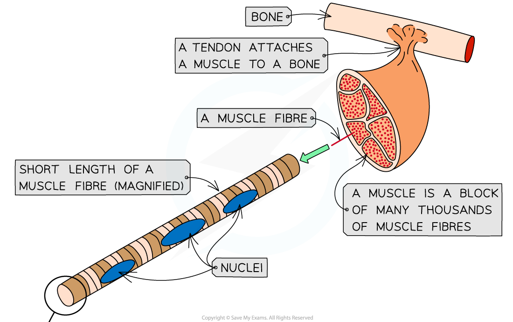
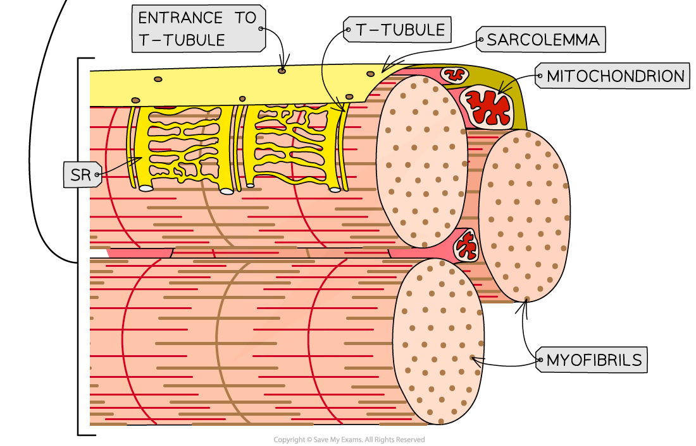

## Muscle Fibres: Structure

* **Skeletal muscle** makes up the muscles in the body that are attached to the skeleton
* Skeletal muscle is made up of **muscle fibres**
* A muscle fibre is a **highly specialised**cell-like **unit**:

  + Each muscle fibre contains an organised arrangement of **contractile proteins in the cytoplasm**
  + Each muscle fibre is surrounded by a **cell surface membrane**
  + Each muscle fibre contains **many nuclei** (**multi-nucleated**) – this is why muscle fibres are not usually referred to as cells
* The different parts of a muscle fibre have different names to the equivalent parts of a normal cell:

  + Cell surface membrane = **sarcolemma**
  + Cytoplasm = **sarcoplasm**
  + Endoplasmic reticulum = **sarcoplasmic reticulum (SR)**
* The sarcolemma has many deep tube-like projections that fold in from its outer surface:

  + These are known as transverse system tubules or **T-tubules**
  + These run **close to the SR** and help spread electrical impulses throughout muscle fibre
* The sarcoplasm contains **mitochondria** and **myofibrils**

  + The mitochondria carry out aerobic respiration to generate the ATP**required for muscle contraction**
  + Myofibrils are **bundles of actin and myosin filaments**, which slide past each other during muscle contraction
* The membranes of the SR contain **protein pumps**that transport **calcium ions**into the lumen of the SR

  + Calcium ions are needed for the contraction of muscle

***The ultrastructure of skeletal muscle and of a section of muscle fibre***

#### Myofibrils

* Myofibrils are located in the **sarcoplasm**
* Each myofibril is made up of **two types of protein filament:**

  + **Thick** filaments made of **myosin**
  + **Thin** filaments made of **actin**
* These two types of filaments are arranged in a particular order, creating different types of **bands** and **line**

**Myofibrils Parts & Descriptions Table**

***The structure of a myofibril***

## Fast vs Slow Twitch Fibres

* There are two types of muscle fibres found in muscles

  + **Fast** **twitch** fibres
  + **Slow** **twitch** fibres
* Human muscles are made up of both types of muscle fibres
* Some muscles have higher proportions of a particular fibre type due to their different properties

#### Fast twitch muscle fibres

* Fast twitch muscle fibres **contract rapidly**

  + The myosin heads bind and unbind from the actin-binding sites five times faster than slow twitch muscle fibres
  + Their rapid contraction-relaxation cycle means they need **large amounts of calcium ions** present to stimulate contraction
* They rely on **anaerobic** **respiration** for ATP supply
* They are suited to **short bursts of high-intensity activity**as they **fatigue quickly** due to the **lactate** produced from anaerobic respiration
* These muscle fibres are often found in high proportions in the **limbs** of animals that flee a predator or hunt prey at high speeds

  + For example, the wings of a robin and legs of a cheetah
* There are high proportions of fast twitch muscle fibres in **human eyelids**

  + They contract in short bursts and do not need to sustain the rapid movement
* Fast twitch muscle fibres have **fewer capillaries**

  + Blood containing glucose and oxygen flow through the capillaries
  + This means they have quite a slow supply of oxygen and glucose for aerobic respiration
* **Low amounts of myoglobin are present** in fast twitch muscle fibres

  + Myoglobin is a red pigment molecule that is similar to haemoglobin
  + Myoglobin functions as a **store of oxygen** in muscles and increases the rate of oxygen absorption from the capillaries
* Due to this fast twitch muscle fibres appear **paler** in colour than slow muscle fibres

#### Slow twitch muscle fibres

* Slow twitch muscle fibres **contract more slowly** and are suited to **sustained activities**like walking and perching
* They rely on aerobic respiration for ATP
* They **fatigue less quickly** due to less lactate production, making them ideal for **endurance**
* These muscle fibres are often found in high proportions in the **limbs** of animals that migrate or stalk prey over long distances

  + For example, the wings of geese and legs of wolves
* **Human back muscles** have a high proportion of slow twitch muscle fibres

  + These muscles have to contract for long periods of time in order to keep the skeleton erect when standing or sitting
* Slow twitch muscle fibres have **a denser network of capillaries**

  + Blood containing glucose and oxygen flow through the capillaries
  + This means they have a short diffusion distance and a good supply of oxygen and glucose for aerobic respiration
* **High amounts of myoglobin, haemoglobin and mitochondria**are present in slow twitch muscle fibres

  + This increases the rate of oxygen supply, oxygen absorption and aerobic respiration
* Due to the high amounts of red pigment, slow twitch muscle fibres appear a **dark red**

**Fast Twitch & Slow Twitch Muscle Fibres Table**

