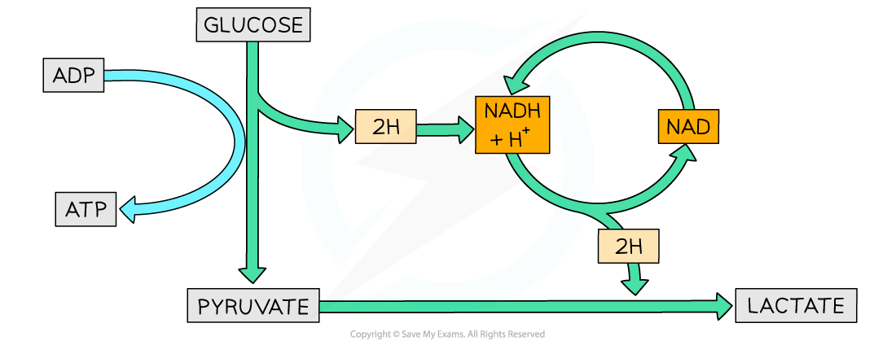

## Anaerobic Respiration

* Sometimes cells experience conditions with **little or no oxygen**
* There are several consequences when there is not enough oxygen available for respiration:

  + There is **no final acceptor** (oxygen) **of electrons** from the electron transport chain
  + The **electron transport chain stops** functioning
  + **No more ATP** is produced **via oxidative phosphorylation**
  + Reduced NAD and FAD **aren’t oxidised** by an electron carrier
  + No oxidised NAD and FAD are available for **dehydrogenation** in the Krebs cycle
  + The **Krebs cycle stops**
  + The **link reaction also stops**
* However, there is still a way for cells to produce some ATP in low oxygen conditions through **anaerobic respiration**

#### Anaerobic pathways

* Some cells are able to **oxidise the reduced NAD** produced during glycolysis so it can be used for further hydrogen transport
* This means that **glycolysis can continue** and **small amounts of ATP** are still produced
* Certain types of micro-organisms and mammalian muscle cells use **lactate fermentation**

#### Lactate fermentation

* In this pathway reduced NAD transfers hydrogen to pyruvate to form lactate
* **NAD** can now be **reused in glycolysis**
* **Pyruvate is reduced** to lactate by enzyme lactate dehydrogenase
* Pyruvate is the hydrogen acceptor
* The final product lactate can be further metabolised
* A small amount of ATP is produced

***The pathway of lactate fermentation***

## Processing Lactate

* Lactate (lactic acid) can build up in the cells after a period of time
* After lactate is produced two things can happen:

  + It can be **oxidised back to pyruvate** which is then channelled into the Krebs cycle for ATP production
  + It can be **converted into glucose** by the liver cells for use during respiration or for storage (in the form of glycogen)

* The oxidation of lactate back to pyruvate needs extra oxygen

  + This extra oxygen is referred to as an **oxygen debt**
  + It explains why animals **breathe deeper and faster after exercise**