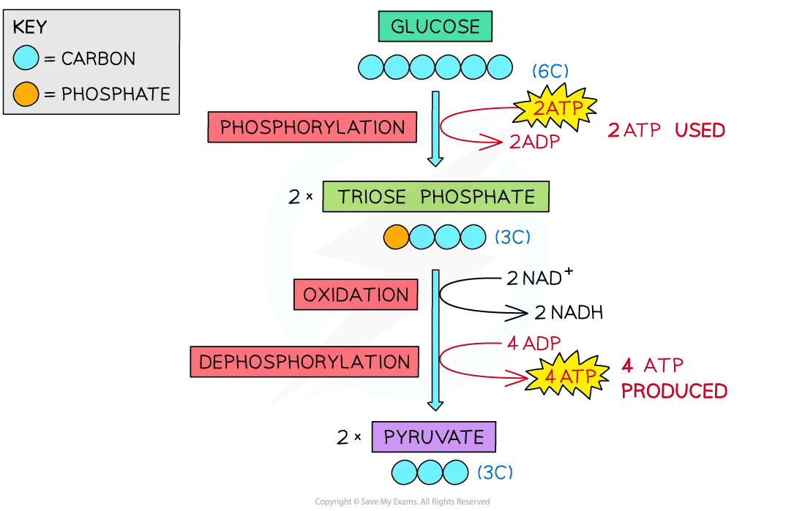

## Glycolysis

* Glycolysis is the first stage of respiration
* It does not require oxygen to take place and is therefore the first step for both aerobic and anaerobic respiration
* Glucose is only **partially** **oxidised** during glycolysis
* It takes place in the cytoplasm of the cell and involves:

  + **Trapping glucose** in the cell by **phosphorylating** the molecule
  + **Oxidising**triose phosphate (by losing hydrogen)
* It results in the production of

  + **2 Pyruvate** (3C) molecules which moves into the matrix of mitochondria to be used during the link reaction
  + Net gain **2 ATP**
  + **2 reduced** **NAD**, which will be used during a later stage called oxidative phosphorylation
* Under **anaerobic** conditions, glycolysis produces **lactic acid or lactate** instead of pyruvate

#### Steps of glycolysis

* **Phosphorylation** of glucose (a hexose sugar)

  + Two molecules of ATP are required to provide the **two phosphates** needed for the phosphorylation of glucose
  + This produces

    - **Two molecules of triose phosphate**
    - **Two molecules of ADP**
* **Oxidation** of triose phosphate

  + After triose phosphate **loses hydrogen**, it forms **two molecules of pyruvate**
  + The **hydrogen ions are collected by NAD** which reduces the coenzyme
  + This forms **two reduced NAD or NADH**
  + Even though a total of four ATP molecules were produced during glycolysis, two of them were used to phosphorylate glucose
  + There was therefore a **net gain of two ATP molecules**

***The process of glycolysis***

#### Examiner Tips and Tricks

It may seem strange that ATP is used and also produced during glycolysis. At the start ATP is used to **make glucose more reactive** (it is usually very stable) and to lower the activation energy of the reaction. Since 2 ATP are used and 4 are produced during the process, there is a **net gain of 2 ATP per glucose molecule.**