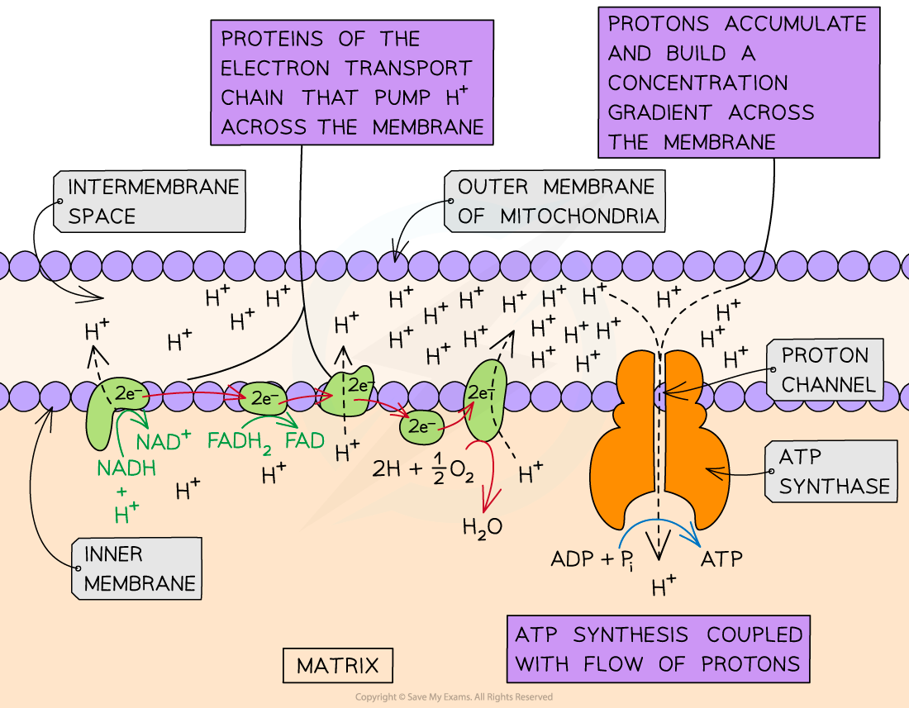
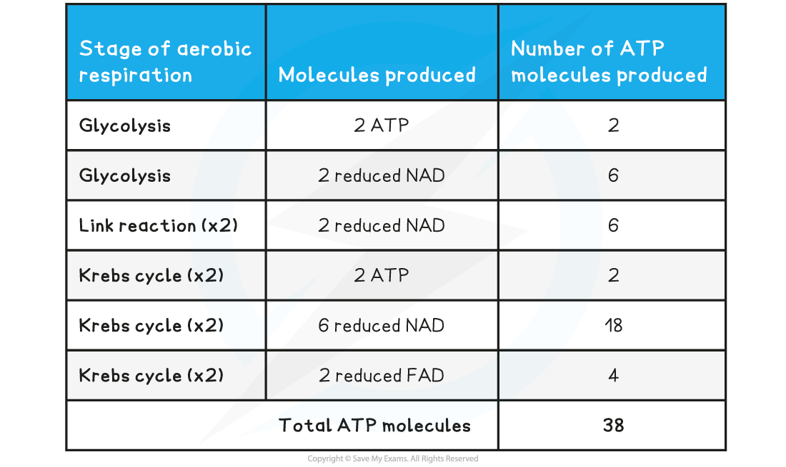

## Oxidative Phosphorylation

* **Oxidative phosphorylation** is the last stage of aerobic respiration

  + It takes place at the **inner mitochondrial membrane**
  + It results in the **production of many molecules of ATP** and the **production of water from oxygen**
* The current model for oxidative phosphorylation is the **chemiosmotic theory**

  + The model states that **energy from electrons** is passed through a chain of proteins in the membrane, known as the **electron transport chain**
  + This energy is used to **pump protons (hydrogen ions) against their concentration gradient** into the intermembrane space
  + The protons are then allowed to **flow by facilitated diffusion** through a channel enzyme called **ATP synthase** into the matrix
  + The energy of the protons flowing down their concentration gradient is harnessed (a bit like water flowing through a hydroelectric damn) resulting in the **phosphorylation of ADP into ATP** by ATP synthase

#### Outline of oxidative phosphorylation

* Hydrogen atoms are donated by reduced NAD (NADH) and reduced FAD (FADH2) from the Krebs Cycle
* Hydrogen atoms **split into protons (H****+****ions) and electrons**
* The high energy electrons enter the **electron transport chain** and **release energy** as they move through the electron transport chain
* The energy released is used to **transport protons** across the inner mitochondrial membrane **from the matrix into the intermembrane space**
* A **concentration gradient** of protons is established between the intermembrane space and the matrix
* The protons return to the matrix via **facilitated diffusion** through the **channel enzyme ATP synthase**
* The movement of protons down their concentration gradient provides energy for **ATP synthesis**
* **Oxygen** acts as the '**final electron accepto**r' and combines with protons and electrons at the end of the electron transport chain to **form water**

#### The electron transport chain

* The electron transport chain is made up of a **series of membrane proteins**/ electron carriers
* They are positioned close together which allows the electrons to pass from carrier to carrier
* The inner membrane of the mitochondria is impermeable to hydrogen ions so these electron carriers are required to **pump the protons across the membrane** to establish the concentration gradient

***Oxidative phosphorylation via the chemiosmotic theory occurs on the inner mitochondrial membrane and requires NADH and FADH******2*** ***from the Krebs Cycle. It produces water and many molecules of ATP***

* Oxidative phosphorylation **uses energy** from reduced NAD and FAD to **produce ATP**

  + **3 ATP** molecules for every reduced **NAD** molecule
  + **2 ATP** molecules for every reduced **FAD** molecule
* For every molecule of glucose, a total of **38 ATP molecules** can be produced during aerobic respiration

**Number of ATP Molecules Produced During Aerobic Respiration per Glucose Molecule Table**

#### Examiner Tips and Tricks

Examiners often ask why oxygen is so important for aerobic respiration. Oxygen acts as the **final electron acceptor.**Without oxygen the electron transport chain cannot continue as the electrons have nowhere to go. Without oxygen accepting the electrons (and hydrogen ions) the reduced coenzymes NADH and FADH2 cannot be oxidised to regenerate NAD and FAD, so they can’t be used in further hydrogen transport.

It is important to use the correct terminology when describing hydrogen; ensure you understand when to use "hydrogen" and when to use "hydrogen ions/protons".