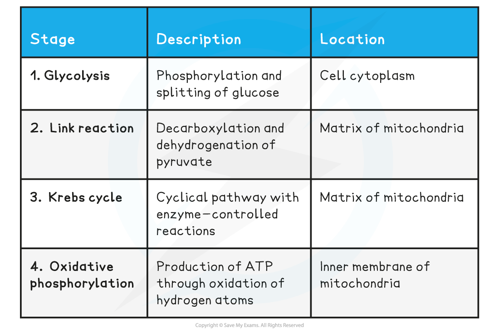

## Stages of Respiration

* Glucose is **broken down in stages**, each of which consists of a series of chemical reactions
* These chemical reactions are controlled by **intracellular enzymes** that catalyses reactions within the cell
* This ensures that the energy trapped within the chemical bonds of the glucose molecule is **released gradually** and not all at once
* A sudden release of such a large amount of energy would result in an increase in body temperature to levels that would **denature****enzymes**
* Each stage of aerobic respiration occurs at a particular location in a eukaryotic cell:

  + **Glycolysis** takes place in the cell cytoplasm
  + The **Link reaction** takes place in the matrix of the mitochondria
  + The **Krebs cycle** takes place in the matrix of the mitochondria
  + **Oxidative phosphorylation** occurs at the inner membrane of the mitochondria

**Four Stages of Respiration Table**

#### Examiner Tips and Tricks

It’s important to know the exact locations of each stage. It is not enough to say the Krebs cycle takes place in the mitochondria, you need to say it takes place in the **matrix** of the mitochondria.