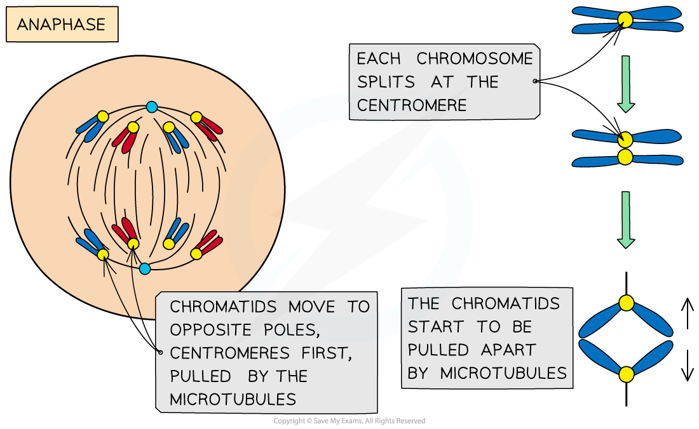

## The Stages of Mitosis

* Mitosis is the process of nuclear division by which **two genetically identical daughter nuclei** are produced that are also genetically identical to the parent cell nucleus (they have the same number of chromosomes as the parent cell)
* Although mitosis is, in reality, one continuous process, it can be divided into **four main stages**
* These stages are:

  + **Prophase**
  + **Metaphase**
  + **Anaphase**
  + **Telophase**
* Most organisms contain many **chromosomes** in the nuclei of their cells (eg. humans have 46) but the diagrams below show mitosis of an animal cell with **only four chromosomes, for the sake of simplicity**
* The different colours of the chromosomes are just to show that half are from the **female parent and half from the male parent**

#### Prophase

* Chromosomes **condense** and are now visible when stained
* The chromosomes consist of **two identical chromatids** called **sister chromatids** (each containing one DNA molecule) that are joined together at the **centromere**
* The two **centrosomes** (replicated in the G2 phase just before prophase) move towards **opposite poles** (opposite ends of the nucleus)
* **Spindle fibres** (protein **microtubules**) begin to emerge from the centrosomes (which consist of two **centrioles** in animal cells)
* The **nuclear envelope**(nuclear membrane) **breaks down** into small vesicles

***Prophase stage of mitosis where chromosomes condense into visible structures***

#### Metaphase

* **Centrosomes** reach **opposite poles**
* **Spindle fibres** (protein microtubules) continue to **extend from centrosomes**
* Chromosomes **line up at the equator** of the spindle (also known as the metaphase plate) so they are equidistant to the two centrosome poles
* Spindle fibres (protein microtubules) reach the chromosomes and **attach to the centromeres**
* Each **sister chromatid** is attached to a spindle fibre originating from **opposite poles**

***Metaphase, where chromosomes line up along the equator of the cell***

#### Anaphase

* The sister chromatids **separate at the centromere** (the centromere divides in two)
* Spindle fibres (protein microtubules) begin to **shorten**
* The separated sister chromatids (**now called chromosomes**) are **pulled to opposite poles** by the spindle fibres (protein microtubules)

***Anaphase, where chromosomes are pulled to the poles of the cell***

#### Telophase

* Chromosomes arrive at opposite poles and begin to **decondense**
* **Nuclear envelopes** (nuclear membranes) begin to **reform** around each set of chromosomes
* The **spindle fibres break down**

***Telophase, where the nuclei reform and the cell begins to split into two***

#### Examiner Tips and Tricks

Make sure you learn the four stages of mitosis. Cytokinesis is often mistaken as a stage of mitosis but remember this is a separate part of the cell cycle.

The acronym PMAT can be helpful to remind you what happens during each stage of mitosis:

**P** = **P**rophase, where the cell **P**repares to divides

**M** = **M**etaphase, where the chromosomes align along the **M**iddle

**A** = **A**naphase, where the chromosomes move **A**way from each other

**T** = **T**elophase, where **T**wo nuclei reform

The chromosome number is important too; after interphase but before the parent cell undergoes mitosis, the human parent cell nucleus actually contains **92 DNA molecules**! This is because during interphase (S phase), the 46 DNA molecules in the parent cell have replicated to form sister chromatids. As human cells have a diploid number of 46 this replication results in 92 molecules. This ensures the two daughter cells will be diploid (have 46 chromosomes each) when mitosis occurs. Remember to read the questions carefully as **only** human diploid cells have 46 chromosomes so if the question refers to another organism, its diploid number will be different.

## The Significance of Mitosis

* The process of mitosis is of great biological significance and is **fundamental to many biological processes**:

#### Growth of multicellular organisms

* The two daughter cells produced are genetically identical to one another (**clones**) and have the same number of chromosomes as the parent cell
* This enables **unicellular zygotes** (as the zygote divides by mitosis) **to grow into multicellular organisms**
* Growth may occur across the whole body of the organism or be confined to certain regions, such as in the meristems (growing points) of plants

#### Replacement of cells & repair of tissues

* Damaged tissues can be repaired by mitosis followed by cell division
* As cells are constantly dying they need to be **continually replaced by genetically identical cells**
* In humans, for example, cell replacement occurs particularly rapidly in the skin and the lining of the gut
* Some animals can regenerate body parts, for example, zebrafish can regenerate fins and axolotls regenerate legs and their tail amongst other parts

#### Asexual reproduction

* Asexual reproduction is the production of new individuals of a species by a single parent organism – the offspring are genetically identical to the parent
* For unicellular organisms such as *Amoeba*, cell division results in the reproduction of a genetically identical offspring
* For multicellular organisms (as seen with many plant species) new individuals grow from the parent organism (by cell division) and then detach (‘bud off’) from the parent in different ways. Some examples of these are budding in *Hydra* and yeast and runners from strawberries