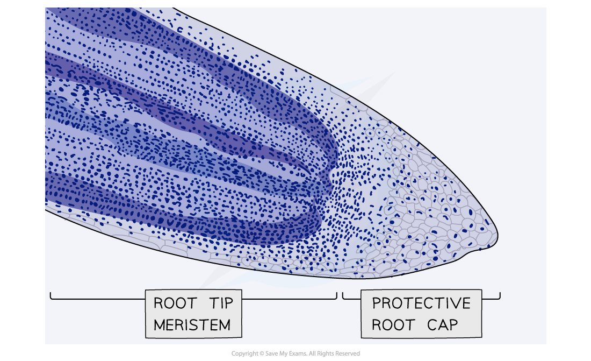
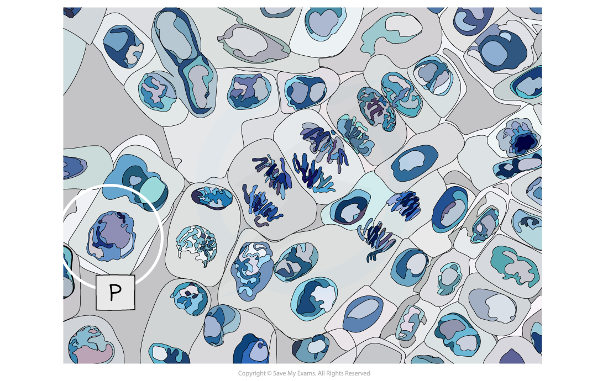
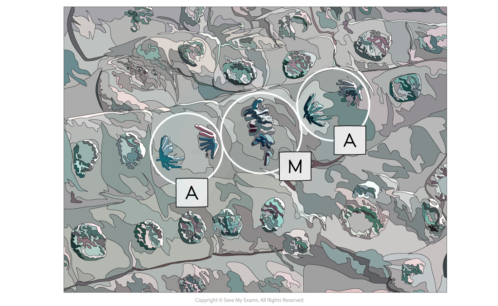
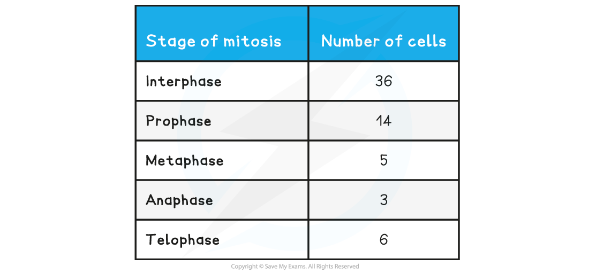

## Practical: Identifying Mitosis in Plant Cells

* Growth in plants occurs in specific regions called meristems
* The root tip meristem can be used to study **mitosis**
* The root tip meristem can be found **just behind the protective root cap**
* In the root tip meristem, there is a**zone of cell division** that contains cells undergoing **mitosis**
* Pre-prepared slides of root tips can be studied or temporary slides can be prepared using the **squash technique** (root tips are **stained** and then **gently squashed**, spreading the cells out into a thin sheet and allowing individual cells undergoing mitosis to be clearly seen)

***A micrograph of a stained root tip, nuclei are clearly visible***

#### Apparatus

* Roots of onion or garlic
* Microscope slide
* Cover skip
* 1 M hydrochloric acid
* Stain (acetic orcein, toluidine blue for example)
* Paper towel
* Scalpel blade
* Cutting tile
* Water bath at 60oC
* Boiling tube
* Optical microscope

#### Method

1. **Garlic** or **onion** (*Allium cepa*) root tips are most commonly used (the bulbs can be encouraged to grow roots by suspending them over water for a week or two)
2. Prepare a boiling tube of 1M hydrochloric acid and place in a water bath at 60oC for 10 minutes
3. Remove the **tips** of the roots (about 1cm) and place in the **warmed hydrochloric acid** for 5 minutes
4. Rinse the tips well in cold water using a pipette and blot dry with a paper towel
5. Cut approximately 2mm off the tip and place onto a microscope slide
6. Add a drop of a suitable **stain** (eg. warm, acetic orcein, which stains chromosomes a deep purple)
7. The stained root tip is **gently squashed** on a **glass slide** using a blunt instrument (eg. the handle of a mounting needle or a cover slip using your fist to gently apply pressure in a rolling motion)
8. View the slide under the microscope
9. Cells undergoing mitosis (similar to those in the images below) can be seen and drawn
10. Annotations can then be added to these drawings to show the **different stages of mitosis**

#### Results

* You should be able to observe cells in different stages of mitosis from the stained meristem

***Micrograph of cells from a meristem showing cells in prophase (P)***

***Micrograph of cells undergoing metaphase (M) and anaphase (A)***

#### Calculating mitotic index

* The mitotic index is the **proportion** of cells (in a group of cells or a sample of tissue) that are **undergoing mitosis**

  + The mitotic index can be calculated using the formula below:

**mitotic index = number of cells with visible chromosomes ÷ total number of cells**

* You can multiply the answer by **100** if you need to give the mitotic index as a **percentage**

#### Worked Example

A student who wanted to observe mitosis prepared a sample of cells. They counted a **total of 42** cells in their sample, **32 of which had visible chromosomes**. Calculate the mitotic index for this sample of cells (give your answer to 2 decimal places).  
  
**Answer:**  
  
mitotic index = number of cells with visible chromosomes ÷ total number of cells

* mitotic index = 32 ÷ 42
* mitotic index = **0.76**

#### Worked Example

The table below shows the number of cells in different stages of mitosis in a sample from a garlic root tip. Calculate the mitotic index for this tissue (give your answer to 2 decimal places).

* mitotic index = number of cells with visible chromosomes ÷ total number of cells
* mitotic index = (prophase + metaphase + anaphase + telophase) ÷ total number of cells
* mitotic index = (14 + 5 + 3 + 6) ÷ (36 + 14 + 5 + 3 + 6)
* mitotic index = 28 ÷ 64
* mitotic index = **0.44**

#### Worked Example

The micrograph below shows a sample of cells from an onion root tip. Calculate the mitotic index for this tissue (give your answer to 2 decimal places).

***The cells undergoing mitosis have been identified in green***

Number of cells with visible chromosomes (green) = 20

Total number of cells (green + red) = 20 + 55 = 75

mitotic index = number of cells with visible chromosomes ÷ total number of cells

mitotic index = 20 ÷ 75

mitotic index = **0.27**