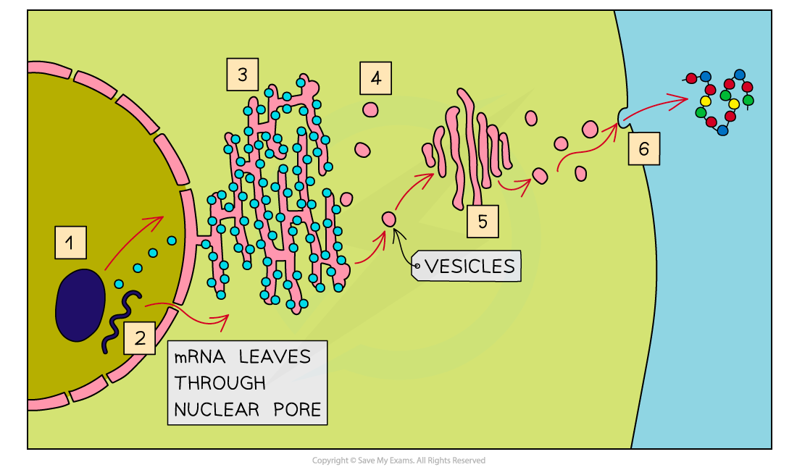

## Eukaryotic Cells: Structure

* Cells can be divided into two broad types; **eukaryotic** and **prokaryotic** cells
* Eukaryotic cells have a **more complex ultrastructure** than prokaryotic cells

  + The term ultrastructure refers to the **internal structure of cells**
* The cytoplasm of eukaryotic cells is divided up into **membrane-bound compartments** called **organelles**
* Animal and plant cells are both types of eukaryotic cells that **share key structures** such as

  + Membrane-bound organelles, including a nucleus
  + Larger ribosomes known as 80S ribosomes
* **Key differences** between animal and plant cells include

  + Animal cells contain **centrioles** and some have **microvilli** while plant cells do not

    - Microvilli are folded regions of the cell surface membrane that increase cell surface area for absorption, e.g. in the small intestine
  + Plant cells have a **cellulose cell wall**, large permanent **vacuoles**, and **chloroplasts** while animal cells do not

***Animal cells are eukaryotic cells***

***Plant cells are eukaryotic cells with a cellulose cell wall, permanent vacuole, and chloroplasts***

#### Cell surface membrane

* All cells are surrounded by a cell surface membrane which **controls the exchange of material**s between the internal cell environment and the external environment

  + The membrane is described as being **partially permeable**, meaning that some substances can pass through the membrane while others cannot
* Cell membrane is formed from a phospholipid**bilayer** spanning a diameter of around 10 nm
* Many organelles inside cells are surrounded by cell membrane, so when referring to the outer membrane of a cell it is always a good idea to refer to it as the cell **surface** membrane

  + The cell surface membrane can also be referred to as the **plasma membrane**

***The cell surface membrane surrounds the cell, separating it from its external environment***

#### The nucleus

* Present in all eukaryotic cells, the nucleus is relatively **large** and separated from the cytoplasm by a **double membrane** called the **nuclear envelope,** which has many pores

  + Nuclear pores are important channels for allowing mRNA and ribosomes to travel out of the nucleus, as well as allowing enzymes, e.g. DNA polymerases, and signalling molecules to travel in
* The nucleus contains **chromatin,** the material from which chromosomes are made

  + Chromosomes are made of sections of **linear DNA** tightly wound around proteins called **histones**
* Usually, at least one or more darkly stained regions of the nucleus can be observed under a microscope; these regions are individually termed **nucleolus** (plural nucleoli) and are the sites of **ribosome production**

***The nucleus of a eukaryotic cell is surrounded by the nuclear envelope and contains chromatin as well as a region called the nucleolus. Note that the nucleus is shown here surrounded by another organelle; the endoplasmic reticulum***

#### Mitochondria

* The site of **aerobic** respiration within eukaryotic cells, mitochondria (singular mitochondrion) are just visible with a light microscope
* Mitochondria are surrounded by a **double-membrane** with the inner membrane folded to form structures called **cristae**
* The **matrix** of mitochondria contains enzymes needed for **aerobic respiration,**producing **ATP**
* Small circular pieces of **DNA,** known asmitochondrial DNA, and ribosomes are also found in the matrix

  + These are needed for replication of mitochondria before cell division

***Mitochondria are the site of aerobic respiration in eukaryotic cells***

#### Ribosomes

* Ribosomes can be found as free organelles in the cytoplasm of all cells or as part of the **rough endoplasmic reticulum**in eukaryotic cells
* They are not surrounded by a membrane
* Each ribosome is a complex of **ribosomal RNA (rRNA)** and **proteins**
* 80s ribosomes are found in eukaryotic cells
* 70s ribosomes are found in prokaryotes, mitochondria, and chloroplasts
* Ribosomes are the site of translation

***Ribosomes are formed in the nucleolus and are composed of almost equal amounts of RNA and protein***

#### Endoplasmic reticulum

* There are two types of endoplasmic reticulum; rough and smooth
* **Rough Endoplasmic Reticulum (RER)**

  + RER is formed from folds of membrane continuous with the **nuclear envelope**
  + The surface of RER is covered in **ribosomes**
  + The role of the RER is to **process protein**s made on theribosomes
* **Smooth Endoplasmic Reticulum (SER)**

  + SER is also formed from folds of membrane but its function is distinct from the RER, being involved in the production, processing and storage of **lipids, carbohydrates**and **steroids**
  + SER does not have ribosomes on its surface

***The RER and SER are visible under the electron microscope; the presence or absence of ribosomes helps to distinguish between them***

#### The Golgi apparatus

* The Golgi apparatus consists of **flattened sacs of membrane** similar in appearance to the smooth endoplasmic reticulum

  + The Golgi apparatus is sometimes known as the **Golgi body**
  + The Golgi can be distinguished from the SER by its **regular, stacked appearance**; it can be described as looking like a wifi symbol!
* The role of the Golgi apparatus is to **modify proteins and lipids** before **packaging** them into **Golgi vesicles**

  + The vesicles then**transport the proteins and lipids** to their required destination

***The Golgi apparatus; the cis face lies near the rough endoplasmic reticulum, while the trans face lies near the cell membrane***

#### Lysosome

* Lysosomes are specialist forms of vesicle which contain hydrolytic**enzymes**
* The role of lysosomes is to break down waste materials such as worn-out organelles,

  + Lysosomes are used extensively by cells of the **immune system** and in programmed cell death, known as **apoptosis**

***Lysosomes contain digestive enzymes***

#### Centrioles

* Centrioles are made of hollow fibres knows as **microtubules**

  + Microtubules are filaments of protein that can be used to **move substances around** inside a cell, as well as to **support the shape of a cell** from the inside
* Two centrioles at right angles to each other form a **centrosome** which organises the spindle fibres during cell division
* Centrioles are not found in plants and fungi

***Centrioles are structures formed from microtubules; they are involved with the process of nuclear division in animal cells***

## Rough Endoplasmic Reticulum & Golgi Apparatus: Function

* In cells, **many organelles** are involved in the **production** and **secretion** of proteins

  + Organelles are **specialised parts of a cell** that carry out a particular function
  + Some organelles are membrane-bound, meaning that they are surrounded by membrane
* The **organelles** involved in protein synthesis include

  + Nucleus

    - Transcription of the DNA code occurs here
  + Ribosomes

    - Free ribosomes and those on the RER produce proteins in the process of translation
  + Rough endoplasmic reticulum (RER)
  + Golgi apparatus
  + Cell surface membrane

    - Proteins formed within the cell are secreted here

#### Rough endoplasmic reticulum

* Ribosomes on the RER produce proteins that can be **secreted out of the cell** or become **attached to the cell surface membrane**
* Proteins that have been passed into the lumen of the **rough endoplasmic reticulum** are **folded** and **processed** here

  + The term lumen refers to the inside space of the RER
* Note that free ribosomes found within the cytoplasm make proteins that stay within the cytoplasm rather than being moved to another organelle or being exported from the cell

#### The Golgi apparatus

* Processed proteins from the RER are transported to the **Golgi apparatus** in **vesicles** which fuse with the Golgi apparatus, releasing the proteins into the Golgi

  + The Golgi apparatus **modifies** the proteins, preparing them for **secretion**
* Proteins that go through the Golgi apparatus are usually

  + Exported, e.g. hormones such as insulin
  + Put into lysosomes, e.g. hydrolytic enzymes
  + Delivered to other membrane-bound organelles
* The modified proteins then leave the Golgi apparatus in **vesicles**

***The RER and Golgi apparatus are involved with producing, packaging and transporting proteins in a cell***